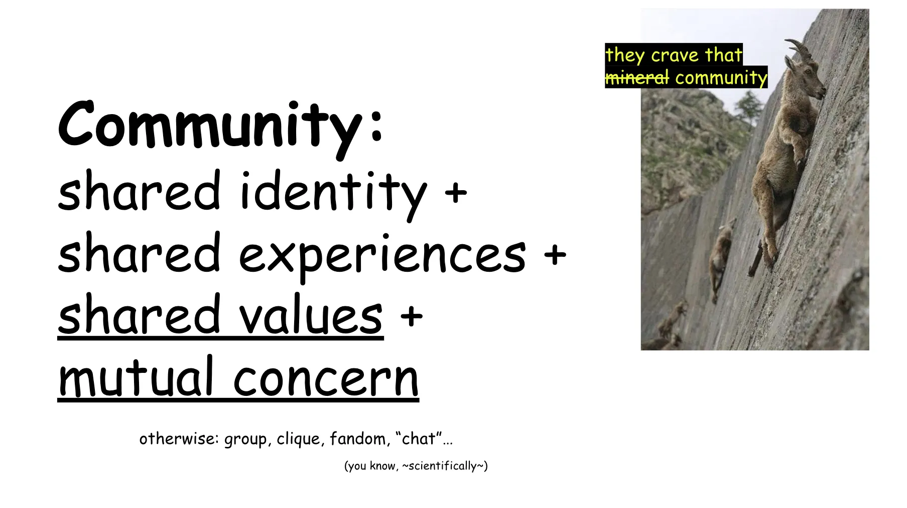
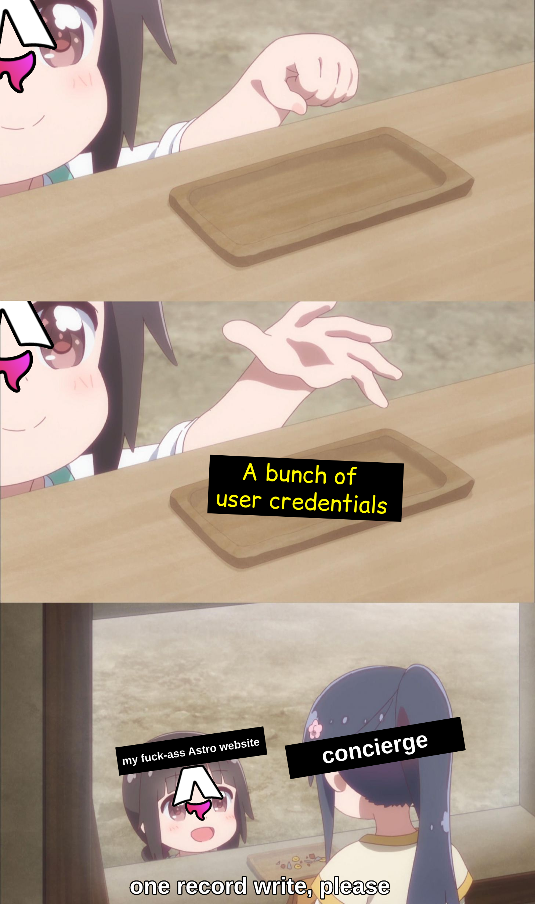
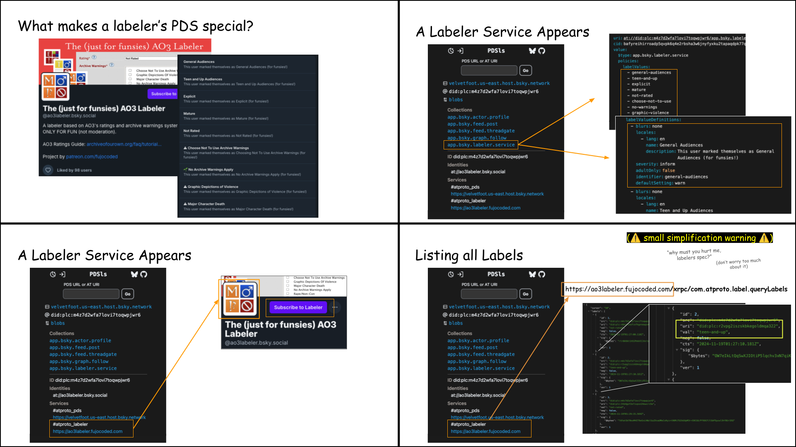

import ZoomableFigure from "../../../../components/ZoomableFigure.astro";
import ConciergeSwap from "../../../../components/ConciergeSwap.astro";
import { ExcalidrawComponent } from "@fujocoded/remark-excalidraw/component";

This article comes after reading [Daniel's thoughts on Bluesky's move towards
Community](https://dholms.leaflet.pub/3mndhk7ihsc2g), when
[Boris](https://bmann.ca/) ~~torpedoed my week~~ wisely suggested I say
something on the topic of ATproto Communities.

If you haven't heard much about them yet, the shallower end of my feelings is
best summed up by what I told Boris right as I closed off Daniel's article:

> _**"I want Bluesky to own my community just as much as I want Bluesky to own
> my PDS[^1]"**_

**And that**—hasty disclaimer before the _"Yeah! Fuck Bluesky!"_ starts—**is a
non-zero amount.** Indeed, Bluesky currently holds not only my _personal_ PDS,
but the username others @ me by. And I'm fine with that! Genuinely!

If you balk at this, consider I have solid reasons for not moving off my cozy defaults:

1. I'm lazy ~~and busy~~ ~~and lazy~~
2. **For any reason I want, whenever the urge eventually hits, I can swap out
   the service hosting my data[^1a] and ditch Bluesky forever**—which means I feel no
   particular pressure to do so _right now_.

Similarly, if I'm ever to kick off my shoes, relax, and trust Bluesky—_any
service!_—with hosting a community I "own"[^2], then everything
surrounding the community's _identity_ and _function_ needs at least as much
credible exit[^2a] as an individual user does.

Put plainly:

> To live up to the protocol's original promise, **an ATproto Community must be
> able to leave a rogue service with everything it needs to take root somewhere
> else**—far, far away from its reach—with as little disruption as possible.

Luckily, that's exactly what Daniel and the others who've been working on this
have been building and writing essays about[^3]! So this article is not me
barging in, shining armor on, rectifying something that's about to go wrong.
**This is just me**—who's been prodding the protocol, building [a prototype of
an ATproto Community](https://atmosphere.community), and spending a few years
looking at the "how the fuck do we online community" issue—**finally getting off
my ass and writing down what I know, believe, and _have been taught_ about how
we should do community on ATproto.**

And to start, I'm going straight to the million dollars question...

## What is an ATproto Community?

It's hard to define what "a community" is, but here's some of what a community
is <u>not</u>: **a community is not the place people meet; a community is not
its members; a community is not its admins, moderators, or (for what it's worth)
its _"owners"_.** In a way, "a community is an ~~idea~~ vibe, and ~~ideas~~
vibes are ~~bulletproof~~ unknowable".

<figure>

<figcaption>
  Oh look! [I have a slide for
  that!](https://www.essentialrandomness.com/posts/rebuilding-community-on-the-web/part-1#the-opposite-of-lonely-is-community)
</figcaption>

</figure>

What's very much knowable, however, is that once you build a technology that
connects people across the web (like ATproto does) people will soon yearn for more
than just ~~sharing porn~~ expressing themselves. They will seek to build "group
spaces" to ~~share porn~~ find belonging in a larger whole. And now that the
moment has come for us, folks are racking their brains—_all together!_—so
**ATproto Communities can live on this protocol the way a user does—owning their
identity, their data, and their freedom to fire any service that stops meeting
their needs.**

And here's the lucky deal: we don't need to define community to design how
Communities may be done on ATproto! Or at least, it seems many are hovering
around similar ideas, no matter what shape the concept holds in their brain.

Thus, a Community on ATproto will likely have:

- **Its own DID**—that is, its own independent identity in the larger ATmosphere
- **Its own PDS**—that is, its own place to hold its own data
- **Some "entity" that can read and write data on its behalf**—often referred to as
  "the Arbiter", after Zicklag's conceptualization of it

This is accepted enough that we may as well consider it settled—or _"almost
settled"_, to be precise. Even as the general shape is taking hold, the third
piece—_that entity_ that acts on the Community's behalf—remains slippery, with
everyone grasping at its edges just to see it unravel against some particularly
sharp corner...

## The Thankless Job(s) of the Arbiter

Last week, [Zicklag](https://bsky.app/profile/zicklag.dev) generously lent me
some time to walk through the Arbiter's design together. My plan was to learn
its more practical ins and outs, so I could jump on stream myself and walk
less-technical "AT-izens" through the shape of ATproto Communities—something now
postponed (not replaced) by this article.

For the curious (and only the curious), here's the resulting diagram[^5]. It was
never meant as anything more than notes to myself, and it's not required to read
the rest—if you, like me, _hate_ spoilers, it may even detract.

<figure>

<ZoomableFigure
  id="arbiter-mindmap"
  class="is-collapsed-preview"
  linkLabel="Link to Arbiter mindmap drawing"
  previewToggleLabel="I crave those spoilers"
>

</ZoomableFigure>

<figcaption>Engineers call this "a great time together".</figcaption>

</figure>

Cutting a long discussion short, Zicklag and I spent the afternoon teasing
apart the Arbiter's various responsibilities, which (Zicklag explained) have
evolved alongside the concept. What started as a single block of functionality
is now "separating" into distinct, _potentially independent_ roles:

- **Custodian of the keys**, holding the credentials to read and write
  the Community's data
- **Member Manager**, knowing who's a Member of the Community and who's allowed
  to do what
- **Community Host**, keeping track of the public and private spaces of the
  Community, and fetching data on the Community's behalf

Of course, I've been rotating all this in my brain ever since. And as I rotated,
I kept circling back to a thought: these aren't just _roles_, they're _jobs_.
Jobs that a Community should be able to hire (and fire!) for, jobs that—Zicklag
said so himself—could in principle be taken up by a different service, run by a
different party, and swapped out independently.

But if each exists on its own, then **a Community looks less like DID + PDS +
Arbiter, and more like a complex weave of jobs to be done, relationships to
maintain, and Members to serve:** all requests swiftly routed or handled; each
credential continuously checked; and information properly filed and
retrieved—across countless members, roles, guests and "hired hands".

Which means a Community needs more than just a bunch of services—

**A Community needs a kick-ass manager.** Something that can keep it all
straight: do the calls that need calling, delegate what needs delegating, and
ultimately satisfy not the requirements of individual jobs, but the needs of the
Community itself.

That is, it needs its own _Concierge_.

## The ~~"Arbiter"~~ Concierge

I'm not here to argue the difference between _Arbiter_ and _Concierge_: Zicklag
himself mentioned the name "Arbiter" was not particularly well-suited, and we
seemed to agree "Space _Host_" was unwise in a decentralized network. I had
off-handedly suggested "Porter" as an alternative, but _Concierge_ sounds a
hundred times cooler (very important), and still centers service over judgement
(also nice).

Which is to say, **the Concierge is my flavor of the Arbiter....maybe.** Or
maybe it's something different. Judgement is still open—all I ask right now is
that you picture it as Charon from John Wick.

<figure>

<figcaption>
  <ConciergeSwap />
</figcaption>

</figure>

In my conception of the Concierge (_"I need it to look like a distinguished,
hypercompetent, and kinda-threatening hot fictional man"_ aside) what matters
most is that **the Concierge is not the Community itself.** It's a _Community
delegate_: a service the Community has hired to handle matters on its behalf,
neither part of it, nor inseparable.

**To have the same credible exit as regular users, a Community must be able to
continue existing without a Concierge**—with degraded service if needed, but with
all it needs to rebuild operations safely in its hands.

This means a Concierge's role is not to hold the Community's data or
its credential. A Concierge _may_ not hold the full set of keys, nor manage
Members _directly_. It _may_ not have read access—never mind _write_ access to
every record of the Community. But:

- _It knows how and who to ask_ to satisfy the request being made
- It knows _who is allowed to make that request_
- It knows _whether they have clearance to receive the response_
- ...and if it doesn't know directly, it knows how to find out!

When a request comes in, the Concierge handles it by _getting the right things
done_: reading data where it can, writing where it should, coordinating with
other services (internal or external) where needed. And if:

1. The Concierge holds _scoped, revocable permission_ to act on behalf of
   the Community and fullfil its needs and its Members'
2. Community data lives somewhere _the Community_ owns
3. The job of Concierge can be easily _reassigned_ to "whoever" comes next

**then a Community can always walk away.** It can fire its Concierge. The
Community keeps existing across the swap; only the manager changes.

When a Concierge stops "sparking joy", the Community elects a new one just like
it did each time—through sign up, configuration, and continued usage. Give it
access to the data, ask it to route requests appropriately, and let it take care
of whatever needs to be done.

**That is not to say electing a new Concierge is not a UX challenge—but _so is a
PDS_.** It may not be easy _(to start!)_, it may be slightly confusing _(to
start!)_. But should a burning-enough happenstance light the ~~laziness~~ inertia
off the ass of communities like mine, they'll be clamoring to yeet their
"signup-assigned Concierge"—to replace it with one more suited to their needs
and, if necessary, principles.

**And the promise of ATproto is that we'd let them.**

## There's an App for That!

You may be squinting:

> "You're describing a service that holds a credential that the Community can
> authorize and revoke, which allows it to read and write Community data, and
> coordinate actions on the Community's behalf. **So you mean like..._a
> Community App?_"**

Why not, let's call it a Community App! [Habitat](https://habitat.network)
already has a notion of installable apps that act on a Community's behalf; so
does [OpenSocial](https://opensocial.community/), which I used to prototype
[atmosphere.community](https://atmosphere.community).

None of this is about whether the Concierge is something installable by the
Community, or how it gets installed. The distinction is more subtle, and it's
best teased apart by looking at my experience with OpenSocial[^6], how today's
zero-generation ATproto-based Community Apps interface with random websites like
[atmosphere.community](https://atmosphere.community), and most importantly
_why_ they work that way.

### AT-Communities: You(r Members) Have No Power Here

When a user logs into an ATmosphere service, they go through one of computing's
most sacred and accursed courtship rituals: _OAuth_—feared and revered _(but
mostly feared)_ by developers everywhere[^8]. In this dance, a website or app
presents itself at the door, fans out its requested scopes, and asks the User
for permission to write data or take action on their behalf. The User may accept
the proposal by logging in and tapping "Allow", or leave the would-be suitor
stranded at the redirect URI by cancelling the process[^7].

TODO: get a picture of the permission screen.

But while the dance is the same for every user and service, there is a fundamental
distinction between a "User" logging in to a service, and a "Community Member"
logging in to one:

- When a "User" logs into a _service_ using their ATmosphere account, **they may
  grant a service authorization to act on their own data**—which may mean
  permission to update the User's Bluesky profile, publish a leaflet on their
  behalf, or other cool things you can do with ATproto.
- When a "Community Member" logs into a _service_ using their ATmosphere
  account, they may grant a service authorization to, well... _act on their own
  data._ But _crucially_ **a "Community Member" has no power to grant the
  service permission to act _on the Community's data itself_**—like writing shared
  content on the Community's PDS, removing a rogue user from its list of
  Members, or removing _themselves_ from it. After all, they don't have that
  permission themselves!

<figure>
  
  <figcaption>
    Pictured: a Community's PDS when a Community Member asks for, well...
    _anything_.
  </figcaption>
</figure>

This perfectly logical distinction creates a quite obvious, quite big problem
for Communities on ATproto: **only those who log in with the Community account
itself can grant a service permission to act on the Community's behalf[^9]**, but a
Community account cannot be shared with every single Member.

To get around this limitation _(and stop me if you've heard this before)_, **there
needs to be an intermediary program that the Community's own account has
pre-authorized**, which can take action on behalf of the Community for
valid requests—including those coming from Community Members.

That is the role of OpenSocial[^9a].

<ZoomableFigure
  id="opensocial-design"
  linkLabel="Link to Atmosphere.community Design drawing"
>
  
</ZoomableFigure>

When a User wants to create a Community Account on ATproto, they:

1. Login to OpenSocial (or equivalent) as their Community Account-to-be
2. Grant OpenSocial permission to act on the Community Account's behalf
3. "Write" into the Community Account's PDS that their regular,
   everyday User Account is the Community Admin
4. Send Users to the Community's OpenSocial Page, where they can login and ask
   _OpenSocial_ to "write them" as Community Members

And they all lived happily ever after.

### Now Featuring: "Third-party" Services

You may be wondering: **does that make OpenSocial the Community's Concierge, elected
when the owner of the Community Account granted it power to act on the Community's
behalf?**

As someone would say, "You're Absolutely Correct!"—which is not _wrong_, but,
as we all know, comes with asterisks and caveats.

Let's poke and prod: what happens when a Community Member logs into another Service
_that's not OpenSocial_ and takes an action that requires permission to modify
Community Data?

- The Community Member cannot grant the Service permission to modify Community
  Data
- The Community Account could grant that Service permission _if_ the Community
  Member had access to the Account
- But _OpenSocial_, like all good services, never sleeps[^10] and is always
  ready and available for those who need to "piggyback" on its permissions

This is exactly how [atmosphere.community](https://atmosphere.community) works:

<figure>

<ZoomableFigure
id="atmosphere-community-design"
linkLabel="Link to Atmosphere.community Design drawing"
>

</ZoomableFigure>

<figcaption>
  The design of [atmosphere.community](https://atmosphere.community), our first
  (spoiler warning) *fuck-ass Astro website*
</figcaption>

</figure>

Now, obviously, **a new Service cannot just show up and ask to modify the
Community's data: the Community needs to authorize it first.**

The way OpenSocial does this is the way most programs and most of the ecosystem
does it:

1. A developer registers a third-party App
2. The App gets added to the Community, and receives its blessing[^11] to
   interact with its data
3. _That "Blessed App"_ is now allowed to write data and take actions on behalf
   of the Community.

...which is portable and works! Everyone has the power to create an App. **The
Community has total freedom to install new Apps, revoke App permissions, switch
away from OpenSocial, or even pair it up with more services.** OpenSocial even
implemented App authentication [via
CIMD](https://opensocial.community/auth/cimd/) (a mechanism I _loved_
discovering), which significantly lowered the friction for third-party App
authentication!

So, in theory, all is good. The gods of decentralization smile upon us.

_...or do they?_

#### _Blessed App_ Mode

That model never sat right with me, and I'm both _very incensed about it_, and
full of doubts. Whenever I rant about this (and I have done at multiple points
_and multiple apps_ in the past), I always feel there's something I'm missing:
maybe it's already possible and I'm not seeing it; maybe I'm being unreasonable
about a problem that's just plain impossible.

But, no matter how hard the technical problem of fixing it might be, there's an
issue I believe must be solved—if it hasn't already been:

**In Community App mode, _the App_ is the unit the Community gives its trust
to.** The Community blesses specific Apps by installing them, and Blessed Apps
get to write and act on its behalf.

So when a **User with membership-granted permission to write Community data
wants to use my random, no-one-heard-it-before, hyper-customized _fuck-ass Astro
website_ to add a record** to the Community's PDS, my _fuck-ass Astro website_'s options are:

1. Become a _Blessed App_ by convincing someone with enough permission in
   the Community to install it—which is not gonna happen at scale
2. Go find an existing _Blessed App_ that will let it piggyback on its credentials
   so it can take that specific action

Both of which are less than ideal, and **both of which risk crushing the
long-tail of small independent apps, websites, and utilities built for Members
of Communities to interact with the Communities themselves**—that is, all the
_fuck-ass Astro websites_[^12] floating around in the ATmosphere.

#### Concierge Mode

In the mode I'm advocating for, which I'm calling "Concierge Mode", Apps are not
the only unit the Community gives its trust to.

**In "Concierge Mode", Apps have a standardized way to ask the Community (or
_\*wink wink\*_ a Community delegate) to trust the permissions of the entity the
App is making requests on behalf of**—whether it's itself, a Member of the
Community, or some random DID who asks to know or do something it may (or may
not!) be authorized to, and thus may (or may not!) be allowed to do.

<figure>
  
  <figcaption>me dropping an RFC</figcaption>
</figure>

So, in Concierge Mode, my now-famous _fuck-ass Astro website_ would:

1. Go to the Community's Concierge
2. **Present a signed request on behalf of the User** (proof of origin and
   anti-tampering mechanism to be worked out), and ask the Concierge to act on
   it.
3. **Wait for the Concierge to handle it according to the policy of the
   Community and to the User's role in it:** checking with whatever services it
   needs, writing data wherever it should be, acting on the Community's behalf
   so the User's request can either be acted upon or denied
4. Communicate the result back to the User

While it may seem simple, this flow is load-bearing: **for the smaller Apps
ecosystem to thrive, Services _must_ be able to act on behalf of a Community
Member with only the Member's own credentials.**

Because by piggybacking on the Member's credentials, a _fuck-ass Astro website_
doesn't need to worry about whether it's popular enough to end up installed, or
whether anyone cares enough about it that they'll pester a Community Admin to.

By piggybacking on the Member's credentials, all a _fuck-ass Astro website_
needs to do is bring the request to the Concierge, then go back to the User with
the result—smile on its face, pepper in its walk, knowing it did the only thing
it could: _its best._

### The Tyranny of _Blessedness_

You may be thinking:

> _Wait a minute—_ "Concierge Mode" is just the second option of "App Mode": all
> _fuck-ass Astro website_ did is "finding an existing _Blessed App_ and
> piggybacking on its credentials"! Who cares if that App is the Concierge?
> _Booo-oooh,_ give me my ~~money~~ time back!

And in a way... yes, "Concierge mode" does require Apps to piggyback on someone
else's credentials! After all, a Member just _doesn't have_ permission to write
the Community's data on its own. It cannot be manufactured out of thin air!

<figure style="max-width: clamp(20rem, 90%, 35rem);">

<ZoomableFigure
id="concierge-pds"
linkLabel="Link to Concierge PDS drawing"
>

</ZoomableFigure>
<figcaption>

_"He's\* making a list/and checking it twice/gonna find out if you got access or no dice 🎵"_
(\*or another service he knows about)

</figcaption>
</figure>

But there's a fundamental difference:

**The difference is that the third-party Service and the Concierge don't have to
trust or know each other.** The third-party Service is not vouching for the
requester: it's just passing along a signed request, and asking the Concierge to
handle it. This means that the Community doesn't need to go around trusting
Apps one by one to grant them permission. And that makes all the difference.

Because the issue with the Community Apps system is not the idea that _Blessed
Apps_ exist: not only should they be part of this ecosystem, they _will need to
be_. The issue is that, by making the barrier to offering smaller,
complementary, additional services to Community Members _that much higher_,
**_Blessed Apps_' lack of scalability creates the risk of a "plausibly-deniable
lock in"—a much greater danger where they're the _blessed_ (🥁) _or only
option_.** It's fundamental to the ecosystem that AT-Communities be interactable
through more than just installable Apps or API keys.

For the ecosystem to thrive, Third-party Services (and _fuck-ass Astro
websites_) must have somewhere to go—a front desk, or a loosely-defined
"person"—and ask that their Users' legitimate requests be fulfilled by someone that
holds the authority to do so. By taking on this role, **the Concierge
centralizes trust to act _on behalf of_ Community Members—and by doing so, it
_decentralizes_ the power to make those acts happen.**

## But _wait_, there's ~~Room~~ Vault for More!

Until now we've mostly focused on point #1 in our list of must-haves for
_Concierge Swappability_—which required learning a lot about how AT-Communities and
permissions work. With this out of our way, time to quickly breeze through the
rest[^13].

Next up:

> 1. ~~The Concierge holds _scoped, revocable permission_ to act on behalf of
>    the Community and fulfil its needs and those of its Members~~
> 2. **Community data lives somewhere _the Community_ owns**
> 3. The job of Concierge can be easily _reassigned_ to "whoever" comes next

So, where should a Community's data live? Well, it depends[^14]:

- **For fully-public data that can be accessed by everyone,** Community data
  can live on the Community PDS—exactly like it does for regular Users.
- **For private Community data that can only be accessed by a specific slice of
  Users or Services,** the accepted answer seems to be "Permissioned Spaces".

...and that's that! A Community can own all its data, QED. Next up, _reassigning
the Conc—_

### "Fully-private" Community Data

_AH! Got you!_ As if I'd keep it that short[^15].

There's _one more type of Community data_, often forgotten or shoehorned into
the previous two: **the "fully-private" Community data that no Community Member
should _freely_ and _fully_ access at all—not the Admin, not the most trusted
Mod, not _anyone_.** This is all data that belongs to a Community, but that in
many Communities _almost no one (if anyone at all)_ can read or write
directly and in its entirety—nor, for the most part, wants to.

It may include things like:

- Historical logs of moderation infractions
- Identity of Anonymous Posters
- PII of Community Members (or anything that could be used to identify them)
- Detailed access logs

...and many more. This category of data often varies from Community to
Community. Sometimes, data a Community kept semi-public may become more (or less)
sensitive as it changes and grows.

In the current ATproto world, where data is all either public or private,
similar data often ends up stored within individual App(View)s. And while
Permissioned Spaces will "bring some back into the light", it won't fully
eliminate the need for it. After all, **for every piece of data you bring, I can
think of a Community that may want it to be private and not directly
accessible to its Members.**

> "_Objection!_" A voice rises from the crowd. "What about membership? In every
> community someone needs to know who its members are!"
>
> _"Do they though?"_ I ask, with the smugness of one who wrote community
> software where no one knew who the Members were, _except for the database[^15a]._

Made-up conversations where I win imaginary arguments aside, what
I'm stressing here is the difference between:

- Information someone must have access to read and write in its _entirety_
- Information someone must be able to access _smaller slices_ of, in _very
  specific cases_

**"Some Community Member (or Service) needs to _know_" is not the same as "some
Community Member (or Service) needs to read and write that data _directly_".**
After all, in traditional software applications, not having a direct connection
to the database doesn't prevent people from asking questions about its data:
they just go through a server—an intermediary that mediates their access. And
_incidentally_, that mediation, self-hosted software shows us[^16], doesn't have to
mean that the data is not in the Community's hands.

Because in the future AT-Communities world, **unless a solution for
Fully-Private Community Data is available, the need for this data won't stop
existing: it will just end up within individual Arbiters (or Concierges)
instead.**

### Enter the _Vault_-verse

Let's dive into our current predicament, then! **How should Communities deal with
their Fully-Private Data?** Ideally, this data would be:

1. As much under their control as a PDS is
2. Not a PITA to use
3. Accessible to individual Users or Services according to their credentials, but
   with fine-grained access _up to the individual record_

...which is actually not that hard of a problem to solve! After all, **ATproto
developers already create stores of data that are not a PITA to use (problem #2)
and can return fine-grained data to Users or Services (problem #3)—we just
implement them over and over _in every single AppView_.**

So let's create one single data store! Even better: **let's put that single data
store under a DID's "control" exactly like we do with PDSes**—which means we're now
_also_ solving problem #1, in the same way we already know how.

**I call this Community-owned Fully-Private data store "the Vault".**

<figure style="max-width: clamp(20rem, 90%, 35rem);">

<ZoomableFigure
id="concierge-vault"
linkLabel="Link to Concierge Vault drawing"
>

</ZoomableFigure>

</figure>

_The Vault_ is a data store that:

- is available as a service named `#atproto_vault` under a DID, which keeps its
  content movable across hosts
- doesn't provide direct write OR read access to anyone but the owner of the DID
  (if at all), which keeps its data private, _only accessible through a
  Concierge_
- can be queried through specific XRPC endpoints using Lexicons—almost like a
  PDS can be—but with granular permissions that can get down to the level of
  individual records

Once again, you can think of "the Vault" as the community's own internal SQLite
database, like the one many AppViews build: just a standardized one with no
access rights directly granted, and a "Concierge"[^17] in front to mediate access.
**Data that AppViews currently hold internally can either be mirrored into the
Vault or placed there to start**—either way, the data travels with the DID, not
with whoever's running the AppView at the moment.

The Vault is _where the off-protocol state goes so the AppView doesn't have to
hold it_—a data store that "speaks" ATproto-language, but is _not_ necessarily
ATproto-shaped. Not today, at least.

## New Concierge, Who Dis~?

And here we are, facing our final requirement:

> 1. ~~The Concierge holds _scoped, revocable permission_ to act on behalf of
>    the Community and fulfil its needs and those of its Members~~
> 2. ~~Community data lives somewhere _the community_ owns~~
> 3. **The job of Concierge can be easily _reassigned_ to "whoever" comes next**

How do we enable a community to choose a different concierge should their current
one prove less trustworthy (or less _featureful_) than they'd like?

<figure>

<figcaption>

_Concierge Service #2_ here represented by famous internet darling and
gay icon the Ask Jeeves butler

</figcaption>
</figure>

While this may seem like a hard question, its solution is already in front
of us. And the journey we've been on until now has helped make it possible. After all:

1. The new Concierge can be granted credentials by the Community Account to do
   its job, **which makes it again possible for third-party Apps to act on
   behalf of Community Members**
2. The new Concierge can act on the same data as the previous one, including the
   _private data in the Community's Vault_ **which removes the need to hold
   Community state in the Old Concierge Service itself**

But there is one last issue, one we've until now overlooked...

### New Concierge, _Where_ It~?

The final hurdle: **how does that random Service carrying the User request—_our
fuck-ass Astro website_—know it should now go _somewhere else_ to ask that it be
fulfilled?**

The same way it knows how to go find the Community's PDS or the Community's
Vault: **by looking up the `#concierge` service in the Community's DID
document.**

<figure style="max-width: clamp(20rem, 90%, 35rem);">

<ZoomableFigure id="concierge-assembled" linkLabel="Link to Concierge Read drawing">

</ZoomableFigure>

</figure>

When a Community writes a Concierge into its DID document, **it promotes the
Concierge as an official part of the Community, even as it remains an external
Service not directly run by it.**

Then all third-party Services need is:

1. A standardized Lexicon to talk to Concierges (or other Services), even as
   implementations change
2. A standardized way for Concierges to forward requests to other Services whose
   endpoints they don't directly implement, as chosen by the Community rather than
   by the requester

This second bit may seem more involved than what we have today, but honestly?
Not by much.

After all, the PDS already has a standardized way to proxy requests to other
services, just one that doesn't let it do _almost anything_ on its own. In a
way, **the PDS is already acting as a Concierge—it just _abdicates_ the
responsibility of knowing about a DID's _preferred services_[^18] and places it
squarely on third parties.**

## What Makes a "User Account" a "Community Account"?

Once the Concierge is an official part of the Community DID, we get one final,
_crucial property_: **we can use the presence of a `#concierge` DID entry as the
indication that the account is a Community account.**

If this seems far-fetched... Well, it's really not! Because **this is exactly
what ATproto does with labeler accounts _today_.**

<figure>

<figcaption>
  Slides from my ATmosphereConf talk, showing the presence of a Labeler Service
  in a User DID turns its Account into a Labeler Account on Bluesky and signals
  the presence of specific Labeler endpoints.
</figcaption>

</figure>

Once we do that, we have the pieces of the puzzle we need to:

1. Let its Members act according to their privileges and permissions
2. Let the Community itself own _its own data_
3. Identify and interact with a Community Account through ATproto, no matter who
   implements the endpoints that make it _a Community_

And through this we can achieve _exactly_ what we asked for at the very beginning:

> **ATproto Communities can live on this protocol the way a user does—owning
> their identity, their data, and their freedom to fire any service that stops
> meeting their needs.**

We _just need to build it._

## — Intermission: Members Management in Practice —

SO! This article took a long time to write...and there's a whole other part
below it (yes, again, I'm so sorry, I swear it's worth it). I'm going to publish
the rest in a few days, but I wanted to show how this might look in
practice.

I'd probably need another day to polish it up where I want it to be, but as they
say "`¯\_(ツ)_/¯`". **I'm not going to pretend I have all the answers. Still
there's A Vision™ here which I believe is roughly, _directionally_ a correct
shape to solve the issue**—one that I've seen everyone involved hover around
_without exactly pinning down its parts_.

Here are my examples, in both read and write editions, using the `community.lexicon`
and `com.atproto` namespaces cause... well, I need some.

Have at it:

### The Concierge — List Community Members Edition

<figure>

<ZoomableFigure id="concierge-read" linkLabel="Link to Concierge Read drawing">

</ZoomableFigure>

<figcaption>
  — You either die a hero or live long enough to see yourself reinvent
  microservices
</figcaption>

</figure>

Here's how it works, using the request to add a new Member to a community:

1. Some Requesting Entity (App, service, Member, member-asking-through-App,
   _whatever_) asks the Concierge to
   "`community.lexicon.communities.listMembers`"
2. The Concierge, consulting data it has access to (whether from the Vault, or
   from the DID document, or however else) determines this Community has elected
   a service that can answer `community.lexicon.communities.listMembers` on its
   behalf—maybe even the concierge itself!
3. The Concierge, having determined Requesting Entity is authorized by the
   Community to know that answers forwards it to the appropriate Responding
   Entity—or again, takes it on itself.
4. The Responding Entity, upon receiving
   `community.lexicon.communities.listMembers`, goes to whoever is in charge of
   the Vault (the `#atproto_vault` service) and asks for everything it needs to
   answer that question. For example:
   `com.atproto.vault.listRecords(["community.lexicon.communities.member",
"community.lexicon.communities.communityRoles",
"community.lexicon.communities.rolePermissions"])`.
5. The Vault's manager returns the list of data the Responding Entity has access
   to—which may _or may not be_ the full list of
   `community.lexicon.communities.member` records.
6. The Responding Entity sends it back to the Concierge
7. The Concierge sends it back to the Requesting Entity

...and that's it! Simple, isn't it?

Ok, that's a lot of jumps...but that's not the point! Jumps and paths can be
optimized, shapes can be changed, and caches can be written. You know what
they say: "Make it work, make it right, make it fast".

### The Concierge — Add Community Member Edition

<figure>

<ZoomableFigure id="concierge-write" linkLabel="Link to Concierge Write drawing">

</ZoomableFigure>

</figure>

This is left as an exercise for readers. Or for me, after I haven't gone to bed
at 5AM for a week to write this article—not to mention, _the whole rest of it
(coming soon?)._

Thanks for reading!

[^1]:
    **P**ersonal **D**ata **S**erver: your personal folder of data in the
    ATmosphere—the network of all ATproto services. The text and images of all
    your Bluesky posts are stored inside this. If you made your account through
    Bluesky, they're currently hosting it for you, but you can transfer that to
    a different provider any time you wish.

[^1a]: (#thanksobama voice) "Thanks ATproto!"

[^2]:
    Philosophical debates over the meaning of community ownership
    notwithstanding.

[^2a]:
    "A credible exit means a realistic, well-supported, and achievable plan to
    leave a situation, investment, or **platform** without major loss or failure."

[^3]:
    
    I need everyone to pause writing until I can catch up. 4 or 5 months should
    be enough...maybe.

[^5]:
    If two engineers meet on a videocall, and no Excalidraw diagram comes out
    of it, did they even meet?

[^6]:
    I want to stress: this has nothing to do with OpenSocial itself. This
    prototype was only possible because of OpenSocial and its contributions to
    ATproto-based Communities and the discussion on how to, well... _make them
    A Thing™_.

[^7]:
    (David Attenborough voice) "Here we see the client approach the
    authorization server, displaying a meticulously groomed redirect URI. The
    service fans out its requested scopes. The user studies the display.
    A pause. A click. 'Allow.' The bond is formed. Tokens will be exchanged at
    dawn, then periodically refreshed."

[^8]:
    After having implemented OAuth more or less 1389247389 times, I'm proud to report
    I find it pretty straightforward now. But rest assured: our ATproto overlords,
    worried I wouldn't have enough enrichment in my enclosure, have made sure to add
    PKCE and DPoP to the mix. Still working up my confidence about those.

[^9]:
    I am told [TranquilPDS](https://tangled.org/tranquil.farm/tranquil-pds) shows us a
    better world is possible...but alas, I've been too busy to explore this better world!
    Maybe that's trying to tell me something, but it's just impossible to know what.

[^9a]: _et al._

[^10]:
    "Oh, so when a service never sleeps that's called four nines of reliability and
    widely praised, but when I, a regular human being,—"

[^11]: Also known as API key (most of the time)

[^12]: Astro not required

[^13]: [[Studio Audience Laugh-track plays]] <small>...im sorry.</small>

[^14]: 

[^15]: [[Studio Audience Laugh-track plays again]] <small>...again, im so sorry.</small>

[^15a]:
    That software [is called BobaBoard](https://bobaboard.com/) and it's where
    my username comes _from_.  
    There is a special type of irony in creating
    Community software that doesn't center any specific member _including
    yourself_, ending up being called "Ms Boba" (as in _"the person who made
    BobaBoard"_) because you don't have a username, and then—after _years pass_—**having people
    _understandably_ assume you're the type of developer who'd name their software after
    themselves.**  
    100/10, _Absolute Auteur Cinema about a woman and her hubris_, would ~~watch~~ not make
    the same mistake again.

[^16]:
    "But most Communities are never going to self-host their—"
    
    **tl;dr:** most Users don't host their PDSes, but that doesn't mean they don't "own" their data.
    As we'll see in the next section, I'm not asking Communities to take on anything more involved
    than what ATproto already asks of them.

[^17]:
    I say "Concierge" here because it continues carrying the point and the
    metaphor at the core of the article. But just like (as Zicklag pointed out)
    the Arbiter doesn't have to all be the same service, the "Concierge" doesn't
    have to all be the same service. It just needs to know how to reach other
    services as needed.

[^18]:
    Well, _almost all_ preferred services.
    
    (affectionate)

