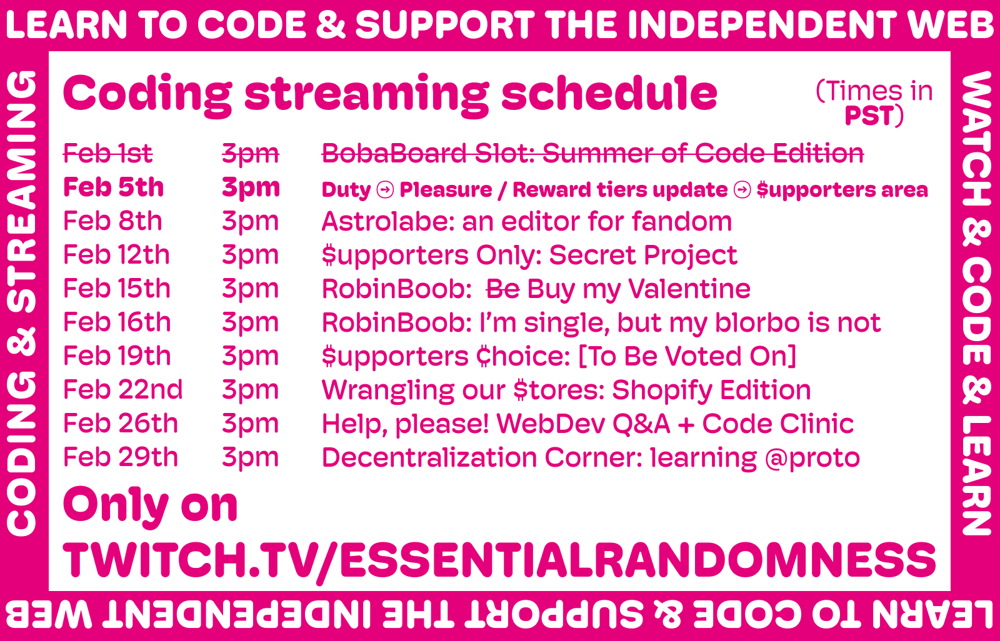

import StreamingSchedule from "../../../components/streams/StreamingSchedule.astro";
import NextStream from "../../../components/streams/NextStream.astro";
import TimeToggle from "../../../components/streams/TimeToggle.astro";

For the first time ever, welcome to **the official February streaming
schedule announcement**:

See you on <a href="https://twitch.tv/essentialrandomness">Twitch</a>!

### Next Up

<NextStream
  startAt={new Date("2024-02-01 00:00:00")}
  endAt={new Date("2024-02-29 23:59:59")}
/>

### Full Schedule

<TimeToggle />
<StreamingSchedule
  startAt={new Date("2024-02-01 00:00:00")}
  endAt={new Date("2024-02-29 23:59:59")}
/>

