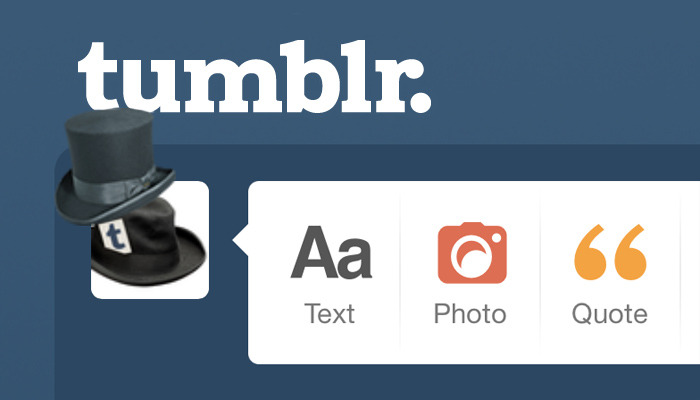
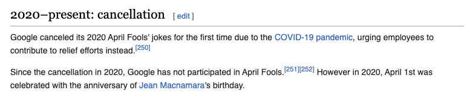
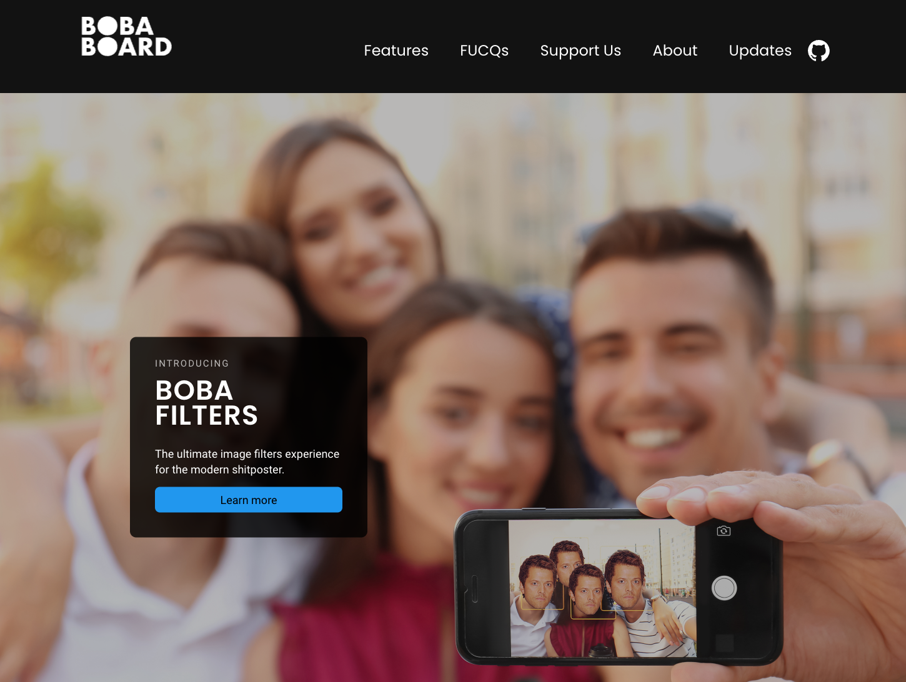

## Companies of the future

I grew up in a time of tech optimism. **In the early 00s, as a teenager learning
to code my own websites, it felt like we were on the cusp of a revolution**:
gone were the old, boring companies, treating employees like pawn-shaped cogs in
a machine! This was the time of the internet, where **success meant hiring smart
people and letting their brains roam free** without forcing them in the office
at specific hours and using time spent at their desk as a proxy for
productivity.

**It's easy these days to have (rightfully) grown cynical about it all[^0].**
However, growing up in a conservative and backward-looking European country with
no understanding of American Brand™-capitalism[^1], the idea that my future work
life could go beyond "sitting in an office from 9 to 5" was incredibly
appealing. In more ways than one, it's **the knowledge that a better work
culture could exist on the other side of the ocean that made me so determined to
grind my way into one of The Big Internet Companies that Were Doing It
Different™**, despite the relative lack of means. And, while I have come to
understand (better than many) the rot that lies underneath big tech, I'm still
grateful that this drive allowed me to lift myself out of poverty, and escape a
sinking country.

## April 1st Jokes and Tech Optimism

It may sound silly, but to me nothing exemplified the hope of a different type
of company as much as April 1st on the web did. **If you're young, you may be
tired of hearing that "the web actually used to be fun", but I swear, it
_was_.** And on April 1st, big (and small) internet companies would often
release fake–or, even better _real_–announcements of out-there products meant to
delight and entertain users everywhere[^2].

<figure>

<figcaption>

"Buy Tumblr Pro for a top hat on your avatar" used to be peak millennial humor.
And you know what? It _was_ good fun and I miss it. Sue me.

</figcaption>
</figure>

"Such a naive Ms Boba, easily swindled by a few PR stunts," you might say. And
what can I tell you? I absolutely am. But as someone who did end up working for
some of these companies, I can assure you: **regardless of the benefit to the
company, it was the employees themselves that championed these initiatives out
of love for whimsical fun.** "You get to see millions of people laugh at your
joke and also the company gets some good publicity" is what we call a win-win
situation. In a healthy social and business context, there's nothing wrong with
that.

<figure>

<figcaption>

Fine, I _am_ being (partly) facetious, but is there anything that exemplifies
the sorry state of the modern web more than this screenshot?

</figcaption>
</figure>

Personally, I miss that era of tech optimism. And most of all I miss when _fun_
was a core part of how online companies tried to attract talent, no matter how
surface-level that idea of fun was.

## "I'm going to build my own tech company, with April 1st jokes and–"

As the story goes, I left big tech around 2020 to figure out how to build a
profitable (but socially-minded and ethical) company that would bring _fun_ back
to my niche corner of the web. As I launched myself in the endeavor, there was a
lot I didn't know. One thing, however, I knew: **if I had to trade years of my
life to bootstrap a tech company, I wanted to build one that actually _kept_ the
promise that got me into tech a long time ago.** A company that would care for
the humans it employed; a company that trusted people to produce excellent work
without fixed hours or restrictive supervision; and, above all, **a company that
believed that allowing for creativity, fun, and more generally _"play"_ is a
fundamental drive towards innovation.** And to me, while they aren't enough on
their own, this also meant that I wanted to build a company that would make
amazing April 1st jokes.

### The Surprising Benefits of April 1st Jokes

Not everything I released throughout the years debuted on April 1st, but some of
the most impactful projects I made were indeed released on this date[^3]. While
this wasn't the main impetus for them, April 1st jokes were a tremendous help in
spreading my projects among the fandom public, and I cherish every keysmash and
"oh my god" I've received in return. Not only that, but **April 1st jokes have
consistently been one of the biggest learning grounds for collaboration among me
and other members of my community.** Many people want to be part of an (at times
intense) sprint to release something they believe people will love, and **every
year I'm always impressed by the personal and team growth that we see on the
other side of them.** Even if my mission of building the "company of my dreams"
were to fail, the jokes I launched and the laughs they generated will always be
one of the things I'm most proud of having been able to achieve.

### BobaBoard's First April 1st Joke: bobafilters

In this series, I want to take some time to showcase our previous April 1st
jokes as we build ourselves up to our 2024 event. And, while this first article
is already long, the first (and relatively unknown) joke is quite short to
explain: **[bobafilters](https://www.bobaboard.com/bobafilters) was a fake
promotional page about a series of filters inspired by popular online memes of
the time (2020).**

<figure>

<figcaption>

"Popular online memes of the time," she says about a 2020 page featuring a hero
image with a 2013 meme. Sorry, but the Mishapocalypse (also an April 1st
thing btw!) is timeless.

</figcaption>
</figure>

This page was created in a few hours on the last day of March 2020, when I
realized I indeed had the power to be the company I wanted to see in the online
world. **While it's not as ambitious as the work of later years, it does have
one characteristic in common with them: it actually works.** If you scroll to
[the bottom of the page](https://www.bobaboard.com/bobafilters), you can
upload[^4] an image to be "misha'fied".

<figure>

<figcaption>

"Person who loves memes is also a Hideo Kojima fan," more news at 12.

</figcaption>
</figure>

The code isn't particularly complicated (or good[^5]), but it is [open
source](https://github.com/essential-randomness/boba-filters) and theoretically
[installable via NPM](https://www.npmjs.com/package/boba-filters). Feel free to
take a look, and (if you're feeling very, very brave) use it on your own
websites.

See you next week with our next joke: the web's first "ship marketplace",
a.k.a. [RobinBoob](https://robinboob.com/)!

[^0]:
    The ping pong table and free gym? An excuse to keep you in the office
    longer. The undefined business hours and unlimited vacation? A convenient
    way to save money on overtime and vacations-payouts. Open offices fueling
    creativity? More like "real estate sure is expensive", amirite?

[^1]:
    I'm really grateful to the opportunities this country has given me, but
    moving here has repeatedly been marked by the experience of going "come on,
    there's no way [thing] could be _that messed up_" just to find out it's
    actually worse. Healthcare is a big one, obviously, but other things (like
    anything related to "credit scores") caught me by surprise.

[^2]:
    To see how prominent this practice was, you can look at the long Wikipedia
    pages for [Google's April 1st
    jokes](https://en.wikipedia.org/wiki/List_of_Google_April_Fools%27_Day_jokes)
    and [Netflix's April 1st
    jokes](https://en.wikipedia.org/wiki/Netflix_April_Fools%27_Day_jokes). Note
    how they both stop around 2019. Tumblr's porn ban was December 2018. I'm not
    saying that the internet started sucking around the time April 1st jokes
    became less popular, but the dates do match.

[^3]:
    Aside from [bobafilters](https://www.bobaboard.com/bobafilters), mentioned
    later in this article, the other April 1st projects are (in order)
    [RobinBoob](https://robinboob.com/), [FujoBoard](https://fujoboard.com/),
    and the [FujoGuide
    Kickstarter](https://www.kickstarter.com/projects/essential-randomness/the-fujoshi-guide-to-web-development).

[^4]:
    The image doesn't actually get uploaded to the site. All processing
    happens on device.

[^5]:
    Not only did I write it quickly and while sleep deprived, but I was also
    coming back to the JavaScript ecosystem after a long, long absence. Let's
    just say there was definitely an adjustment period.

