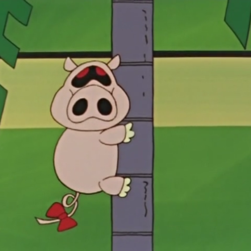
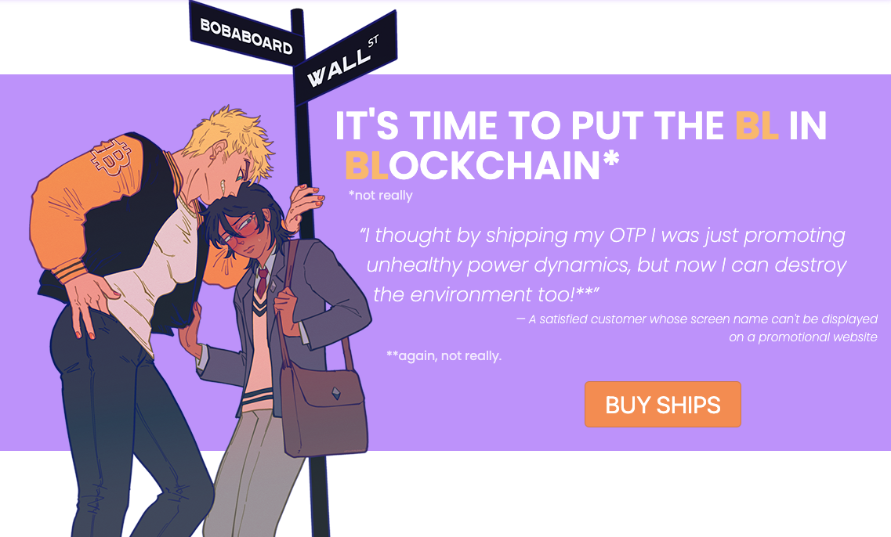
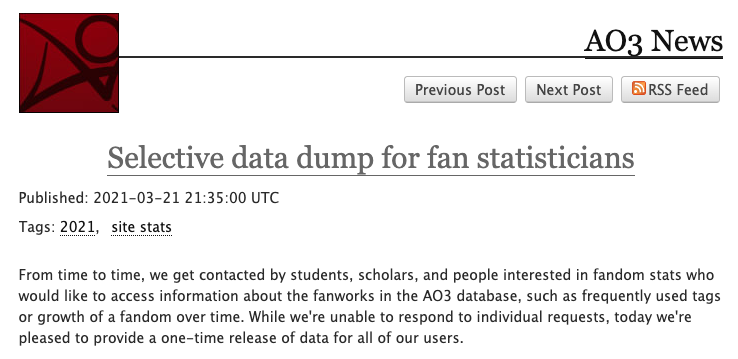
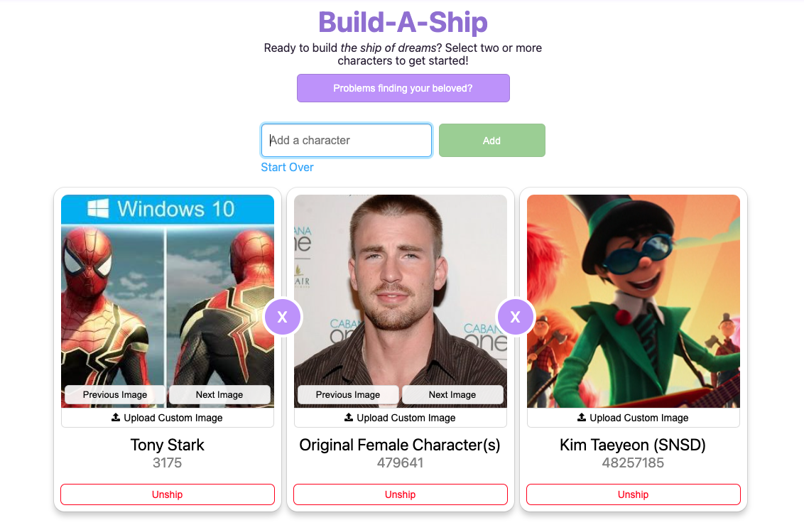
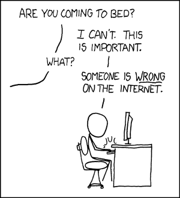

import Outro from "../../../components/posts/Outro.astro";

## The ineluctable pull of online discourse

When I decided to "stop whining and go do something" about the sorry state of
the web, **it was (partly) due to seeing how much time fannish folks (me
included) were wasting on increasingly less-useful discourse**[^-1]. This was
honestly a great decision, and I wish I could say I then never discoursed again.
Old habits, however, die hard. Even with my newfound worksona (who has
thankfully stayed away from fandom wank), I sometimes manage to drag myself into
digging way too much into the _controversial topic du jour_–a pull that is
especially hard to resist when that topic sits at the intersection of my special
interests.

## "This is important. _Everyone_ is wrong on the internet."

[^0]

Historically, _the_ biggest culprit (and the star of this story) has been NFT
discourse. At the time, I already wrote [a way-too-long
article](/posts/the-fight-for-the-open-web) (sorry sorry sorry) about my
feelings. The tl;dr: **as it often happens with discourse, people on all sides
missed part of the picture, or at least flattened some aspects of the
problem.**[^0_5] But while the arguments on the _other side_ of the divide can
be frustrating, nothing beats the frustration of _your side_ getting a
particular aspect of the issue wrong.

In particular, **one argument kept riling me up: the confident assertion that
people online wouldn't spend money on "meaningless JPEGs".** As a fandom person,
I simply knew deep in my guts that this was not true[^1]. Seeing people
continuing to parrot this talking point (and NFTers rightfully shooting it down)
was driving me up a wall.

<figure>

<figcaption>

"Even a raccoon will climb up a wall when peeved."

</figcaption>
</figure>

## Finding the right cliff to ~~die~~ learn on

While the NFT discourse raged, the Famed FujoVerse™ Holiday (April 1st) was
quickly approaching. [As I mentioned in part
1](/posts/april-1st-tradition-part-1), **one of my favorite aspects of building
whimsical April 1st jokes is using them as an experimental ground for skills I
haven't had the chance to develop yet.** At the time, the need to monetize was
becoming more and more pressing, so throwing myself onto a rapidly-approaching
deadline would be an excellent way to force myself to learn how to handle money
online[^2].

One question remained: what could one sell that would _delight_ our audience and
make for an "appropriately hilarious" joke? As I asked myself this, the NFT
discourse continued popping back into my mind (and Twitter timeline). I don't
remember when I finally connected the two ideas[^2_5]: **if I was so pissed off
at the current discourse, why not _show_ that people _would_ indeed buy
meaningless JPEGs of things they care about?** Thus, the idea of selling
_absolutely meaningless shipping certificates_ was born, and [RobinBoob with
it](https://www.robinboob.com).

<figure>

<figcaption>

I did not realize one could make the BL(ockchain) joke until later, so imagine
my delight when everything fell into place. The ETH-kun/Bitcoin-senpai design is
by our long-term collaborator and amazing artist
[spillingdown](https://www.fujoweb.dev/team/spillingdown).

</figcaption>
</figure>

While this story might make RobinBoob seem like a unilateral dig at my own side,
there is more to it than that. **RobinBoob is also a statement about the
(typical of NFT spaces) conflation of financial speculation and the desire to
collect things you care about.** Buying a ship certificate would never make
someone rich. However, it bought something way more important: a fun time on the
web, and an excuse to connect with your broader community[^3]. _That_ is why,
with all due _"oversimplification warnings"_, many in fandom buy (and sometimes
sell) things.

## The part where engineering

With the premise out of the way, let's talk a little bit about the technical
details. The RobinBoob's website itself isn't particularly complicated. **Don't get
me wrong: the code is an absolute mess[^3_5]**, but that's more a byproduct of
time and knowledge constraints rather than of intrinsic complexity. Long story
short, I found a NextJS + Stripe starter on GitHub and got to hacking, learning
what I needed to learn as I tried to decipher its inner workings.

### A lucky break appears

**The hardest part of building RobinBoob was figuring out how to build a list of
characters, and how to avoid character duplicates that would make the whole game
a lot less fun.** The obvious solution was to scrape [Archive of Our
Own](https://archiveofourown.org) for this data. But while this was overall
feasible[^3_7], we also were very short on time. We could try, but there was no
knowing how many characters we could get in that short time.

As I was exploring the various options, however, an incredible coincidence
happened: for the first time ever, AO3 released [a dump of its own
database](https://archiveofourown.org/admin_posts/18804). This included all
character tags, and the information needed to deduplicate them[^4].

<figure>

<figcaption>

Selective data dump for fan statisticians. Or, you know, website-weaving shitposters.

</figcaption>
</figure>

And so the RobinBoob project was officially a "go". What can I tell you? Someone
out there really loves fujoshi and good jokes.

### Woman vs deadline: getting nerdsniped

There isn't much more to the story (that I remember) aside from a few
anecdotes. For example, **we found out that the ~~lazy hack~~ carefully-designed
method I was using to associate a purchase with character pictures would stop
working when someone bought a certificate with 6+ characters.** This was a few hours
before release. And so the RobinBoob sprint marked the first time I did not sleep
on March 31st (a 3-year streak we're hoping to break in 2024).

With all of this said, there were some aspects of this rush that were overall
avoidable: **the biggest culprit was that I nerdsniped myself into figuring out default
pictures for our character selector.**

<figure>

<figcaption>

Sometimes people ask me about why some of the default character pics in the ship selector
are "like that". Buckle up, kids, there's a perfectly reasonable explanation behind it.

</figcaption>
</figure>

Eventually I realized I didn't need to get those images in, and could instead
use our classic "historical sexyman" fallback (that is, a picture of the
Once-ler). However, **this feature did made for some amazing code sleuthing, and
I'm still proud of having figured out how to makes it work.**

Here's the step-by-step logic:

1. I used AO3's data dump to figure out which characters had the most fics (since
   I knew I couldn't get to _everyone_).
2. Having ordered the characters by number of fics, I scraped AO3 to get the name of
   their fandom (a piece of information that's not in the database).
3. Once I had the name of the fandom, I scraped the search page on
   [fandom.com](https://www.fandom.com/)[^5] to find its wiki.
4. I used the [MediaWiki API](https://www.mediawiki.org/wiki/API:Main_page) to
   find pictures of the character on the wiki of their fandom.
5. I had my program upload a few of them to my own storage and pair them with the
   character in the database.

...and that is all! **While the code I ended up with isn't particularly complex,
the hard part was figuring out _how_ this could be done with no idea whether it
could be at all.** The sleuthing included looking through various image search
APIs, then wondering whether MediaWiki had one and finding out that indeed it
does.

Eventually, thanks to this fully-automated method, I was able to add some
pizzazz to our character search[^6]. The results aren't always perfect (and
sometimes are completely puzzling), but, hey, it was all worth it for the memes.

See you next week with another April 1st deep dive: [FujoBoard](https://fujoboard.com)!

[^-1]:
    As visakanv@twitter says, [focus your time and energy on what you want to
    see more of](https://x.com/visakanv/status/1324978566455468035?s=20). After
    a certain point, creating is a more empowering–and, honestly,
    _effective_–act than discoursing will ever be.

[^0]: 
[^0_5]:
    You can also see this happen with AI discourse these days, but I know
    better than to kick this particular hornet's nest. Please be proud of my
    progress.

[^1]:
    This wasn't (and isn't) an endorsment of NFTs. I have as much beef, if not
    more, with the other side. It's just a _different_ beef. What can I tell
    you? No urge pulls with the same strength as someone you generally agree
    with stepping on a _pet peeve_.

[^2]:
    I call this the "throw yourself off a cliff and learn to fly" method of
    learning. As someone who struggles with ADHD (and completing tasks), this
    type of forced deadline has been a godsend. Among the things it taught me is
    what corners to cut when necessary without getting stuck in "just another
    feature" rabbit holes.

[^2_5]:
    It probably involved me running out of my "weed cave" to yell at my
    partner about the amazing idea I had. For once the answer to "was whoever
    made this on drugs?" is "yes, most likely".

[^3]:
    RobinBoob's sale patterns are often clustered. Someone will buy a ship,
    show it off on their discord server, then their friends will "ajsdfhskjdfh"
    about it all and buy more for themselves.

[^3_5]:
    People ask for new features from time to time, but I had to give up to the
    idea that they’re not worth doing without a serious rewrite. If you want to
    come watch and chat during our in-progress rebuild, check out my
    [Twitch](https://www.twitch.tv/essentialrandomness) or
    [YouTube](https://www.youtube.com/channel/UCI_NX0PeoiWiMsHIFH0TBsw).

[^3_7]:
    We even have [an open source library for it
    now](https://github.com/Fandom-Coders/AO3.js)! You can use it in your
    JavaScript projects and also contribute to it if you want to add
    functionality. We'd love to help you get started ;)

[^4]:
    Look at the date on that post: it was published on March 21st, barely 10
    days before "showtime". I honestly don't know how RobinBoob would have
    turned out without this stroke of luck. But also, this is why the
    RobinBoob DB is stuck in time with only the characters that existed at the
    time of that dump. We're working on it.

[^5]:
    Using the tools of [the enemy](https://www.youtube.com/watch?v=qcfuA_UAz3I)
    against the enemy! Take that, fandom.com!

[^6]:
    "Was it worth it?" Silly reader, I know better than to ask myself that
    question. Once again, we didn't do it because it was easy. We did it because
    we _thought_ it'd be easy. Or, at least, fun.

