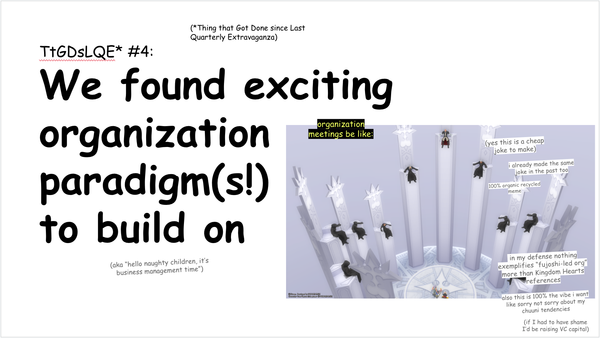
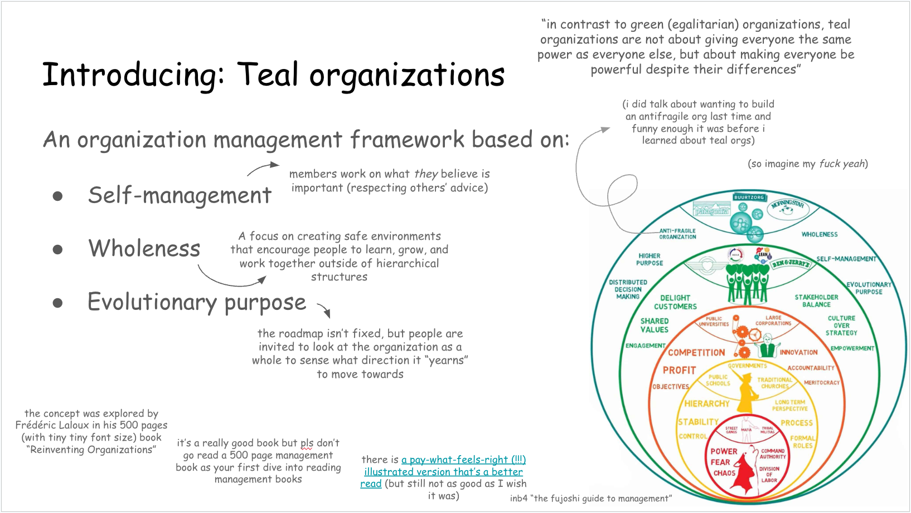
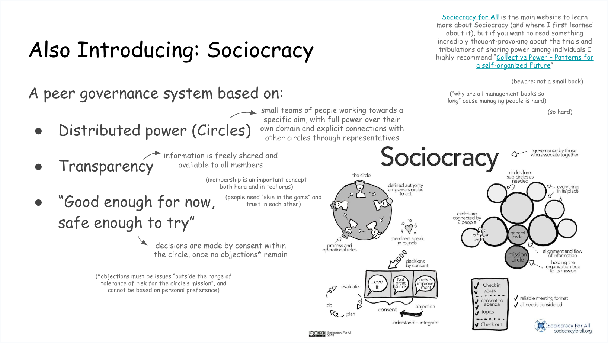
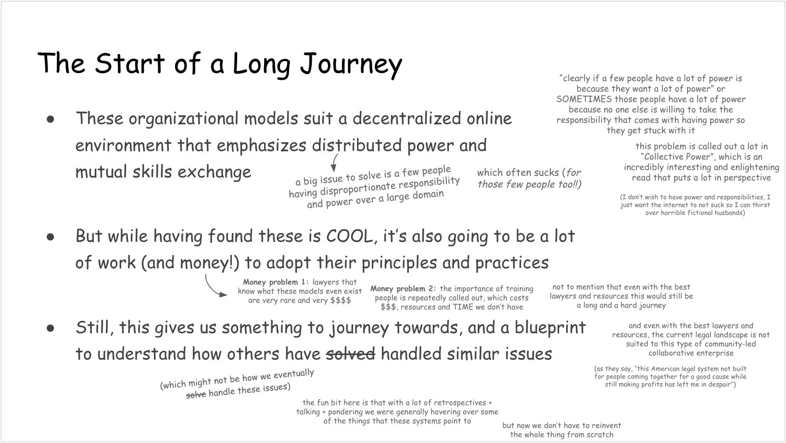

Anon on Tumlbr asked:

> Hello, your proposition about ethical business really intrigued me, and thank
> you for pointing my way to the Sustainable Economies Law Center! I really
> wanna learn more about this, but I don't really know where to go, do you mind
> sharing if you have any more sources of reference?

Thank you for asking, anon! As it turns out, you just activated one of my ~~trap
cards~~ special interests. So, time for a story, an infodump, and the public
unveiling of my Extravaganza #4 slides.

## Searching for Wisdom

When I started working on better online spaces, I knew that to tackle a problem
of that size I'd (eventually) need to form an organization to oversee the
effort. Despite being a much more innocent, bright-eyed software engineer whose
experience predominantly came from within large corporations, **I had heard plenty
of horror stories about independent efforts degenerating into a mismanaged mess,
and was determined to figure out how to avoid this happening.** After all, my goal
was to build an organization that would carry forward my ethical principles in a
way I could be–ideally, _remain_–proud of.

My plan was overall straightforward: go very, very slow, find more experienced
people to hound with questions, then, after finding the organizations who are
Doing It Right™, copy their homeworks. After a lot of false starts, however, I
came to a realization: in the overwhelming majority of cases, organizations
haven't _really_ figured out how to solve the problems that come when many
people are working together towards a goal[^0]–no matter how much _everyone_ in
it cares about the goal and wants the effort and organization to succeed.

## The Truth about Organizations

Nowadays, I believe that organization don't start "good" and become
dysfunctional through the incompetence of misguided individuals; instead,
without someone desperately working to remain ahead and pull them out of
inevitable issues, they naturally devolve into chaos. Managing an organization
is a countinuous struggle against the tendency groups of humans have to go
against the best interest of the collective.

Now, I imagine this could come across as a misanthropic position. I don't
believe that's the case. In a perfect world, humans would have their needs met,
their lives stable, and would be taught effective collaboration and collective
governance as they grow up. Instead, we're all operating in a world that's
crumbling around us, while carrying around intergenerational work trauma born
out of a world where people build empires on the shoulders of those below them.

In this situation, even if you want to build the best, most stable organization,
how are you supposed to _know_ how to do it? And even if you set out to be
better at it than most–_more careful, more understanding, more informed_–how are
you supposed to continue doing it while the amount of people bringing their own
baggage in grows, and you find yourself shorter and shorter in time and emotional
energy?

## Looking Beyond the Web

At my most frustrated, I would have almost told you this is an impossible problem
that no one quite knows how to solve. However, by almost accident[^1], I found out
about two different (but similar!) ways to run businesses and organizations that are
currently being researched and popularized:

- **[Teal Organizations](https://en.wikipedia.org/wiki/Teal_organisation),** an
  organizational theory centered on worker autonomy and peer relationships.
- **[Sociocracy](https://en.wikipedia.org/wiki/Sociocracy),** a theory of
  governance centered on consent and psychological safety.

Now, there's _way too much_ I'd want to infodump on when talking about these
paradigms. However, I'll have to leave that for another article. Instead, I'll
try to give you pointers about where to learn more[^1_5], and attempt to not be
carried away.

### Teal organizations

Teal organizations have been studied by Frederic Laloux, a former McKinsey
partner[^2], for his book [Reinventing
Organizations](https://www.reinventingorganizations.com/). Compared to the books
on Sociocracy (in the next section), "Reinventing Organizations" is targeted
towards a business management public, and it's a 500-page read I struggle to
reccommend to people who aren't used to them. _All of that said_, both this book
and its illustrated version (a lighter read, but still not great), are available
as ["pay what you want"](https://www.reinventingorganizations.com/pay-what-feels-right.html).
So, if you're curious, do consider downloading them and giving a read to the sections that
look interesting, or to the end of chapter summaries. Skip Part 1 and go directly to part 2.

### Sociocracy

While Sociocracy has a deeper history than Teal organizations, I've found out about it
(and got most of my information) from [Sociocracy for All](https://www.sociocracyforall.org/)[^3],
a nonprofit dedicated to promoting sociocracy as a sustainable way of governance. They have
[a lot of different books](https://www.sociocracyforall.org/books/) available,
but here's two I recommend:

- [Many Voices One
  Song](https://www.sociocracyforall.org/many-voices-one-song-2/), a
  "comprehensive manual covering all topics relevant to sociocracy in
  organizations." This is bigger than some of the very small books they have,
  but not huge. While it acts as a manual, it also explains the theory behind
  the governance models it proposes, and it will definitely provoke thoughts and
  provide valuable insights even if read "recreationally".
- [Collective Power](https://www.sociocracyforall.org/collective-power/), a book
  on "effective collective building principles, that highlights unity, power
  sharing, and governance as crucial for impactful change". This is a lot more
  theoretical than the previous book (and much longer), but it's an incredibly
  enlightening exploration of the problems that arise when trying to work collectively,
  and what can be done to lessen them.

You can find the table of content for both books at the link. There are some free
sociocracy resources on their website too, but I haven't personally made use of them[^4].

## Knowing the Path vs Walking the Path

While I'm obviously very happy about having found these systems, I'm always
somewhat nervous about sharing them without caveats. Indeed, while having found
guidance makes the journey _easier_, it doesn't (unfortunately) make it _easy_.
As we move to understand how we can implement these system in the
organization(s) me and my allies are building, the complexity of fitting these
systems within our limitations remains daunting. You cannot simply read a book
and implement it, and there are unique (and less unique) challenges we face that
make this an uphill climb.

Unfortunately, I believe, people are often less charitable with people who try to
do things right and fail, than with people who just

### Issue 0 – Money

Let's get it out of the way: the answer to a lot of "how do we...?" can be
straightforwardly solved by throwing money at the problem. Whether it's hiring
someone who can get things done efficiently and independently, paying for the
help of an expert, or buying classes (or books) for collaborators[^5], money is
a convenient way to make a hard journey easier.

Most importantly, however, money buys _time_. Time to figure things out, time to
try and fail, and time to eventually learn how to succeed.

Without money–_tale as old as time_–progress is harder, slower, and more
brittle.

### Issue 1 – "Unfortunately, as you probably already know, people"

More originally (and yet somewhat still obviously), "the tendency of people to
be, well, _people_" is a huge barrier in creating an organization that works. As
I've touched upon in the beginning, society does not equip us for the inevitable
difficulties of working collectively towards a shared goal.

Even further, the reality of a life under capitalism is incredibly stressful for
everyone involved.Especially with a group that is so heavily full of
neurodivergent, disabled people whose life can becoem chaotic at any minute, and
have often been full of trauma and rejection, it's easy to accidentally step on
each other's toes. And even when no toes have been stepped on, we're still
fallible. We have bad days, we say the wrong thing, we misunderstand. And rifts
take time and energy to heal.

### Issue 2 – Trust and Psychological Safety

### Issue 3 – Skin in the Game

## How to Help

[^0]:
    The pattern generally went like this: Ms Boba, eyes shining bright, finds a new
    organization with an interesting management system . Some time later, some news
    comes out about the organization's internal struggles, and she realize those who she
    thought "got it" don't actually "got it". Rinse, repeat.

[^1]:
    A friend of a consultant I hired recommended me a book on building organizations, and
    I miracolously remembered to actually buy it 3 months after being told about it.
    Take that, ADHD.

[^1_5]:
    If you want to skip the reading and just be reccommended _one_ book, my vote for a
    committed but casual reader goes to [Collective Power](https://www.sociocracyforall.org/collective-power/).

[^2]:
    If you've never heard about McKinsey, John Oliver dedicated [an episode to
    them](https://www.youtube.com/watch?v=AiOUojVd6xQ). I mention them here
    because, while I 100% believe amazing people can work for unethical companies
    (and even end up radicalized by the experience), Laloux's line of work explains
    the context he's coming from in his research. Don't let this stop you from reading
    the book and learning more about Teal Orgs though. It's _great_ stuff.

[^3]:
    Funnily enough, I found out about Sociocracy for All from [a
    newsletter](https://enliveningedge.org/browse-topics/) that I found out about
    from resources on Teal Organizations. If this all sounds connected, it's because
    it is. While these are different systems, once you learn about them both,
    similarities start emerging.

[^4]: Clearly you don't need _free resources_ when you have a book-buying problem.
[^5]:
    Both the sociocracy and the teal organizations books call out "training" as
    one of the "must have" requirements for the successful onboarding of employees.
    Among the training they both emphasize is effective conflict resolution, which
    is something I've seen people repeatedly struggle with in our communities, and
    that I wish I had money to train everyone in.
