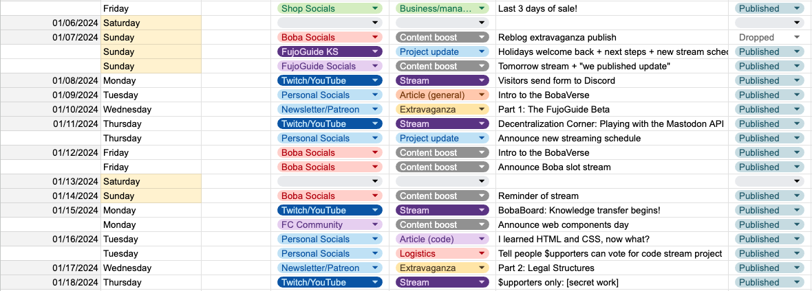
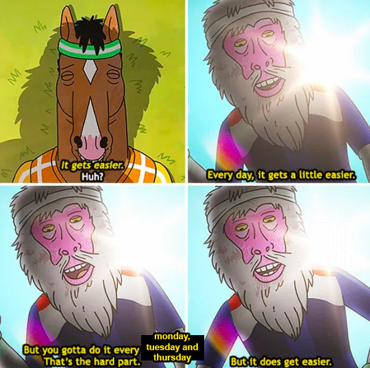
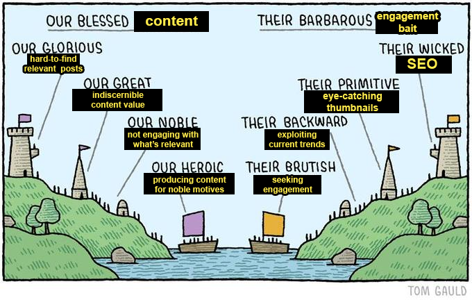
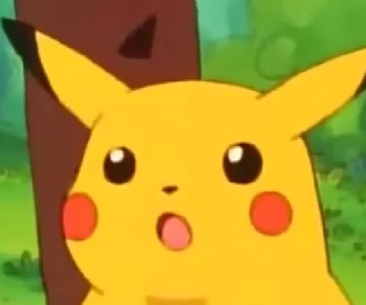
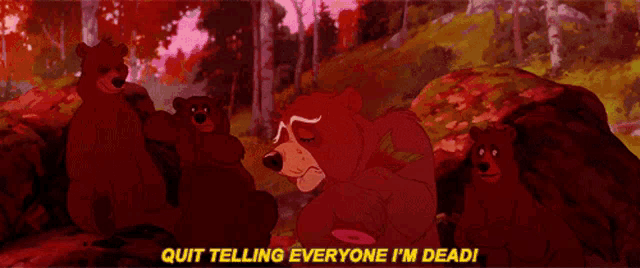

## Content calendaring: the good, the bad, and the practical

As you might/might not know, my new year resolutions included keeping a content
calendar for every month of 2024, and do my best to stick to it and
_finally_ publish content in my blog.

<figure>

<figcaption>

A screenshot from my content calendar, featuring my content creation schedule
for January 2024.

</figcaption>
</figure>

While I had tried and very much failed to keep such calendar before, **this year
I managed (_at least as of January_) to push through my past hangups and deliver
some Juicy Content™**. While this was an emotionally charged journey, I'm happy I
took the plunge and somewhat landed on two feet.

 Bonus: what changed this year

1. **I got practice:** promoting the FujoGuide Kickstarter was an incredible
   amount of work, the most grueling part of which was maintaining a calendar
   and writing content every day for a month straight. As usual, at least for
   me, "swim or sink" is a very efficient, (mostly) "enjoyably stressful" way to
   learn.
2. **I got schooled:** in December, I did a small content trial: I tried
   streaming twice a week for a month straight. Unfortunately, I'm sad to report
   that "you need to publish on a consistent schedule to grow a public" is not a
   Big Content™ ploy to personally vex me.
3. **I got motivated:** tl;dr, I gave myself until August to prove to myself
   that [my ambitious
   plan](https://www.essentialrandomness.com/posts/enter-the-fujoverse) _can_
   work. Unfortunately, I realized, people cannot support what they don't know
   about–even if telling them about it takes time and energy away from working
   on the thing itself.

With this article, I want to share a few thoughts on what [was good about this month](#the-good),
what was [less good](#the-bad) about it, as well as some hard numbers on
[what the result was](#the-practical).

## The good

### I learned to care about the who and why

As "the poster child for ADHD", my time (and energy reserves) often feel like
vague, nebulous entities with little bearing on reality. Filling limited calendar slots
with scheduled articles, however, forced my brain to realize that there's a limited
amount of content I can produce in a month[^1].

It's known that adding constraints often makes broad problems easier to tackle.
In this case, **the limited space on the calendar forced me to ask the question:
_what does truly matter to people out there?_** What is important for them to
know? What can I write in these limited slot that will resonate with them? I
can't say I'm good at answering these questions, but I'm glad I'm now asking
them.

Asking these questions gave me a new appreciation for those who create content
for a living. For many reasons, people often look down on content creators and
take pride in "being bad at socials". However, I've come to see it as an
important (and trainable) skill: **done with empathy, content paves the way to
genuine connection and dialogue.** Every article is an excuse to start a
conversation with a broader community, and to engage with them through new
knowledge or perspectives on topics they care about.

### I wrote useful things and got some good software done

At this stage, my job _is_ content production. Writing useful software or
plotting brilliant organization-building plans is secondary to the most
fundamental goal: gain people's support so we can continue writing useful
software and plotting brilliant organization-building plan.

However, if there's one thing I like doing is, as they[^2] say, _"bait two seme
with one uke"_. **By working at the intersection of "what's useful to our team
goals" and "what supporters outside might care about", I was able to work on
things I felt truly mattered**, like [putting an ambitious plan into linear
words](https://www.essentialrandomness.com/posts/enter-the-fujoverse) [^3],
showing beginners [they can aspire to more than simple
websites](https://www.essentialrandomness.com/posts/html-css-what-next) [^4], or
educating people on [topics they're unlikely to seek out on their
own](https://www.essentialrandomness.com/posts/extravaganzas/2-2-llc-vs-nonprofit).

Similarly, maintaining a streaming schedule allowed me to make progress on the
software I need to build, while teaching people to build theirs at the same
time. **Nothing says "what you're doing makes a difference" like seeing a
used-to-be-beginner put together concepts they learned through "listening
osmosis"**, and realize they now understand web development at a deeper lever
than they ever thought possible.

### I survived! (somehow)

Aside from the crushing abyss of a blank page to fill, which strict deadlines
help me get over, **my least favorite part of creating content is dealing with
the (perceived) sense of rejection from putting it out there and getting little
practical interaction back.** This is a struggle for everyone (especially with
social media as it exists now), and I hesitate to say I have it worse than
others here. However, it _definitely_ impacts me more than I wished it did.

What's helping me get over it, aside from getting practice, is understanding
that **producing content behaves like a compound interest[^5], and "money"–or,
in my case, "Patreon support"–is a lagging indicator[^6] of doing a good job at
it.**

<figure>

<figcaption>
  The monkey in my brain reminding me that the best way to get over the
  emotional turmoil of producing content is to keep producing more of it.
</figcaption>

</figure>

While some days of publishing still feel better than others (and likely always
will), I believe this will get better with time. After all, so many aspects of
building communities and leading projects that I can easily juggle now, used to
be a great source of stress just a few years ago. **Regardless of how my
feelings about content will evolve, however, what matters is "I survived January
2024".**

_One month down, eleven more to go._

## The bad

### Social media is broken

While proclaiming that "social media is broken" states the obvious, the
experience of producing content made me appreciate it to a whole new level.
First, Tumblr's demise [^7] scattered my community (transformative fandom) to
_"more nipple-y"_ social pastures; then, Twitter's current "whatever that is"
gave it the final stab. **So how can I reach people where they're at, if "where
they're at" is _everywhere_ and at the same time _nowhere_?**

Don't get me wrong: **I'm the first one to say that _less people_ on _more
platforms_ is great.** However, it's clear that technology has yet to catch up
with the current situation, and it's harder and harder for people to find
community within this scattered and often hostile landscape. **When you don't
have a community, it's harder to feel your interactions with others matter to
them**, and the resulting isolation acts as a downward pull making interaction
even less likely.

Thing is, **I believe many people did not replace the social networks we lost
with new social networks.** Instead, they replaced them with Discord server
(where communities can still be built) and, when they go back to these
platforms, with a quick, often-mindless catch up that leaves little space for
meaningful interaction.

Honestly, I'm sure that the lack of engagement is partly a _skill issue_. Trying
to understand how creators can engage other people on these platforms also made
the "necessary grifting (affectionate)"[^8] stand out more. **There is an art to
growing a public in the current online world that I'm still trying to square
with my own personality and priorities.** While I believe it is possible to do
this in a way that doesn't make me feel "dirty inside", part of that is
unlearning a cultural mistrust of "those who want to build a public and their
dirty tricks".

<figure>

<figcaption>
  I know this is not exactly how the meme is supposed to work, but it does
  convery how I feel we often think about "professional" content creators.
</figcaption>

</figure>

### "One must imagine Sisyphus happy"

**This is now my standard response when I'm asked about my feelings on this
whole "content production thing".** The long story short is that I got sick for
a couple of days a week ago, and my precious content schedule has been in
disarray ever since. This post is late, the one scheduled for last week has been
completely abandoned, and despite all this I still feel like I'm playing catch
up. **Pushing a boulder up a hill just to see it slide back down when you think
the end is in sight is an apt metaphor for content creation these days.**

When I worked closely with people who worked closely with "influencers", I often
heard stories of burnout laying just below the surface. Too many platforms to
manage, the inability to stop under treat of newfound irrelevance, and the risk
of parasocial relationships always looming made me wonder why would anyone even
_want_ to do this. If I hadn't been forced in this position by my desire to
change the trajectory of the web, I wouldn't be here. However, this would also
be a loss: **if important ideas are had in a forest and there's no one there to
hear them, do they make an impact?**

With time, I hope my schedule will become more sustainable. After all, one of my
main focuses this year is removing myself as the unfortunate (but until now
necessary) bottleneck of the projects I lead. Hopefully, **I will soon be able
to share the load of communicating the value of what we're building, so I can
kick back and return to shitposting about my blorbos.** That is, after all, what
the internet is _truly_ about.

### "How do you do, fellow people?"

I've mentioned my ADHD a couple of times already, and with good reason: nothing
makes me feel like an outsider as much as trying to understand what "regular
people" care about. Indeed, **while "masking" and "hyperfixations" are most
often discussed in regards to autism, ADHD people also often share these traits
and the associated diffuculties.** And so, while I've made progress on aligning
what I write with what I believe people want to hear–and I'm glad I did!–I still
struggle with feeling like I even _know_ what that is.

Among the many reasons I'm so attached to the internet and fandom is that, like
they do for many other neurodivergent kids, **they gave me a space where my
encyclopedic knowledge of whatever piece of media I was fixated on was not seen
as _weird, if not a nuisance_.** While I could (attempt to) seem like a
professional software engineer in my everyday life, "online fandom" was the
place where I could just _be the way I am_. After all, my ability to infodump
about my latest hyperfixation at 100 mph never meant most people _wanted_ to
hear me infodump at 100mph.[^9] That is, unless that infodump included
very–let's call them _"colorful"_–things happening to fictional characters.

Now, **with my identities clashing, I'm forced to learn how to translate between
two worlds that were never meant to touch.** When my current hyperfixation is
reading 500 page business management books, it's hard to engage the fandom world
with _that_. But when I try to talk with "business people" about what I'm doing
without fully reverting to a professional persona, I can feel them smelling the
fandom gremlin on me.

I don't have a solution to this (yet). While I believe one exists, the easiest
path to spot involves being so good at what you do that people are able to look
past–and in a way _forgive_–your weirdness. But, while I don't know whether I
can indeed get there, I hope the content I'm writing will help me understand how
to straddle these two worlds, and maybe help me make them just a little bit closer.

## The practical

Now, with all those words out of the way, it's time for some stats! With such small
numbers it's hard to know whether the data has any significance, but who doesn't love
seeing some hard numbers?

### $upporters by platform

Here's the $upporters stats for January:

- **Patreon:** +6
- **PayPal:** +1
- **Stripe:** 0

I'm surprised at how much more popular Patreon is compared to my self-hosted option. You
really can't beat convenience.

Additional stats:

- 3 ko-fi tips
- +17 followers and 2 subscriptions on twitch (for a whooping $5.5 in revenue)
- +20 followers on tumblr

### Content reception

**Most of the new $upporters came from the ["enter the
fujoverse"](https://www.essentialrandomness.com/posts/enter-the-fujoverse)
article**, which makes sense because it debuted what me and collaborators have
been working towards in a package finally understandable enough to support.
Another small bump also came after the ["LLCs vs
nonprofits"](https://www.essentialrandomness.com/posts/extravaganzas/2-2-llc-vs-nonprofit)
article, which received little overall engagement but a lot of positive feedback
by those who did read it (tl;dr: "I learned things I didn't know I needed to learn").

**A good percentage of $upporters came from people personally reccommending my
work to others.** If you ever wonder whether your word of mouth matters, the
answer seems to be that it does. A lot.

**My most popular post was ["I made some pages in HTML and CSS, now what?"](https://www.essentialrandomness.com/posts/html-css-what-next).**
I believe the eye-catching title has a lot to do with it. However, compared to the other
two, this article resulted in no new $upporters (at least not directly).

**My most successful stream was _definitely_ "playing around with the Mastodon API".** I guess
decentralization topics are very relevant to the current zeitgeist of people who care
about the same things I do. We'll see if this remains true with this month's edition
of "decentralization corner" (even though we're cheating on ActivityPub and learning @proto).

## Conclusion

Whether it eventually turns my projects into a viable monetary path or not, I'm
glad I took the plunge and started this experiment in content publishing. **This has
been a learning experience, and hopefully will continue being such in the _eleven
additional months_ I'll be doing this for.** I hope by the time the year is over
producing regular content will have become second nature, so I can continue reaping
its benefits without as much pain.

I'm looking forward to learning more about the world of and skills required by
content creation, but above all to continue this journey with you all. In the meantime,
_onwards to February!_

[^1]: 
[^2]:
    By "_they_" I mean "_me_". I say this, and I'm not going to stop until
    others do too.

[^3]:
    The reason my content is often delivered through Power Point presentations
    is that my thoughts are very non linear, which makes communication a
    struggle. #ADHD

[^4]:
    I've been trying to die on this hill for a very long time: while there's a
    lot of people reminding beginners that they don't need complex set ups to
    start building with code, we don't have enough people telling them that
    they–_yes, they_–can tame those more complex set ups and build things they
    can't even dream of yet.

[^5]:
    The more content you accumulate, the more results you see from your larger
    content production. In an environment that's less ephemeral than modern
    socials (like this blog), the content of yesterday continues producing value
    tomorrow.

[^6]:
    A lagging indicator happens when the results of the work you do _today_
    will only be visible _sometimes in the future_. The hope is that page good
    content now will eventually materialize in a sustainable public, even if
    some days this feels like a pipedream.

[^7]: (Tumblr voice) 
[^8]:
    Eventually, understanding how to navigate the "attention economy" is
    unfortunate but necessary. If you have content you want to be seen, you must
    work to present it in a way that makes people out there want to engage with
    it more than the other content out there. "Hate the game, not the player"
    and so on.

[^9]:
    If nothing else, having to produce content on a strict schedule has forced
    me to cut back on the length of my blog posts, which is helpful to both me
    and readers. No, seriously, I'm sorry my blog posts used to be that long
    (for both me and readers).
