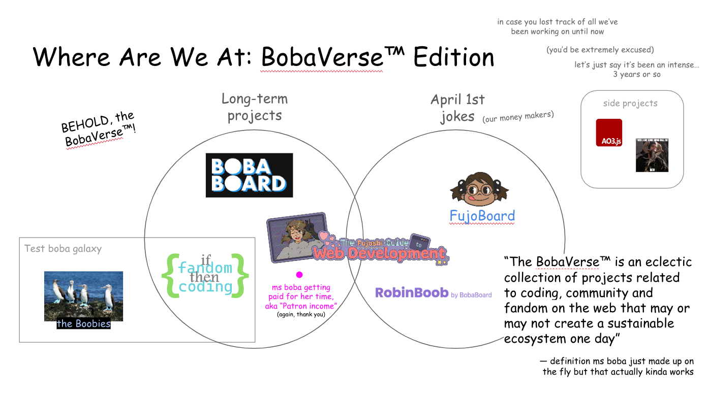

## What is the ~~Boba~~FujoVerse™

The FujoVerse™[^1]–previously known as The BobaVerse™[^2]–is "an eclectic collection of
projects related to coding, community and fandom[^3] on the web". In this series, I want
to give an eagle-eye-view of this ecosystem, and how it works to accomplish its goal:
**turn the web back into a place of fun, joy, and connection, where people build
and nurture their own communities and software.**

<figure>
  
  <figcaption>
    Slide introducing the FujoVerse™, from [the first edition of my
    quarterly(ish) newsletter](/posts/extravaganzas/1-now-its-time-to-find-out)
  </figcaption>
</figure>

## The Pillars: Community, Software Ownership, and Technical Education

[The FujoVerse™ projects](/projects) evolved over time, based on what I learned
building each piece, making friends and allies, and reading anything I could
find on related topics. While ambituous goals that tackle complex systems
cannot have too-tight roadmaps, these efforts have hovered around a few fundamental
pillars:

### Community

There's many issues that come together to make the modern web feel like a "joyless
landscape", but **a core and often-underestimated problem is the abscence of
_true communities_.** Indeed, while the hyper-connectedness of contemporary
social online spaces may trick us into seeing these as such, their shape makes
it hard (if not impossible) to build the necessary group identity, shared norms,
and mutual concern between their members[^4].

Research shows that **the lack of true community heavily contributes to
loneliness and social isolation we feel in the modern days**, even in the online
world. This adds to the disenfranchisement felt by many users, and keeps them
disempowered and stuck in a loop of helpless, often-misdirected anger at one
another. (Re)building communities is required to change how we feel and
interact on the web.

### Software Ownership and Collaboration

The needs of niche online communities are, well, _niche_. While software built
by big tech companies is increasingly at odds even with mainstream users, the
current dynamics disproportionately impact marginalized groups and communities.
**To build software that responds to their own needs, members of niche
communities must be able to shape this software themselves.**

As we know, however, this challenge is not only technical[^5]: solving it means
building structures and processes for constructive collaboration, both within
each community and accross different ones. Unfortunately, **effective
collaboration requires both trust and psychological safety.** As communities
erode, and the web and social systems break down, building safe, stable spaces
for collaborative work (an already-difficult problem) becomes more and more
complex.

### Education (Technical and Beyond)

To shape their own spaces, members of niche online communities need to know how to
build and maintain their own software. Unfortunately, most educational material
for web developers targets people who seek a professional career, or hardly
moves past simple HTML and CSS pages (with maybe a sprinke of basic
JavaScript)[^6]. **To change the web, we need highly-technical education that
speaks the language of hobbyists**, supports and encourages their desire for
mastery, and carries them across the gap from beginner to intermediate builders.

Once again, the need for education goes beyond the technical realm:
from community building to conflict resolution, from negotiation to effective
(and kind) communication, from marketing to project management, **niche
communities need many different skills to build a better future for themselves
and the web.** In a world that doesn't equip many of us with these skills, we
must build approachable and trusted resources to learn them from.

> **Note:** In more than one way, these pillars also intersect with _open source software_
> and _decentralized protocols_.

## The Future: Help Build the FujoVerse™

Despite all that we've already built, **The FujoVerse™ is still in its
inception.** We have a long road ahead of us to support the collaborators that
make our project possible, and to continue making an impact in 2024 and beyond. To
this end, **this year I'm focused on building a larger public to find new
supporters and sponsors.** If you believe that a better web is worth fighting
for, you can support our work [on
Patreon](https://www.patreon.com/essentialrandomness) or [by subscribing through my
own alternative](https://www.essentialrandomness.com/support-me#donate). If you
wish to donate more, you can [reach out to set up a custom
sponsorship](mailto:essential.randomn3ss@gmail.com).

In the long term, given the opportunity and finances to do so, **we believe we
can build profitable projects that will be able to independently sustain our
mission.** After all, the people who contribute to The FujoVerse™ have a unique
perspective that speaks to the needs of the web and its netizens in a way that
no mainstream company can replicate. While the road to manifesting and
harnessing their power will be difficult, nothing ambitious has ever looked easy
from the starting line.

<figure>
  
  <figcaption>
    Slide explaining the masterplan, from [the first edition of my
    quarterly(ish) newsletter](/posts/extravaganzas/1-now-its-time-to-find-out)
  </figcaption>
</figure>

[^1]: Not a real trademark
[^2]: Also not a real trademark
[^3]:
    "Fandom" should be considered a stand-in
    for "_niche online community_". While my work centers around
    ["transformational/shipping
    fandom"](https://fanlore.org/wiki/Transformational_Fandom) (because that's
    my own online niche), the projects, principles and lessons are applicable beyond it.

[^4]:
    This will be an article at some point. For now I suggest reading [The Art
    of
    Community](https://bookshop.org/p/books/the-art-of-community-seven-principles-for-belonging-charles-vogl/12472751),
    or (if you can stomach business speak) the excellent [Building Brand
    Communities](https://bookshop.org/p/books/building-brand-communities-how-organizations-succeed-by-creating-belonging-carrie-melissa-jones/11208654),
    from the same author.

[^5]:
    The challenge is not only technical, but it is (alas) _also technical_. A
    baseline of technical skills and understanding empowers people in other
    roles to become more active and informed partecipants. It's important that
    we nurture these skills, just like we must nurture non-technical skills in
    tech-oriented folks.

[^6]:
    Sometimes people push against this point by listing various existing
    resources. However, after spending three years and counting mentoring
    hobbyist coders and nurturing a community dedicated to their growth, I
    continue being confident in this assessment.

