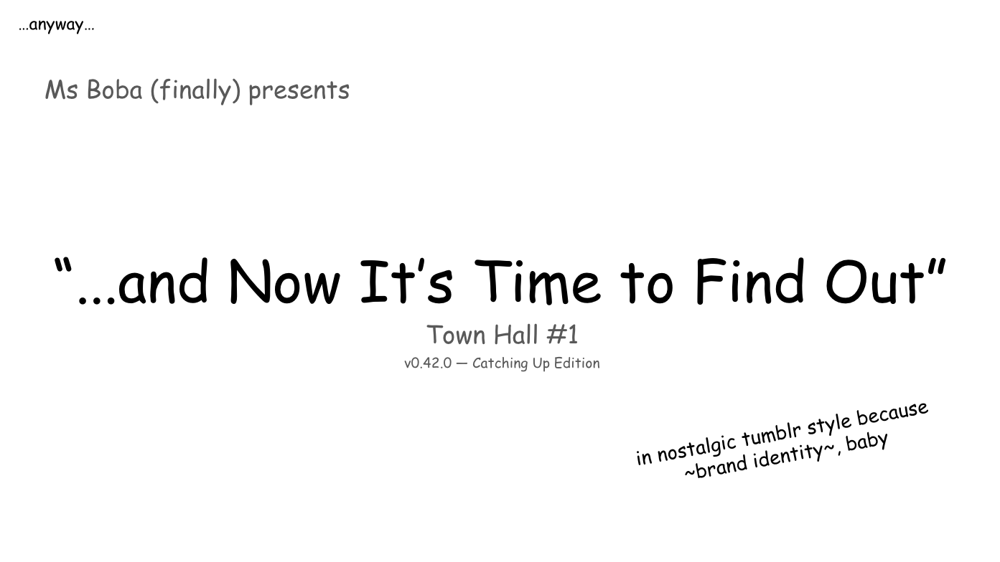
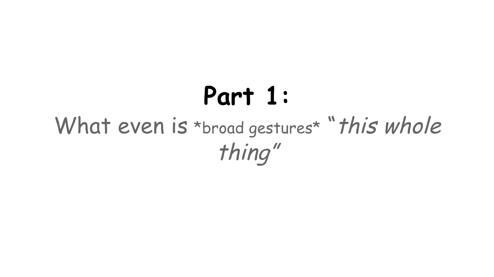
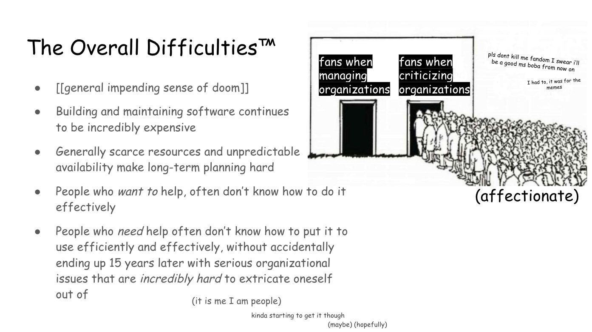
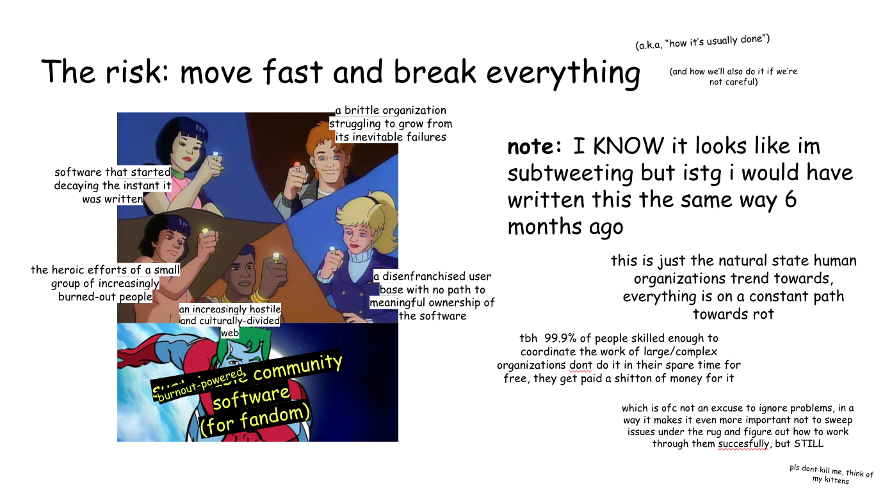
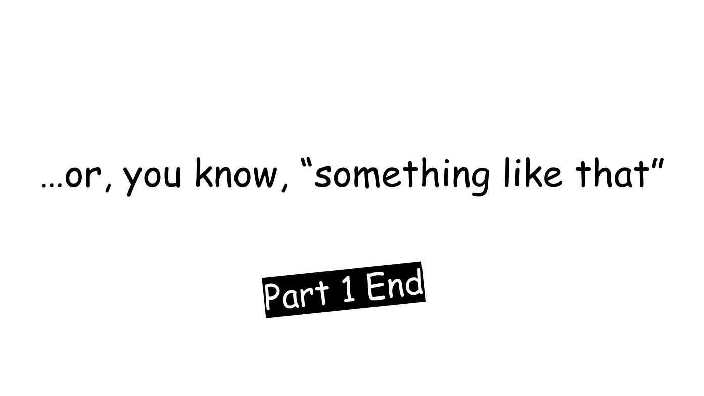
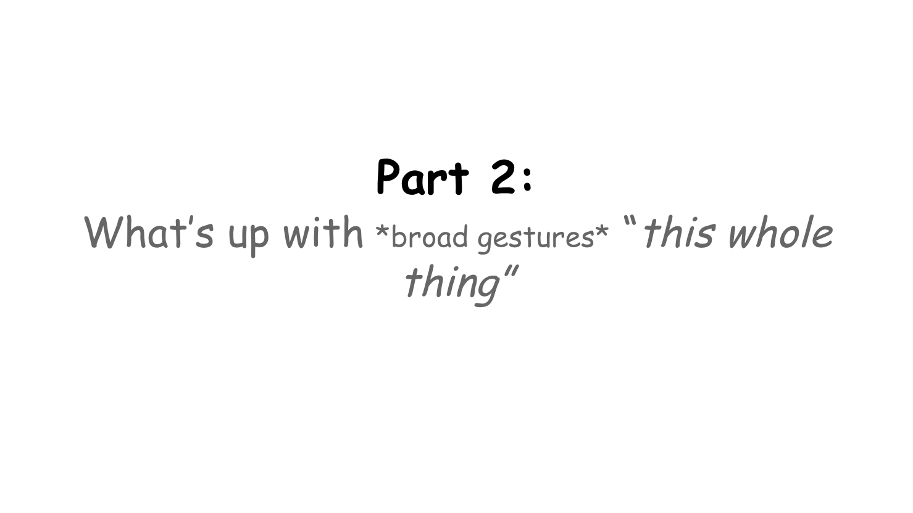
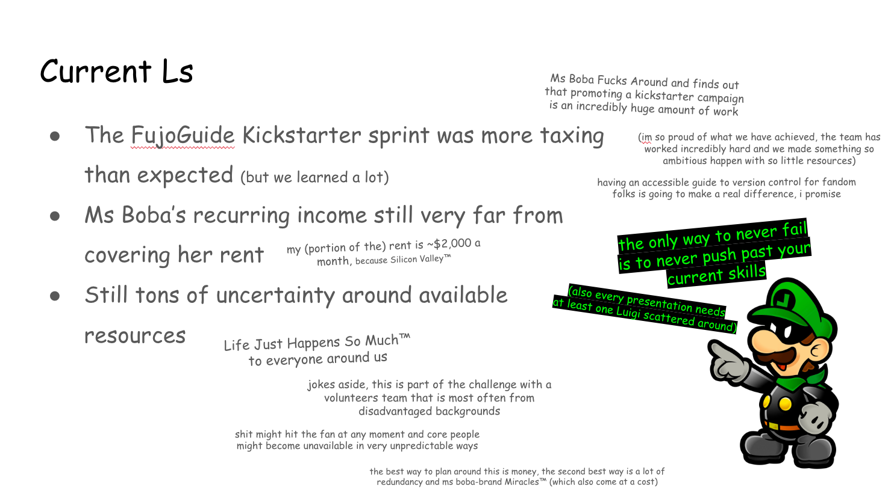

  
OwO What's this?

This is a commented version of the first edition of my newsletter/town hall. It
was originally published in July 2023, and I'm only now getting to making it
public. If you want new editions of this Town Hall straight into your inbox as
soon as they're available, you can support me on [Patreon](!link:patreon),
[Ko-fi](!link:kofi) or [this same website](/support-me)!

## Intro

Fashionably late (or, better said, just in time for the second edition), it's
time to finally release my $upporters-only Town Hall to the world, "...and Now
It's Time to Find Out" edition!

Follow along this blog post to learn more about the BobaVerse (but heed the
ground rules).

## Part 1: What is the BobaVerse?

### The BobaVerse™

As the slides say, "the BobaVerse™ is an eclectic collection of projects related
to coding, community and fandom on the web that may or may not create a
sustainable ecosystem one day". We took all we learned while [building up the
BobaBoard community](/projects/bobaboard), and envisioned a future where !

### Building it Slow

Getting any project to sustainability is hard, but getting a project off the
ground in this internet (and fandom) environment is a particularly thorny issue!
Doing it slowly is fundamental to success, but doing it slowly is not easy
either! Many issues loom at the horizon.

### A Different Approach

With all the complexities of building sustainable community-driven software, The
BobaVerse™ wants to do things differently: rather than just building another
unsustainable social platform with disenfranchised users, it seeks a
self-sustaining ecosystem that involves them in the building process (and gets
more underrepresented people into open source at the same time)!

## Part 2: Where is the BobaVerse at?

(or better said, "where was the BobaVerse at in July 2023, when this was
written?")

### The Fundamental Question

While a vision like this poses a lot of questins, the most important one is
fairly simple: can this all be setup for success before I run out of money and
have to go back to sell my <abbr title="Over Powered">OP</abbr>
business/programming skills to some VC-backed company?

### Learning, Failing, and Learning Again

The process of getting to sustainably build things is a treacherous and complex
one, and one that must account for the (unfortunately inevitable) failures along
the way. Learning is a fundamental part of the building process!

We fail, we learn, we get up, we go back to trying (see [our retrospectives
process](https://docs.bobaboard.com/docs/volunteering/general/retrospectives)
for more details)!

### Our Wins

In the first half of this year (before this was published), we got quite a few
wins under our belt! The highlight of which is [The Fujoshi Guide to Web
Development](/projects/fujoguide), our successfully Kickstarted guide to Git and
GitHub that will help us clear the highest hurdle to collaboration: teaching
Version Control to a whole new set of people!

### Our Losses

We also had a few Ls, which we don't shy away from! For one, the Kickstarter was
an immense (but worth it) amount of effort; I'm incredibly far from covering my
rent (so she can keep at this); and life just Keep Happening™ to all volunteers,
which makes collaboration hard!

### How to Help

So how can you help? Well, we did have some requests, and we did get help with a
bunch of them! Right now (for how uncomfortable that is to say) the main thing
we need is recurring income. Our runway is getting shorter, and every little bit
helps us focus on building and not fundraising!

## Bonus: What we Learned Running a Kickstarter Campaign

Since content creation takes a long time (and I need to entice people somehow),
I'm keeping bonus question content as subscribers-only! If you're interested in
reading it, make sure to [subscribe to one of my support channels](/support-me)!
At this stage, you'll also need to ask me for a link, since old editions aren't
automatically sent out (working on it).

...and that is all for this edition of Ms Boba's Whimsical Extravaganza!

Like what you read? Help by sharing it on socials!

- [Twitter](!link:twitter)
- [Tumblr](!link:mastodon)
- [Mastodon](!link:reddit)
- [BlueSky](!link:reddit)

And remember to [subscribe to one of my support channels](/support-me) to get
the next edition straight into your inbox!

