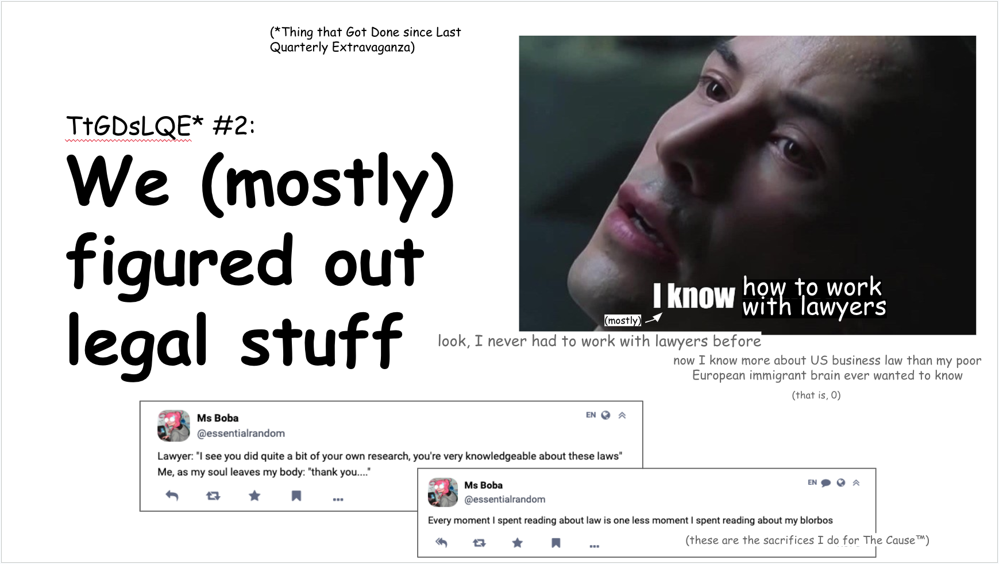
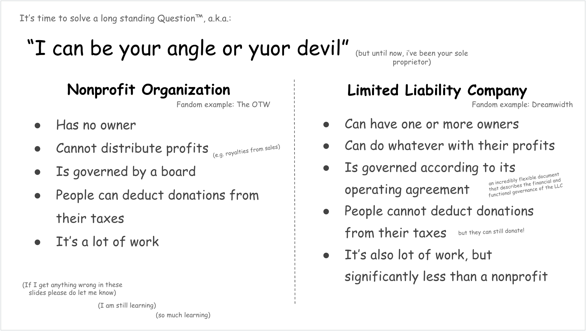
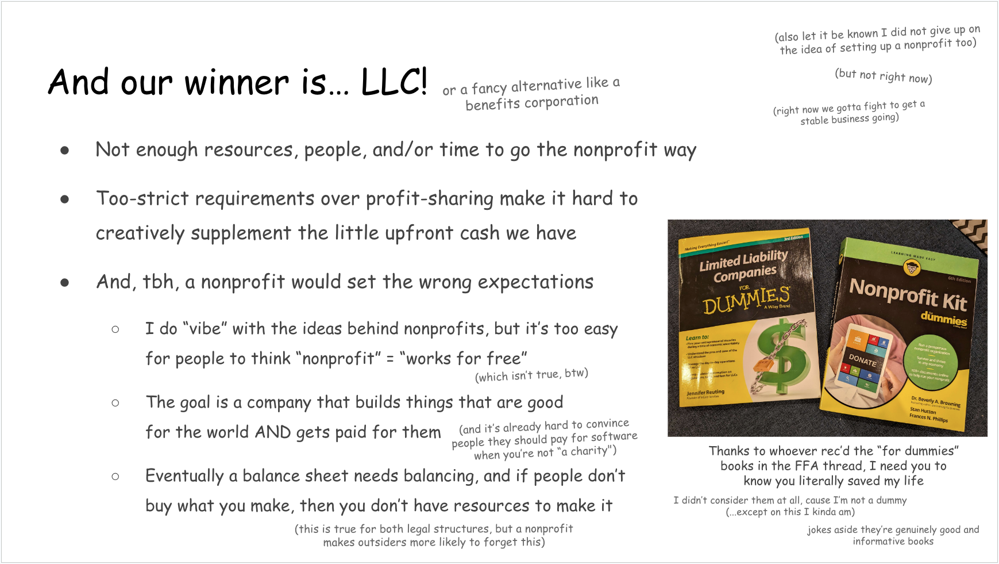
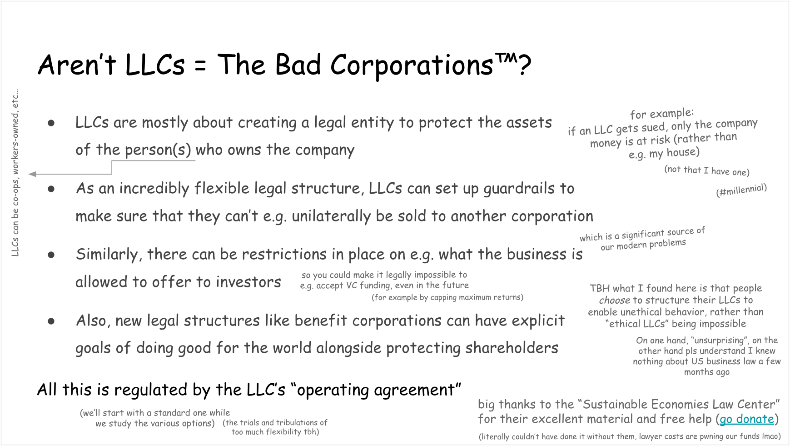

  
OwO What's this?

**This is a commented version of the second edition of my $upporters
newsletter/town hall/"quarterly extravaganza"** (or at least of one of its sections).
It was originally published in January 2024, and it's now public. If you want
new editions of this Town Hall straight into your inbox as soon as they're
available, you can support me on
[Patreon](https://www.patreon.com/essentialrandomness) or [this same
website](/support-me)!

Prefer to read (or share) on socials?

- [Twitter](https://twitter.com/EssentialRandom/status/1730008152652075403?s=20)
- [Tumblr](https://www.tumblr.com/essential-randomness/735367619946987521/ms-bobas-quarterly-extravaganza-1-intro?source=share)
- [Fediverse](https://indiepocalypse.social/@essentialrandom/111496528300906386)
- [BlueSky](https://bsky.app/profile/essentialrandom.bsky.social/post/3kfegvmpx7g2b)

  
Warning: Missing Feature!

  **You cannot enlarge images on this blog yet** (alas). Do make generous use of
  "open image in new tab" on browsers, "pan to zoom" on mobile, or ignore the small
  text and focus on the–literal!–big picture.

## Town Hall 2 part 2: We (mostly) figured out the legal stuff

Since the dawn of [the BobaVerse project](/posts/enter-the-fujoverse), there was one
question in the back of my mind: **in the long term, should these projects be under a
nonprofit or a regular business?**

For a long while, this question stayed unanswered. Then, after FujoGuide's very succesful
[Kickstarter campaign](https://www.kickstarter.com/projects/essential-randomness/the-fujoshi-guide-to-web-development)
showed us we were "in for the long run", it became time to finally answer it.

The challenges were many: for one, I had never worked with lawyers before (not even in my
home country); then, as the lawyers themselves said, "the legal system is 20 years behind
the type of project you're trying to build"; last, (in case you're not aware) lawyers are
_really expensive_.

However, with the usual grit, determination, and lots and lots of reading, we eventually made
a choice.

Here's what we learned.

### Nonprofits vs LLCs

One obvious first step was looking at the path chosen by other fandom-adjacent
entities. As people might know, Archive of Our Own (the biggest fanfic archive,
popularly known as AO3) is headed by The Organization for Transformative Work, a
_nonprofit_ organization dedicated to the preservation of fanworks. Conversely,
Dreamwidth (a social network for fandom born on the wings of Strikethrough) went
with an LLC, thus choosing the for profit route.

Being unable to copy our foreparent's homework (an unwise choice regardless),
the next task became obvious: **we collected information on the difference between
nonprofit organizations to help us determine which one would better fit our
needs.** On the other side of this work, the difference feels straightforward. However,
the journey needed felt way more overwhelming when going through it.

> Before we reveal the choice, one fun fact: **we were sure we'd make the opposite
> choice until the almost-very-last minute.** One day, you'll hear all about what
> we'd do if we had the resources to choose both (maybe one day we will).

### Choosing a Winner

As the slide says in big, bold letters, **we eventually chose to incorporate\* as an
LLC** (and, once we grow enough, switch to a benefits corporation). First of all, while
our projects have a "charitable intent" that would allow us to qualify for 501c3 status (a.k.a.
become a nonprofit), we felt that **the procedures required would place a too
heavy weight on our already-stretched shoulders**; next, as we're spearheading
many ambitious projects with very little budget, **we wanted to be able to reward
those who took a bet on us with their time and work** should our efforts
eventually pay off; finally–_without mincing words_–**the online (and fandom)
discourse around nonprofits made us uncomfortable**: while it's true that nonprofits have
a charitable intent, they still have a balance sheet to balance, and produce work that deserves
to be paid for.

> \* As of January 2024, we're not yet officially a company. We're working on it, and you'll
> hear more as the year progresses!

### The ethical concerns

As our projects were born with a clear "anti-corporate bent", choosing a for
profit corporation came with some concern. However, as we researched more, we
found that LLCs are an incredibly flexible legal structure with ample power to
add guardrails. By leveraging their Operating Agreement, **LLCs can ensure the
company is run (and remains run) in a way that's consistent with our values**: for
example, we might choose to put an upper limit on the amount of returns that can
be offered to investors (thus discouraging or forbidding Venture Capital
invesments), we could become a cooperative managed by our members, or we could
figure out a completely different type of management structure that better meets the
needs of our collaborators.

Until we have more resources in place and a better understanding of our future,
we're going to keep things simple. At first, our LLC will be what's called a
"single-member LLC", owned by yours truly (me). As our work continues and
enjoys more and more stability (and more funds for lawyers), we'll be
looking into **how we can better distribute both success and responsibilites, as well
as how to formalize and incorporate our ethical principles.**

In the meantime, **if you know a lawyer who loves infodumping about corporate (or other) law,
[please send them my way](mailto:essential.randomn3ss@gmail.com).** Our legal journey
has just started, and it's only going to get more complex from here on out. Lawyers are
a significant expense, and this research has taken a lot of time, effort, and money. We really,
_truly_ wouldn't have been able to get here without the pro-bono help of the amazing
["Sustainable Economies Law Center"](https://www.theselc.org/mission), whose lawyers provided
incredible advice and fielded many disparate questions. [You can donate to them here](https://www.theselc.org/give).

## Next Up: More Extravaganzas

If you've enjoyed the content in this article, there's way more where that came from!
Subscribe to [my Patreon](https://www.patreon.com/notifications) or my [self-hosted newsletter](/support-me)
and enjoy exclusive, early-access to this content and beyond!

<h3>Like what you read? Help by sharing it on socials!</h3>

- [Twitter](https://twitter.com/EssentialRandom/status/1730008152652075403?s=20)
- [Tumblr](https://www.tumblr.com/essential-randomness/735367619946987521/ms-bobas-quarterly-extravaganza-1-intro?source=share)
- [Fediverse](https://indiepocalypse.social/@essentialrandom/111496528300906386)
- [BlueSky](https://bsky.app/profile/essentialrandom.bsky.social/post/3kfegvmpx7g2b)

And remember to [subscribe to one of my support channels](/support-me) to get
the next edition straight into your inbox!

