## This was originally a [talk given at CitrusCon](https://www.youtube.com/watch?v=tFx4XAOnFVE).

## The Story So Far

Hello and welcome to Rebuilding Community on the (fujo)Web[^1]! My name is Ms
Boba and I’m here representing FujoCoded LLC, a very young company with (as
you’ll see) a much longer history.

Our work focuses on empowering fujin, BL fans, and all their friends and
supporters to reshape the internet into something that’s, well, better than what
we have today.

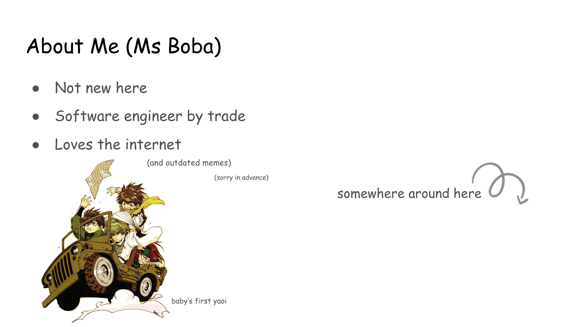

So, something about me. **I’ve been here on the web since the very early 2000s,
when I was gifted my first computer and immediately fell in love with the
internet.** I was a neuroatypical kid with a lot going on in her life, and had a
hard time fitting in with my peers. Then I joined a Gensoumaden Saiyuki[^2]
community on–blast from the past–Yahoo groups, and suddenly had a space to
explore my queerness and find people I truly belonged with[^3]. Since then, I’ve
been on the internet a lot. I met my long-time partner here, my best friend, and
almost everyone I love and cherish.

So, as you can see, I owe a great deal to the fandom web in general, but I also
owe it my career. I learned to make websites and to program to express my love
for my favorite series, and when I turned out to be pretty good at it, **I got
to move from Europe to Silicon Valley and start working for a big internet
company.** At the time, I was very excited cause I felt I had the chance to give
back to a place that had meant so much to me.[^4]

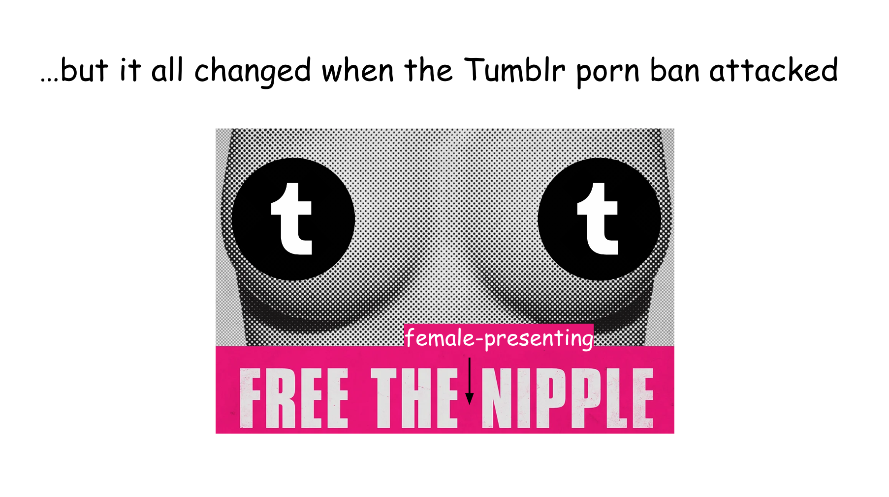

Like many fannish folks, I was also a prolific Tumblr user in 2013, around when
the Avengers fandom got really big[^5]. Once again, I owe a lot to that place. I
joined Tumblr during a pretty hard time in my life, and there I found friends
and knowledge that helped me grow and regain my footing.

Then the place started changing.

**Around 2016 many of us were concerned with a cultural shift we were seeing on
the fandom internet.** I still deeply loved the place, but there was a growing
let’s-call-it-“increasingly mean” undercurrent.

But the real wake up call was Tumblr banning porn. **Suddenly I truly saw how
much the web was deteriorating** and realized that if things continued going in
that direction, it would just keep getting worse and worse.

## The (spite-fueled) Call to Adventure

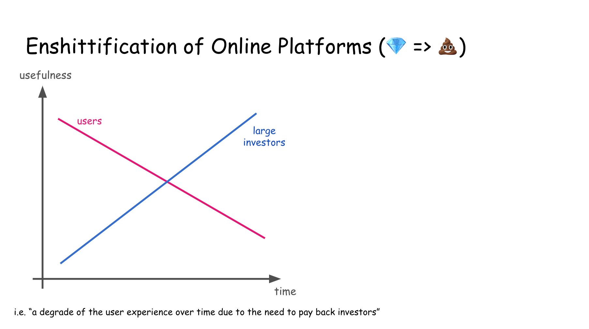

I know many people felt the same back then, but **I was in a unique place to try
and do something about it.** I was still working in a big internet company, so I
could access people who had actual power to influence this trajectory. At the
time, I was just a senior software engineer with no clue about anything
business-related and, frankly, zero faith in my ability to ever understand any
of it. But I was on a mission, and so I got to work.

Trying to “make change from the inside” was an eye-opening experience, to say
the least. One of my many “villain-origin moments” was having an executive tell
me with a straight face that harassment was not a big problem on the social
internet[^6]. **It was at that point that I realized how wide the disconnect was
between those at the helm of these really big web giants and us who actually
spent our time on the internet.[^7]**

I also got a front-row seat to some of the dynamics that cause things like
“enshittification” and how pressure from big investors influences the evolution
of tech platforms. I can’t say I loved any of it. Even as I made some headway,
**I was forced to realize that no matter how good I was, or how
well-intentioned, any progress would be short-lived and double-edged.** Soon, I
saw that the world I had joined because I loved the internet so much was the
very force that was corrupting it. This however, led to a realization…

---

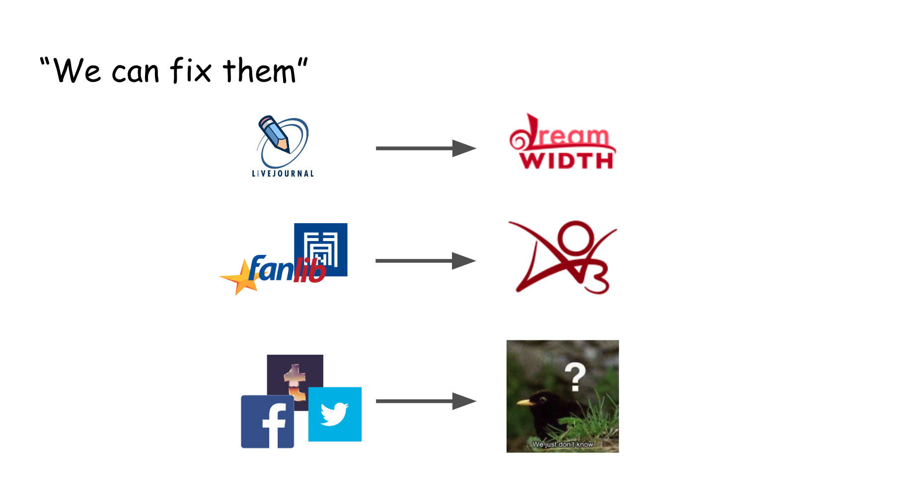

When you’re deeply embedded within a system, like I was, you can easily believe
solutions can only be found within it. But I didn’t really need permission from
a company or an “institutional investor” to go work on this problem. And
historically we did have examples of fandom–specifically fujin-adjacent
fandom!–bootstrapping ambitious, seemingly-impossible projects on the web. From
the fall of LiveJournal, we got Dreamwidth. From the mass deletions of
fanfictions, we got the OTW and AO3… There’s a lot of nuance to what we call
“the power of fandom”, but regardless of what you think of it there exists
precedent for us leading change on the web. Now, obviously, the internet today
is more complex than it was when those platforms were started, and, well, fandom
isn’t exactly the most tight-knit group right now. Could we as fans still come
together to change the internet back to a place of authentic connection? And
could we do that without losing all the positive changes of the last two
decades, and make it better than it ever was?

---

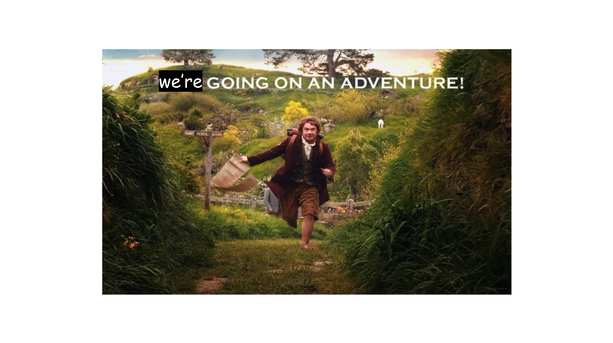

At the time, I did not feel ready to attempt and pull people together for
anything like this. But as I looked at my technical qualifications, what I had
learned about how businesses and products work, and how much I cared about this
problem, I had to ask myself: if I don’t do this, who will? …and so I decided to
give it a try! Take it as an adventure, keep my expectations in check, go in
with a growth mindset, and explore the wild world of making change on the fandom
web.

## What is Wrong with ~~You~~ the Internet?

So, step 1: an ambitious mission cannot have an ambiguous goal! Now, when you
ask around, the overwhelming majority of us agrees: something about the online
world is broken. But what is broken exactly? Or better said, among all the many
things that are broken, what should we work on fixing?

---

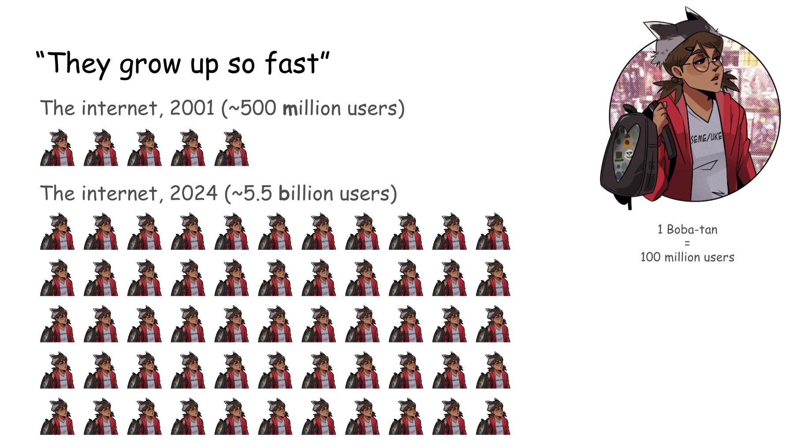

If we think about the many ways the internet has changed, there is one I believe
is waved away too early when discussing what makes the web feel so different.
And that is simply the sheer number of people on it today. The internet of 2024
is 11 times larger than what it was in 2001, and more than twice as big than it
was in 2013. A large size is not conducive to a feeling of intimacy and safety.
Not only that, but the types of people who spend a lot of their time on the
internet today, are very different than they were “before doing so was cool”.

---

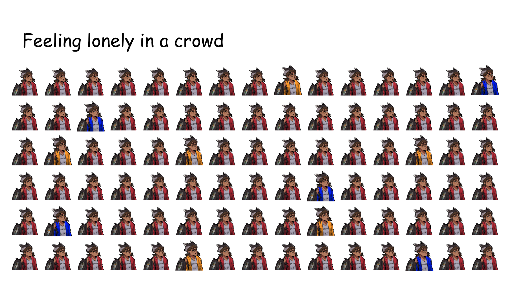

Our online social spaces are not made for us to feel nurtured and connected when
surrounded by so many people, especially when those people have so many
different ways to see the world, so many different ways to do fandom, and so
many different ways to conceptualize what is right and what is wrong. Research
is clear on this: we’re more connected to each other than ever, especially
online, but we’re also in an epidemic of loneliness. And loneliness sucks. It
makes us depressed, angry, disengaged… it makes us feel like no one out there
understands or cares for us. And to me that is the exactly the opposite of what
the internet is supposed to be about. So what is the opposite of loneliness?

---

That would be community! Community is what happens when we have enough people
with authentic, inter-connected relationships that are nurtured over a certain
amount of time. When you think about fans of your favorite piece of media on a
place like Twitter, you may think of them as a fandom, but they’re most likely
not a community. That’s because they may share an identity as “fans of
something”, and experiences such as “tuning in each week to see what the OTP is
up to”, but unless they’re a small and tight-knit group they’re unlikely to
share values and to care deeply about one another.

---

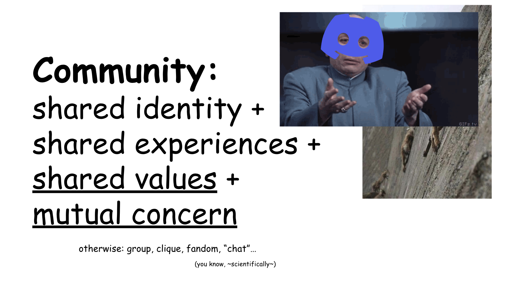

When you think about it in these terms, the incredible growth of Discord among
fannish folks and beyond makes a lot of sense. When you can create closed,
thematic spaces with (hopefully) strong moderation or at least a good invite
policy, people can form authentic connections based not only on shared
interests, but on shared values; this helps build mutual care and concern, and
over time creates (sometimes) a real community. Now, I’m not going to go into
all the reasons why the answer here isn’t just “Discord exists, problem solved”.
Among other things, Discord is a platform backed by large investments, and
unless they can miracle out enough money to satisfy those investors
enshittification will eventually come for them too. That’s just how big tech is
nowadays.

---

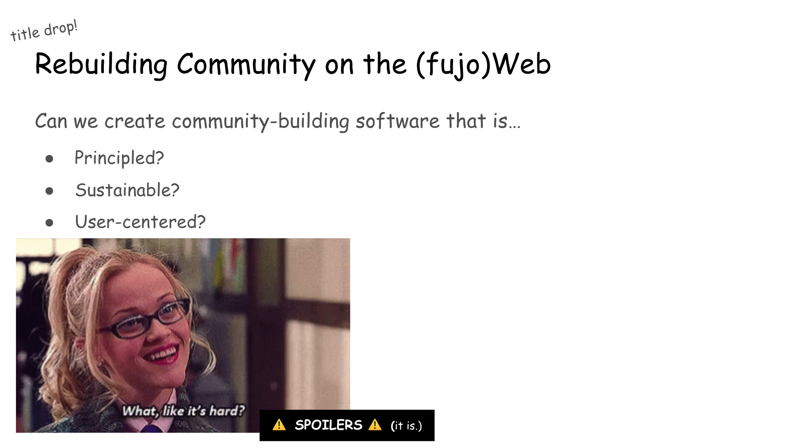

So for me the problem statement became: is it possible to build software for
community on the web that knows what its ethical principles are, treats those
who build it with fairness, and centers the needs of its users that are not
businesses?

---

To try and answer this I quickly built a proof of concept for BobaBoard, a
software to create forum-like communities modernized for current fandom. Along
with upgrading some familiar features, it included some additional fun gimmicks
on top, mostly related to making it possible for users to hold an identity only
within the boundaries of a single thread without losing the ability to moderate.
As you can see from the website, the initial branding was built to target fujin
who shared my cursed sense of humor, and thus at least part of my values. I
launched the first BobaBoard community right after the pandemic started, and it
proved popular enough among early users that I decided to try and make it
possible for others to start communities like the one we were running. As you
can imagine a lot has happened since.

---

Not mincing words: trying to bootstrap a project like BobaBoard beyond proof of
concept was a hard journey. When I connected with fandom folks who had been
around the “new platform for fandom” block a few times, I was repeatedly
commended for being the rare person approaching it with realism. And yet, it was
still orders of magnitude more complicated than I thought it would be. Above
all, something unexpected kept happening over and over: me and my collaborators
would find ourselves grappling with a hard problem (usually an organizational
one), but when I tried connecting with other project leads to learn how to fix
it I’d find they had been struggling with the very same one, often for a long
time. Even worse (or better?), sometimes it turned out we were doing a great job
compared to the average, and yet the job we were doing was anything but good
enough.

---

This all came to a head in November of last year. The BobaBoard team had been
going through a period of intense frustration. With a team made primarily of
volunteers we kept encountering false starts and stops, spending resources
training newcomers just to have their lives explode in their faces and having to
go back to square one. But more importantly, we were surrounded by negativity
towards small platform builders, and at the same time frustrated by the
overwhelming amount of responsibility placed on what is a small set of people,
without what we felt was a corresponding level of support from those who
directly benefited from our work. Once again I thought I must have been doing
something wrong. Then on Nov 9th, 2023, three different project runners
published three different posts on the same day talking about the unsustainable
mental and physical toll that their projects had placed on them.

---

These were Denise Dreamwidth, Matt Automattic and Leif Omegle. Now, I’ll drink a
glass of water and leave you a minute to read them. But before I do, I just want
to say: I know some of you will balk at the inclusion of our newest Tumblr
daddy. But please consider those who run projects without that amount of capital
experience similar dynamics with way less layers of indirection, and way less
money to have others come take care of issues on our behalf. — BREAK — Since
then, I witnessed many other project leads and contributors express similar
feelings. More independent projects, like retrospring recently, have been forced
to close shop. Even in the larger world of open source software, maintainer
burnout has been a bigger and bigger issue, with almost 60% of maintainers
having considered quitting (or altogether just quitting) their own projects.
When issues like these come up, people run to find explanations that focus on
how the projects are run: “if only their TOS had been good! Didn’t they know
better?”, “haven’t they thought about converting to a non-profit?”, “maybe if
they hadn’t been rude that one time, then I’d have supported them”, or the
evergreen “well, if they just added this one feature”...

---

This is, of course, an understandable impulse, and not one without basis. I am
personally, painfully aware that any project lead wishes they had handled
something differently. And I’ve been very frustrated at avoidable mistakes I’ve
seen other projects make. So here, before we move forward, I want to emphasize I
don’t mean to dismiss the share of the blame on the shoulders of project
runners. But over-indexing on these mistakes means missing the ever-increasing
structural issues that make it harder and harder for indie projects that benefit
the web to be born and to continue to exist.

---

Building and maintaining quality software is more and more expensive, with most
non-business users unwilling or unable to pay recurring fees; the hostility in
online spaces keeps escalating, and continues causing pain and frustration to
already overstretched project contributors; social and economic instability
makes it harder to bear the physical, emotional and financial toll of these
projects; and last but not least important, many bleeding heart believers who
even remember what the independent web was like are getting older, more tired,
and sometimes outright passing away. With how dire things are right now, it’s
hard to ask people to step in to fix the issues that plague the social web.
After all, what reward is there to reap? If anyone competent enough to succeed
was seeking money, they’d have an infinitely easier time and much more
likelihood of success with other types of software ventures; if anyone was
seeking glory, what they’ll find themselves facing as their project gains
visibility is an increasingly uncharitable and for some of us outright dangerous
internet.

---

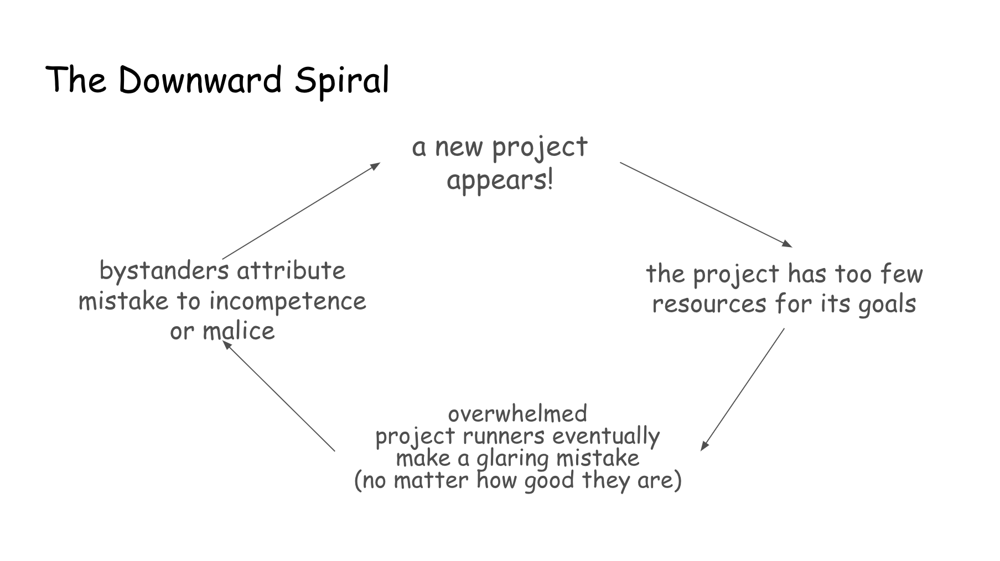

The things is, we’re currently in a downward spiral. Since large corporations
keep disregarding the needs of their users and underpaying their workers, indie
projects often feel that they, untouched by corporate greed and capitalistic
incentives, are supposed to bring forth a utopia where all hard problems are
solved, everyone is compensated fairly, and no one is ever made to feel unhappy
or unwelcome. But they come into a system that’s set up to see them fail. Being
an indie project makes it harder not easier to meet these expectations. After
all, large swaths of our online world only survive because of large investors.
And even assuming a project were willing to ask for their help, large investors
would not find the financial return they seek in the projects we need and would
then refuse to fund them. And so, as these projects try to fix everything with
nothing, eventually one of two things happens: either the people working on the
project burn out, killing the project, or a glaring mistake happens which proves
to bystanders that the issue was simply that project runners were not up to the
task.

---

Then we do another round around the block: people who’ve had their hearts broken
before are even less inclined to support new projects, and a lot of resentment
breeds all around. And the spiral continues.

---

So now that I’ve described this uplifting and encouraging situation, can we stop
this?

---

There are 3 main ways for a project to try to escape this spiral. None of these
are mutually exclusive, and they all influence each other to a degree. I had
originally included more about each, but it made this talk run long and I want
to have some time to answer questions people have sent in. So let me just give a
couple thoughts about the first two, and we’ll look at the third one in depth.

---

First, “do less”. If you set your sights lower, then you can build what you seek
while needing less resources. One way to do this is to take open source software
that already exists, modify it a bit, rebrand it and offer it to others. For
example, an enterprising group of fans could use the open source software behind
AO3 to create a new fanfiction archive with a different moderation and tagging
policy without having to build a platform from scratch. This has already
happened in fandom before: it’s what Dreamwidth did with LiveJournal, and it has
given people a stable, independent home away from big platforms for the last 15
years. But since one of the comments we saw earlier was from one of Dreamwidth’s
own founders, you can see this route still comes with its own challenges.

---

Next, get more money. There is a lot to say here so I’ll just let a picture
speak nearly half a billion words…

---

…cause that is the difference in funds raised by the OTW and Discord throughout
the years. While I made this image a couple years ago, not much has changed.
Most likely, the disparity has just gotten worse. I want to stress: this chart
does not include the money Discord makes selling things like Nitro or getting
paid by advertisers for product tie-ins. This is just what external donors
invested in the company to buy it enough time to become profitable software, and
is what Discord will be asked to pay back with interest one day.

---

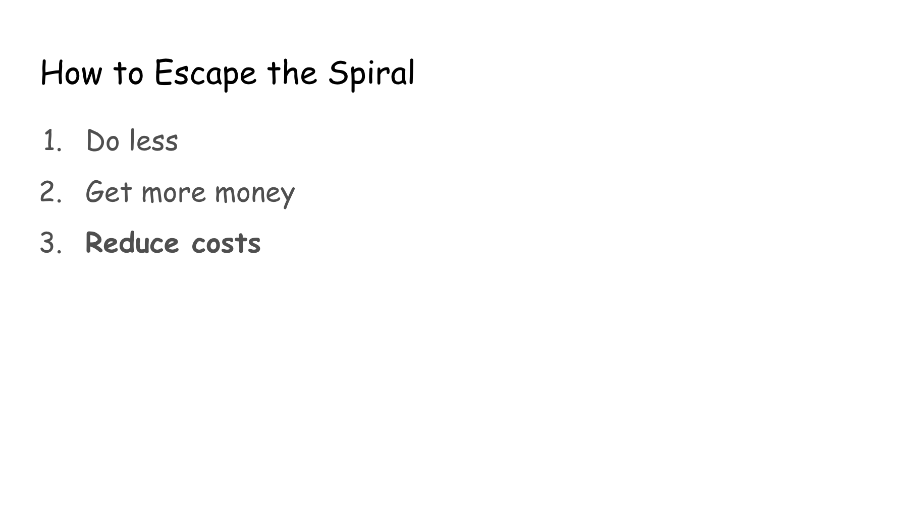

So here’s the last strategy and our focus: reducing costs. There are a few
different ways costs can be reduced. Building decentralized software is
definitely one, and open source software also helps. But the most tempting
option is always the same: volunteer labor. In theory, if you’re looking to
build a platform that solves a problem as shared as “better online social
spaces” then volunteers seem almost a no-brainer.

---

After all, isn’t part of the issue that there’s too many of us? And if people
feel powerless and in the dark, at the mercy of platforms’ poor decisions,
wouldn’t they want to be involved? Here’s where it gets tricky…

---

…as a famous software engineering maxim says “no matter what the problem is,
it's always a people problem”. Unfortunately, working together with people is
hard. BobaBoard, and Dreamwidth, and AO3, along with many others projects did
and do indeed recruit the help of volunteers. But as far as I can tell, this
alone has rarely been enough to create an environment that is truly sustainable
and that doesn’t overwhelmingly rest on a few individuals. And to analyze why
that is, we need to talk about power.

---

Now, this may feel like it’s coming out of left field, but bear with me. Let’s
go back to that fateful day when those posts were published. After seeing other
project leads talk about the toll of running projects, the frustration me and my
collaborators had been feeling spilled over, and we found ourselves discussing
our struggles openly within our communities. While the discussion was at times
raw, we found that rather than creating fear, uncertainty or resentment and
causing people to retreat, it instead renewed a sense of closeness and
comradery, with more people coming forward to ask what they could do to help.
After those discussions, we did see a vibe-shift in our spaces. Obviously, that
didn’t fix all our issues. And yet, why did something change? For a while, my
answers were fairly simplistic. It wasn’t until I read about other groups having
similar experiences that I got to better understand the role power played.

---

Now, the world as it has existed for a long time overwhelmingly rests on
hierarchical power structures. This means we often tend to perceive our
relationship with the world as an “us” and a “them”, two separate entities, one
above and one below, one with power and one subjected to it. Unfortunately this
is so ingrained inside and outside us, as to be inescapable. So when you have
people like us small platform runners (but not only) that aren’t quite as
powerful as those often slotted in this “them” group, but that still do have
some power, where do we go? You may think, “well, it depends on the person”. And
that's true! Power is not an absolute thing, power only exists in the context of
a relationship.

---

Now here's the thing: indie projects are often born as a rebellion against large
tech platforms, with the desire to shift the balance of power and put it closer
to the users. But shifting who is in power doesn’t change that a hierarchy
exists, no matter what intentions the power shift is born with. Groups like ours
that are overwhelmingly full of queer, disabled, poor, and otherwise
marginalized individuals, have often been betrayed and mistreated by those in
power. Because of this we’ve justifiably learned to be suspicious of anyone who
has it or seeks it. At the same time, we've so often been stripped of our own
power and agency, that we may perceive those who wield it as fundamentally
different.

---

Because of this, small platform runners can end up in the “them” group (often
subconsciously), even for the people we're here to serve and help. This is not
true for everyone, nor it is a fixed thing. I've seen this happen first hand:
what is a often long-time peer relationship, even a friendship (in a way an
“us”) can suddenly take an “us vs them” feel the moment I find myself having to
step into a role that has power. Eventually as long as someone is in power, the
us versus them is still there. Where there's power people will either passively
submit, leaving all the responsibility in the hands of “leaders”, or actively
rebel, antagonizing those above them.

---

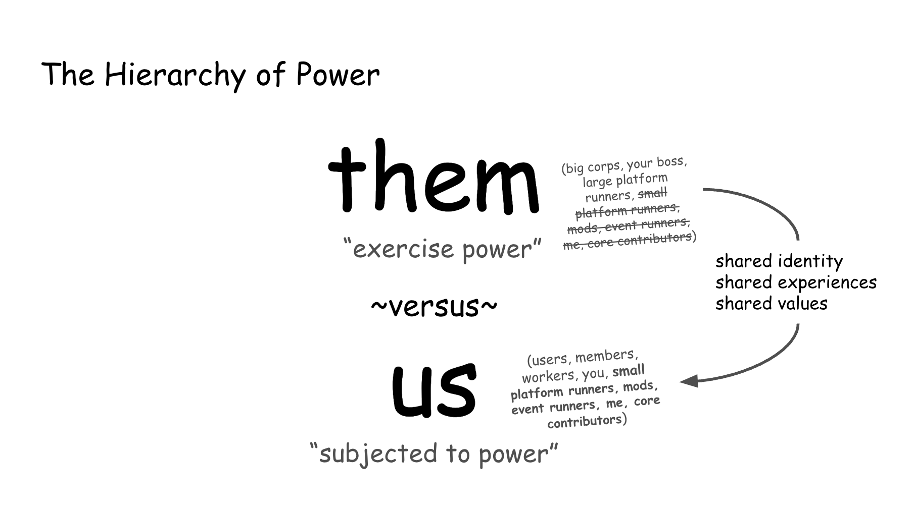

However, when people saw us come forward with our frustration and pain, and
express the overwhelming weight of what we were carrying, it made it harder to
continue the narrative of us vs them, platform user vs builder, server members
vs moderators, person who can’t and person who can. After that discussion people
saw us for who we truly are: members of their same community that, for all their
weaknesses and faults, are trying to build something that makes a difference.
Once people saw the barrier drop, we were able to level the playing field, and
it became easier for us to ask for help, and easier for others to give it. It
made it easier for people to empathize with us and give us the grace we
sometimes need. Now if you’re jumping in your seat going “I know how to fix
this! I know how to fix this! Let’s get rid of hierarchy and power”, don’t
worry: we’ll get there. But before we do, let’s talk about different types of
power.

---

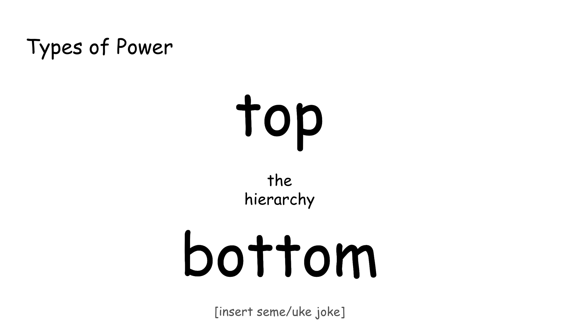

They say knowledge is power, and indeed one of the most powerful things we can
do is to know more about it. So… We all deal with power in our lives but we tend
to have an oversimplified view in which it exists as a single entity. In
reality, power takes many different forms.

---

We’re all familiar with power-over. This is the classic type of power that flows
from above to below: often wielded through fear, shaming and bullying, where
people who use it are more concerned about being right than getting it right. It
centers those at the top and disregards those at the bottom. When someone has
power-over they can make a decision that affects someone when the decision is
not theirs to make.

---

Power-over is often confused with authority, which is when someone with special
context, expertise or insight has earned their position through experience and
learning. The opinion of an authority may have more weight not because of their
place in the hierarchy but because of their understanding of the situation. But
this is only true in some contexts, and it can easily become power-over if
authority exceeds its bounds. Now, while we’re used to hearing about these types
of power, we’re less familiar with others. In particular, there is one
lesser-known type of power I believe is fundamental to understanding the dynamic
in our spaces: power-under.

---

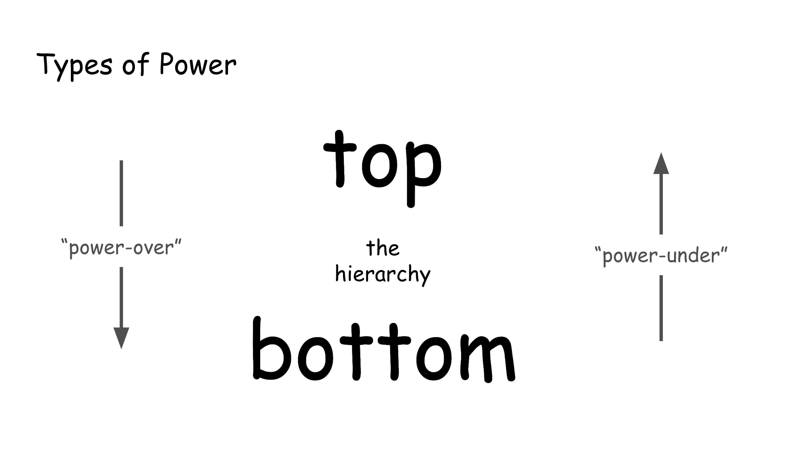

Power-under is power that flows in the opposite direction: where people at the
bottom of a hierarchy wilfully avoid stepping into the power that they do have.
Now since we often see power as inherently desirable, you may be confused by the
idea of choosing to renounce it. But what we tend to forget is that with great
power comes great responsibility, and responsibility can be incredibly
uncomfortable.

---

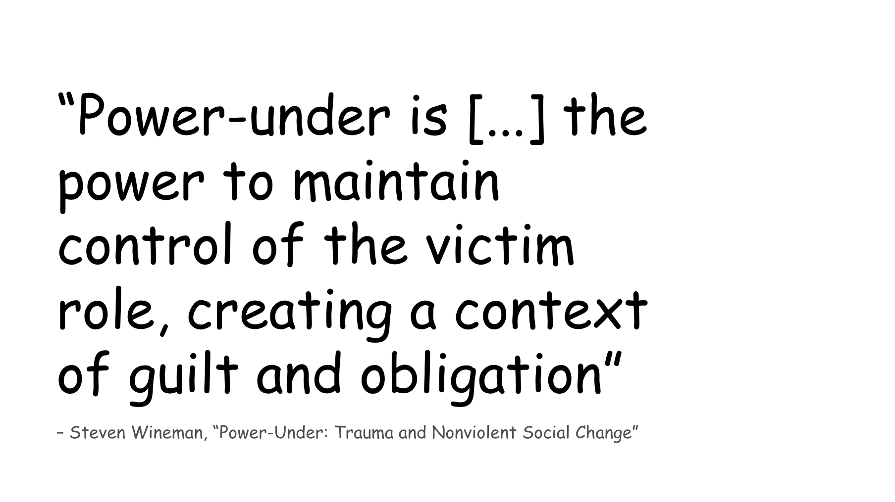

When we renounce our responsibility and let others make decisions for us, we
always retain the ability to blame them when they turn out to be wrong, when
they were faced with impossible choices, or simply when we don’t like the
outcome of what was decided. When we don’t take on responsibility ourselves, we
can always say “I told you so” and believe we would have known what to do and
done it better. By giving away their power, people also overpower others at the
same time.

---

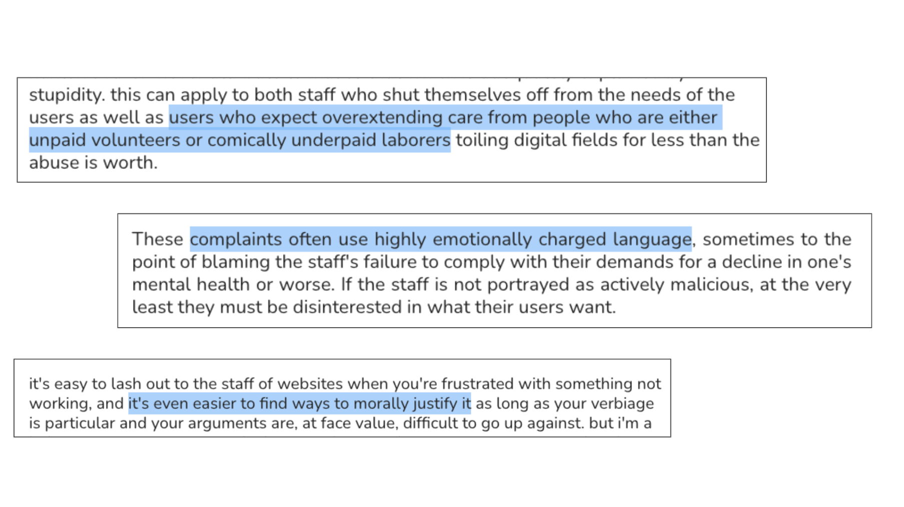

To show a neutral example, here’s quotes (presented with permission) from a
Pillowfort thread I did not participate in myself. You can see people do
recognize power-under, even if they can’t name it. And you can see how damaging
it can be to small teams of folks trying to make a difference. During
rehearsals, I was asked to pause here to let people reflect. So let me drink a
glass of water again. — BREAK — Now I want to be clear: just because someone is
in a top or bottom position, this does not mean that they exercise these powers,
do so all the time, or do so willingly. And power-under does not imply that
people use it because they’re evil. Instead, it’s been most often observed as a
trauma-response, especially in marginalized populations that may not often have
access to “power-over”. So given what we know about the demographics that form
our groups, you can see why it’s important that we discuss it and learn to
recognize it. Once you know about power-under, you can see it permeate not only
our platforms, but our discord servers, fandom events, social movements and so
on… and while you can see it morphing and getting worse over time as the web
degrades, you can see it has been in our spaces way before this decline started.

DO NOT READ: In this thread, a lot of different hypotheses are brought forward:
the lack of agency on social platforms in our current web; the lack of
understanding of the reality of running spaces and platforms, not to mention
businesses; and just in general the shift of tone we’ve seen, and the necessity
to find someone to blame for the suffering we’re all going through. All of these
are valid reasons and they do help explain some of what we’re seeing. But
power-under [something something this actually has been known to sink social
movement for changes and it’s something we all need to be aware of and learn to
callout and deal with]

---

Now that you know this, you can see removing hierarchy is not as simple as
having those at the top give up power. To get equal power, those in power do
need to step down…

---

…but at the same time those with less power need to step up: collective power,
power shared between platform users and builders, can only happen when everyone
uses the power they have.

---

Now, I’ve been around these spaces long enough to know what some of you are
thinking: well, this sounds great for people who do have power inside them, but
this surely does not apply to me! I don’t have anything of value to contribute,
and my personal life circumstances would keep me from participating anyway.

---

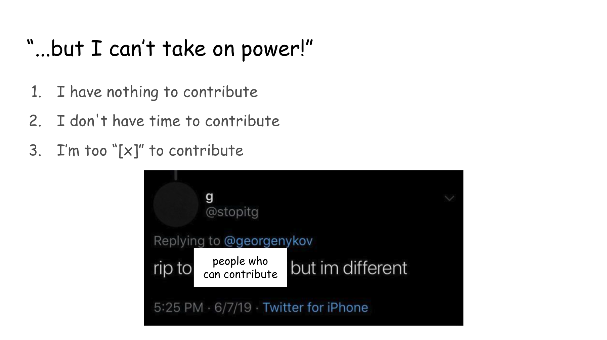

This goes back to something I said before: for many different reasons, people
sometimes see those of us working on these projects as inherently different. And
when we discuss these differences, these are the points we most often see come
up. Before we go forward, an important reminder: it is not up to me to decide
whether you can contribute or not. Nothing I say should be taken as implying
anyone is making excuses. Your power or lack of it is for you to self-determine.
But I do believe it’s important for me to publicly spend some time talking
through each one of these points, as my collaborators and I did privately after
the Fateful Day™.

---

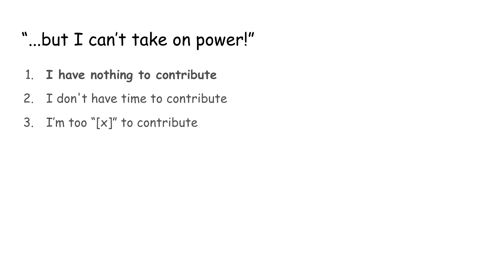

So, let’s go in order!

---

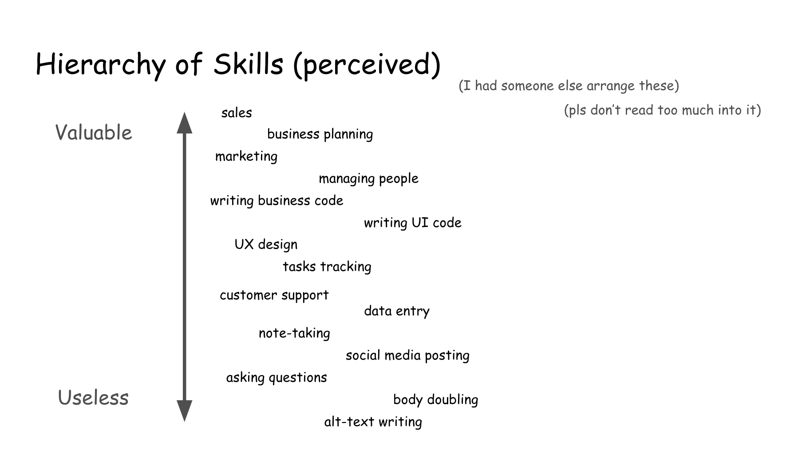

When we talk with people about what hesitations they have about joining our
project, we often hear the same answer: “I don't have any valuable skill to
bring in, and all I’d do is bring everyone down”. Now, here’s the thing: when we
think about hierarchy, we see there is not just a hierarchy of power in our
society, but also a hierarchy of skills. Some skills are seen as more valuable
than others, which are instead diminished and dismissed. Since we tend to see
skills as a fixed thing you either have or don't have, this means that if there
are valuable and useless skills, there also have to be valuable and useless
people. But not only is that not true, that wildly misunderstands how skills are
built and the type of skills a group needs to succeed.

---

Let's take me as an example: there are some things I'm naturally good at. These
include things like "software engineering", “abstract math”, and "shitposting".
And I was lucky enough to be born in a era where my natural aptitude for
computers made it possible for me to be regarded as a "highly-skilled
professional".

---

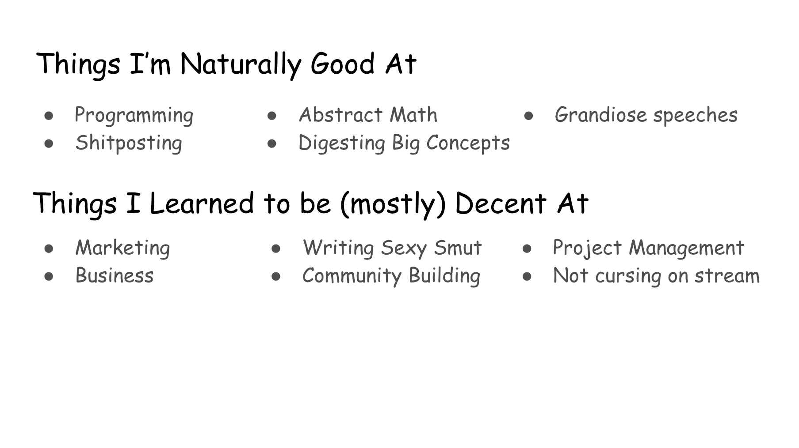

However, there's also things I'm naturally terrible at, that I've only become
(relatively) able to do through active learning or repeated practice. These
include things like "business", "marketing", and "community building".

---

And then there are things that I never have been able to practice, or that I
still suck at despite trying and trying to get better at them. There are also
things that, while I'm theoretically able to do well, take a disproportionate
toll on me and quickly sap all my time and energy. These include "collecting
notes after discussions”, "assigning people tasks", and "entering data". Because
of my position as one of the "doers" and because some of my natural skills are
so high in the perceived hierarchy, I've found that people tend to assume that
if I possess the skills at the top, then I must also inevitably possess those at
the bottom. That couldn't be further from the truth. Very often when I talk to
people about the skills I lack and what I’m desperately struggling with, I see a
light bulb go off above their head: "oh, that's not hard at all", they say, "I
love doing that type of task", or (one of my favorite to hear) "I didn't even
realize that was a skill".

---

So allow me my one swearword in this PG-13 talk: fuck the hierarchy of skills.
To build successful projects we need many different types of abilities, all
across that “so called” hierarchy. Just like we’d be unlikely to succeed without
someone who knows software programming or without a good business plan, we’d
also have a hard time going anywhere without the skills society tries to
convince us are useless. Some of the most impactful and positive contributions
to our project have come from people who collected data, updated our socials,
asked questions, and wrote alt-text for our posts and websites.

---

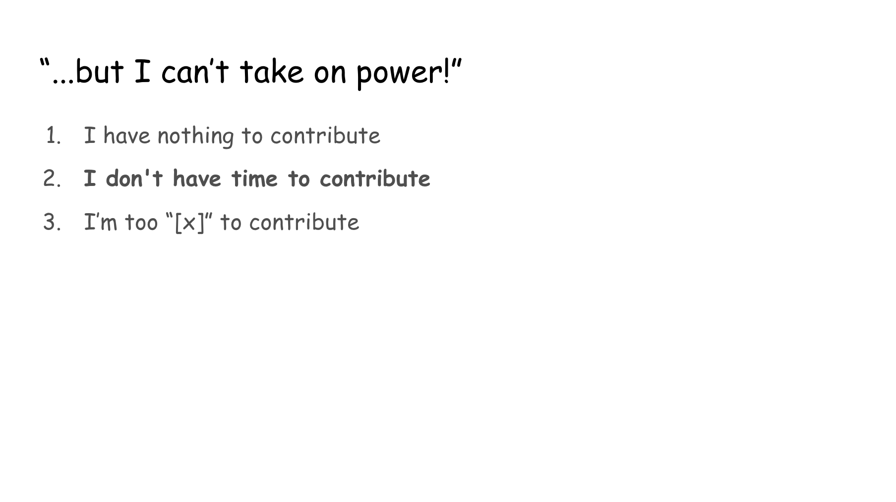

Now, the second one: “I don’t have time”. This is completely understandable!
Time (and mental space) are incredibly limited nowadays. But just like we tend
to think we need to have big skills to contribute, we also think that we need to
do things that take a lot of time. And yet, there is something anyone running or
joining projects needs that requires very little time to do…

---

…and that is actively showing your support!

One of the hardest things any creator and platform runner deals with is complete
silence. There’s nothing more alienating than doing things for an unresponsive
audience, and not hear back until something needs fixing or changing.

Whether it is personally thanking someone who’s doing something in your spaces,
gushing about their work with others, or boosting their posts on socials,
interacting with people working to make your communities better is guaranteed to
make their day, and doesn’t take much time.

Now you may think: but that’s so little! And, well, to be blunt it is! But this
is where we’re currently at. I’ve heard this over and over from many sources:
people who are doing essential work for the health of our fandom web and
communities are struggling to get back even a simple “thank you”.

And if you want to do more start looking carefully at your spaces: you’ll soon
notice small bits of work people may use help with that no one else is taking
up. Here’s some examples I was given of requests that often go unheard: helping
to choose the day an event should be held on and create a calendar invite,
submitting ideas for a “question of the day”, saying hello to new members
joining a Discord server, or helping fill entries in a community wiki. You may
not be the perfect person to help with any of these, and yet you may be the only
one doing so!

---

And now the hard one…

---

This is something that’s very hard to talk about, and I wish I had had more time
to have many people review my wording and be confident I’m conveying the right
amount of nuance with the perfect phrasing. Unfortunately, this talk took way
too long to prepare, and the time for this topic is shorter than ideal. Remember
I speak as an inside ambassador: some of our most important collaborators have
disabilities that significantly impact their lives; some of our collaborators
have had significant life and health events; a lot of our collaborators struggle
with mental health, to the point that we have (as someone defined it) "a
bingo-card of mental illnesses" among our team; and obviously some of our
collaborators are poor, overworked, and in generally difficult life situations.
When those of us who face these struggles have talked about contributing with
people in similar situations, we’ve repeatedly encountered something we believe
needs to be talked about.

---

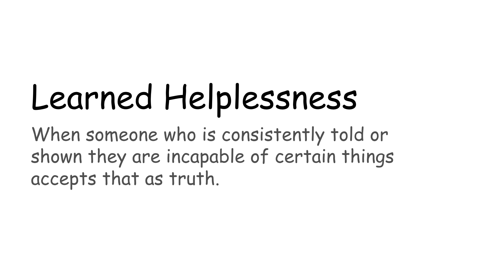

And that is learned helplessness. Here’s what this may look like: Maybe we fail
to meet a deadline for reasons we even struggle to explain, and feel the weight
of the other person's disappointment, or worse we get yelled at. So we stop
showing up for tasks with deadlines. Or maybe we see someone effortlessly breeze
through tasks we don’t even know how to start with, and when we struggle with
the same we get the task taken away, or worse get mocked for our inability to
complete it. So we stop showing up for tasks that are hard. Maybe we’re told
people like us will always struggle, so we come to believe that we will never
amount to anything. The trauma of learned helplessness builds up slowly, over
time. Eventually, we stop believing we could ever meaningfully contribute to our
projects and our communities. While everyone's life circumstances are different,
I’m here to tell you: it may come with unique challenges, it may not be easy,
you might need support and encouragement and a safe space to fail, learn, and
get up to try again, but all of us have the power to show up and make a
difference.

---

And this brings us to the last type of power of today: power-within. This is
what happens when we're able to step into our own agency, see that we are
capable, and believe (or even better know) that we can meaningfully contribute
to our collective. During this journey, we’ve met many people struggling with
learned helplessness and saw them overcome it to reach power-within. When this
happens, people are transformed. They often go from timid and hesitant to
eagerly volunteering their skills and opinions. They learn to say, “I don’t know
if I can do it, but I will try”. They learn to recognize when a task does not
play to their strengths, and see failure as an inevitable condition for growth
rather than a personal defeat. Even more importantly they go from needing
encouragement, to giving encouragement.

---

Helping people step into their power is hard work, and not everyone can do so
within organizations as messy as the ones that exist today. But that makes it
even more important that those who can show up for this stage of the journey
help us create an upward spiral that counters the cycle of hopelessness we’re
currently stuck in. More than any piece of software this is what will rebuild
our communities. Because real community happens when people help each other
become who they want to be; when people come together to share information,
skills, hard-won lessons, attentive care, and above all friendship; and, when in
the process of doing so, people create something that is bigger than the sum of
their parts.

---

And with this hopeful message, it’s time for the last big question: is what we
discuss today enough? Well, I’m sorry to say that alas, harnessing the power of
more helpers is a necessary but insufficient condition to escape the current
situation. Here’s the problem:

---

As you know the larger the cast the higher the number of relationships between
its members. Similarly, when more than a handful of people come together to work
on a project, complexity increases dramatically. Every person adds more arrows
to the graph of relationships, and every arrow adds new possibilities for
misunderstandings, missed expectations, someone shipping your NOTP, and
eventually proper conflict.

---

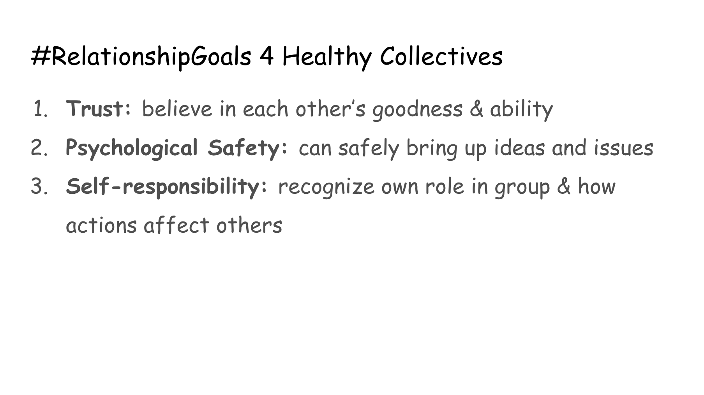

Going deep into this would require us to explore trust, psychological safety and
self-responsibility. However, this talk is already long, so I’ll leave you with
just a few thoughts: as things are now, it’s hard to feel safe and secure in the
spaces we inhabit. When we feel under constant threat, it’s hard for people to
speak up when needed and to listen when necessary. When the collective
suspicion, resentment, and pain that results from their members feeling
silenced, disrespected or otherwise unsafe eventually boils over, organizations
often clench up in response. They tighten their ranks, become less transparent,
and attempt to maintain order through increased control and hierarchy.

---

But we can create environments where feedback is gladly given and received. We
can teach people the skills to solve their own conflicts from a place of love,
giving them a true sense of responsibility for the words they use and the
environment they create. We can build projects where we collaborate on an even
field despite our differences. But creating those spaces starts with
understanding that organizations and communities are messy. Being together in
harmony is the biggest problem humanity has ever faced, and one we continue to
struggle with. Despite what we may think, building good organizations is not a
solved problem with an easy blueprint to follow.

---

But this has started to change in recent years. Within the past year, I learned
about sociocracy, a peer governance system that uses a mechanism of circles and
consent to enable non-hierarchical, decentralized decision making. A lot of what
I discussed today I only learned thanks to the educational material created by
Sociocracy for All, an organization that helps other organizations learn about
and adopt this system.

---

I hope today helped you appreciate how the problems that plague our web and our
communities are complex and intertwined. No one knows how to fix all of these
problems alone, and not all of them even have a clear solution.

---

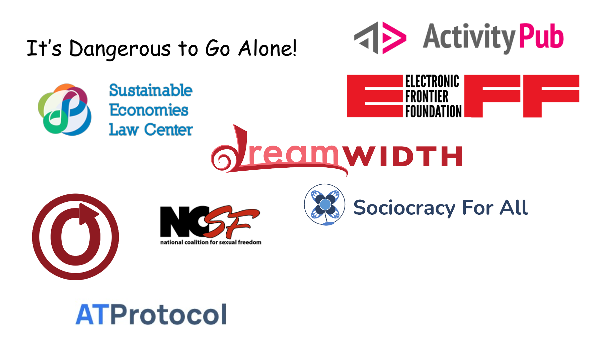

But here’s the good news: just like we are not alone as people, we are also not
alone as communities. There’s a lot of groups out there solving the many
problems on the way to a better, more equitable, more communal online and
offline world. I mentioned Sociocracy for all already, but we also wouldn’t be
here without the Sustainable Economies Law Center, that has given us free legal
advice that helped me go from someone terrified by the american legal system to
someone who’s still terrified by the american legal system but that can
understand and navigate some of the issues it presents. And obviously I would be
remiss not to mention the work that Dreamwidth did paving the way and that they
continue to do on both the legal and platform sides, as well as offering us
support and advice as needed. Similarly, it’s important to recognize the
inspiration that the OTW provided as well as the wisdom its individual members
have shared with us.

---

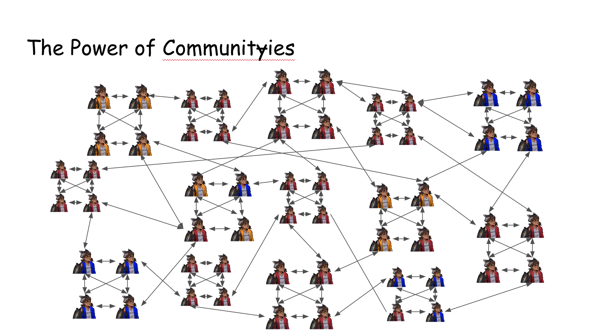

Eventually true change on a large scale does not happen by working together as a
single group, but by empowering people to create new ones and work together on
the problems that matter to them, with their unique power and perspective. When
such a system exists, everyone can find the place where their power can be put
to use in a way that best matches their work style and values. And just as
importantly, the failure of one project won’t cause the whole system to
collapse, but instead makes us all stronger by teaching us what we didn’t know
before.

---

And with this our talk comes to a close.

---

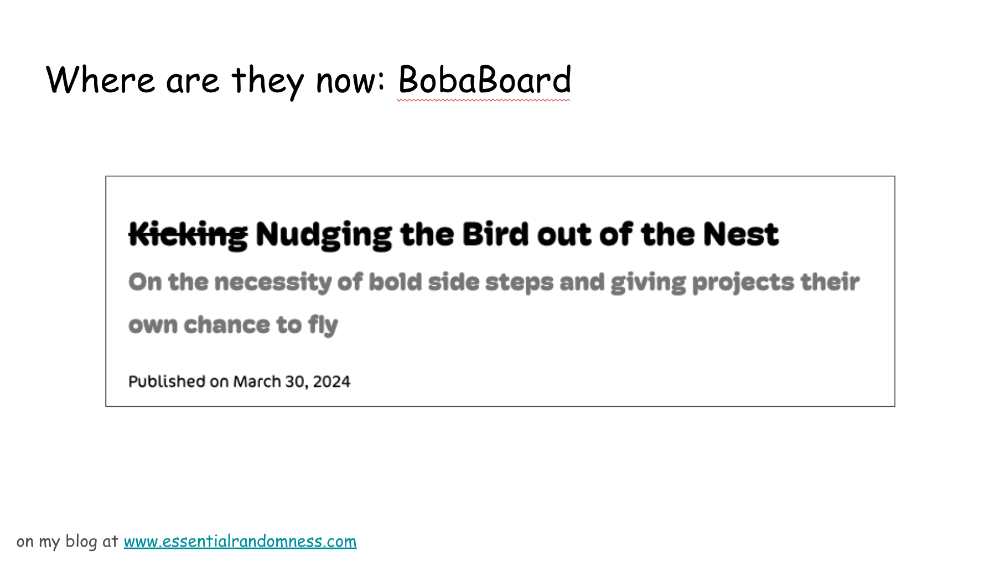

In March, some time after “that fateful day”, I officially stepped down as
BobaBoard’s project lead. While I’m still involved with the project, this
gesture explicitly signaled my decision to renounce the power I had and put
BobaBoard’s future in the hands of the community. I’m happy to say people gladly
stepped in to take on the power I had given up, and thanks to the hard work of
some contributors, we’re now in the process of growing BobaBoard as a
sociocratic organization. Progress is slow, the todo list is ever growing, but
we’re working hard to remove me as a bottleneck and unwillingly-central decision
maker and enable people to come help us make BobaBoard a reality.

---

And then this April, me and a few other BobaBoard volunteers officially founded
FujoCoded LLC, with the explicit goal to empower members of online subcultures
to shape their own web and build a kinder, more diverse, more collaborative
internet.

---

The projects we run are many and varied. They range from teaching people how
build and collaborate on software by using hot fictional versions of programming
languages, to starting communities that help people find support on their coding
journey, to building experimental software like BobaBoard that will give them a
place to come learn and create their own web.

This new chapter of this story has just started, and there’s no telling where
it’ll end up going in the future. Knowing our next steps doesn’t make the
journey an easy one. But I’m excited and eager to continue working on nurturing
an internet that has meant so much to me, alongside the friends who helped make
this journey possible, and the new faces we’ll continue to meet along the way.

---

And with this, I’m done! Don’t forget to go check out our website to sign up for
our newsletter, support us on Patreon so we can continue providing awesome
educational resources, and buy our incredibly cute merchandise on our store!
Thank you

---

[^1]:
    As everything on this page hopefully suggests, you should picture me
    saying all this in front of a live audience.

[^2]: Once a Cho Hakkai girl, always a Cho Hakkai girl

[^3]:
    "Exploring your teen queerness on fandom Yahoo groups" is (I believe) just
    the 00s version of the 10s' "exploring your teen queerness on fandom
    Aminos", which (probably) is now "exploring your teen queerness on fandom
    Discord servers". \
    \
    May it have been as fun and exilarating to you all as it was for me—I'd say
    "not as dramatic though," but I know fannish teens.

[^4]:
    08's me was sweet and innocent and had drank a lot of sweet-tasting tech
    kool aid. But, while you're ~~hearing~~ reading the story of me discovering
    things aren't as bright and rosy as I imagined, I want to stress: **being
    able to move to the USA, undergo the professional development a big tech
    company will offer, and earn a tech salary _did_ change my life and it _did_
    lift me out of poverty.** I will forever be grateful to the tech industry
    for that, my many gripes with it aside.

[^5]: Yes, I survived _"Tom Hiddleston takes over Hall H"_. AMA.

[^6]:
    I'm sure this particular executive never thought about their comment
    again, but every time I think about it whenever I find myself asking "can
    this category of people really be _that_ out of touch?".

[^7]:
    See it from the POV of an average successful Big Tech Executive who goes
    on Twitter mostly to post some pre-made statement about how proud they are
    of a launch, or to retweet some company announcement: they don't know what
    callout posts are; they've never seen a BYF; they live—or did at the time—blessed,
    simple internet lives.

