This was originally a talk given at [the 2024 edition of CitrusCon](https://www.citruscon.com/citrus-con-2024)
to a public of Boys Love media fans—one of the online communities most impacted by the current state
of the web. [Check it out on YouTube](https://www.youtube.com/watch?v=tFx4XAOnFVE), or read on!

## The Story So Far

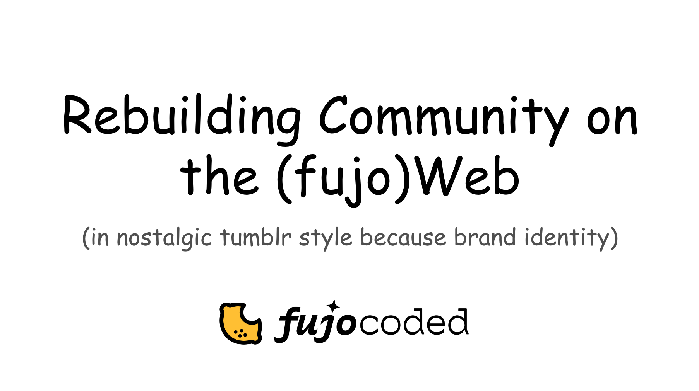

Hello and welcome to Rebuilding Community on the (fujo)Web[^1]! My name is Ms
Boba and I’m here representing [FujoCoded LLC](https://www.fujocoded.com), a very young company with (as
you’ll see) a much longer history.

Our work focuses on empowering fujin, BL fans, and all their friends and
supporters to reshape the internet into something that’s, well, _better_ than what
we have today.

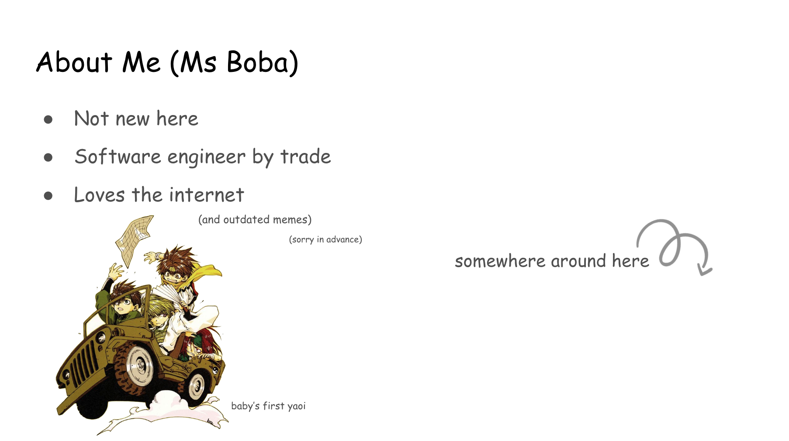

So, something about me. **I’ve been here on the web since the very early 2000s,
when I was gifted my first computer and immediately fell in love with the
internet.** I was a neuroatypical kid with a lot going on in her life, and had a
hard time fitting in with my peers.

Then I joined a Gensoumaden Saiyuki[^2]
community on—blast from the past—Yahoo groups, and suddenly had a space to
explore my queerness and find people I truly belonged with[^3]. Since then, I’ve
been on the internet a lot. I met my long-time partner here, my best friend, and
almost everyone I love and cherish.

As you can see, I owe a great deal to the fandom web in general, but I also
owe it my career. I learned to make websites and to program to express my love
for my favorite series, and when I turned out to be pretty good at it, **I got
to move from Europe to Silicon Valley and start working for a big internet
company.** At the time, I was very excited because I felt I had the chance to give
back to a place that had meant so much to me.[^4]

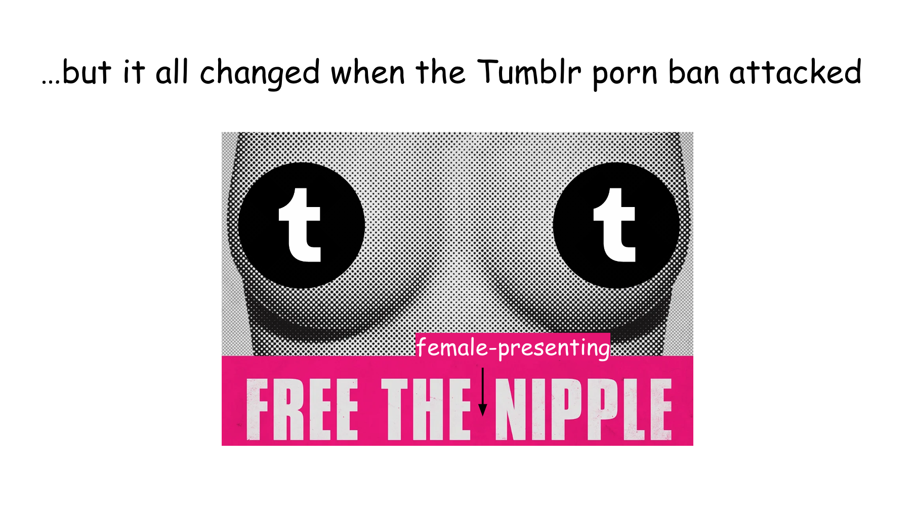

Like many fannish folks, I was also a prolific Tumblr user in 2013, around when
the Avengers fandom got really big[^5]. Once again, I owe a lot to that place. I
joined Tumblr during a pretty hard time in my life, and there I found friends
and knowledge that helped me grow and regain my footing.

Then the place started changing.

**Around 2016 many of us were concerned with a cultural shift we were seeing on
the fandom internet.** I still deeply loved the place, but there was a growing
_let’s-call-it-“increasingly mean”_ undercurrent.

But the real wake up call was Tumblr banning porn. **Suddenly I was hit in the face with how
much the web was deteriorating**, and I realized that if things continued going in
that direction, it would just keep getting worse and worse.

## The (spite-fueled) Call to Adventure

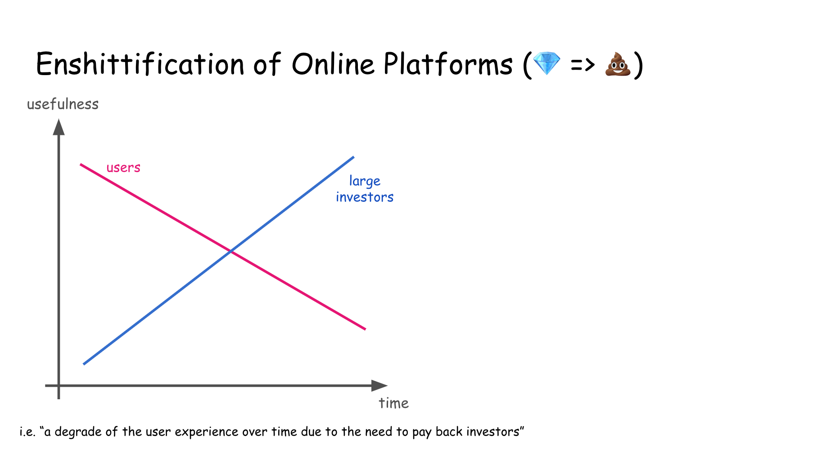

I know many people felt the same back then, but **I was in a unique place to try
and do something about it.** I was still working in a big internet company, so I
could access people who had actual power to influence this trajectory. At the
time, I was just a senior software engineer with no clue about anything
business-related and, frankly, zero faith in my ability to ever understand any
of it. But I was on a mission, and so I got to work.

Trying to “make change from the inside” was an eye-opening experience, to say
the least. One of my many “villain-origin moments” was having an executive tell
me with a straight face that harassment was not a big problem on the social
internet[^6]. **It was at that point that I realized how wide the disconnect was
between those at the helm of these really big web giants, and us who actually
spent our time on the internet.[^7]**

I also got a front-row seat to some of the dynamics that cause things like
“enshittification” and how pressure from big investors influences the evolution
of tech platforms. I can’t say I loved any of it. Even as I made some headway,
**I was forced to realize that no matter how good I was, or how
well-intentioned, any progress would be short-lived and double-edged.** Soon, I
saw that the world I had joined because I loved the internet so much was the
very force that was corrupting it.

This however, led to a realization…

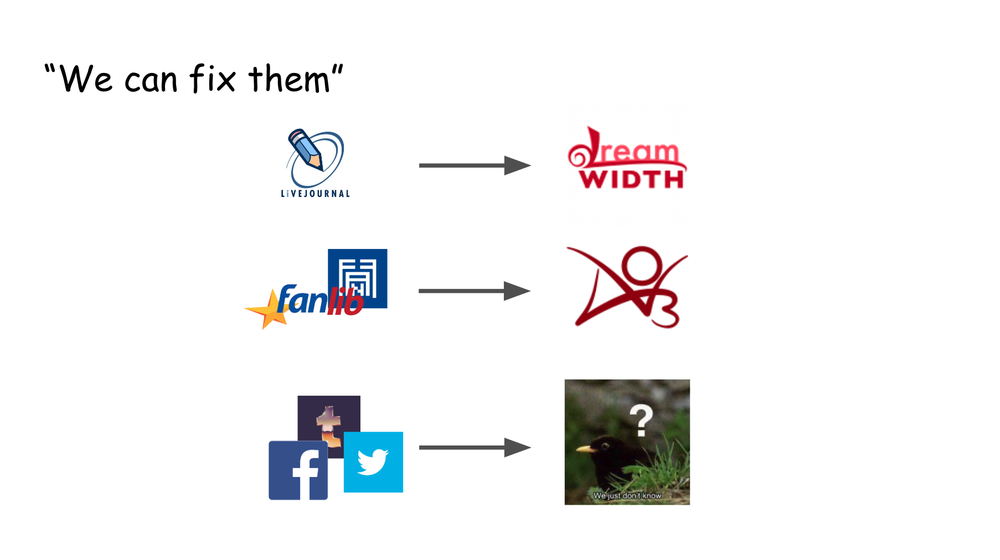

**When you’re deeply embedded within a system**, like I was, **you can easily
come to believe solutions can only be found within it.[^8]** But I didn’t really
need permission from a company or an “institutional investor” to go work on this
problem.

And historically we did have examples of fandom–specifically fujin-adjacent
fandom!–bootstrapping ambitious, seemingly-impossible projects on the web. From
the fall of LiveJournal, we got Dreamwidth. From the mass deletions of
fanfictions, we got the OTW and AO3… There’s a lot of nuance to what we call
“the power of fandom”, but regardless there exists precedent for us leading
change on the web.

Now, obviously, the internet today is more complex than it was when those
platforms were started, and, well, _fandom isn’t exactly the most tight-knit
group right now._ **Could we as fans still come together to change the internet
back to a place of authentic connection?** And could we do that without losing
all the positive changes of the last two decades, and make our spaces better
than they ever were?

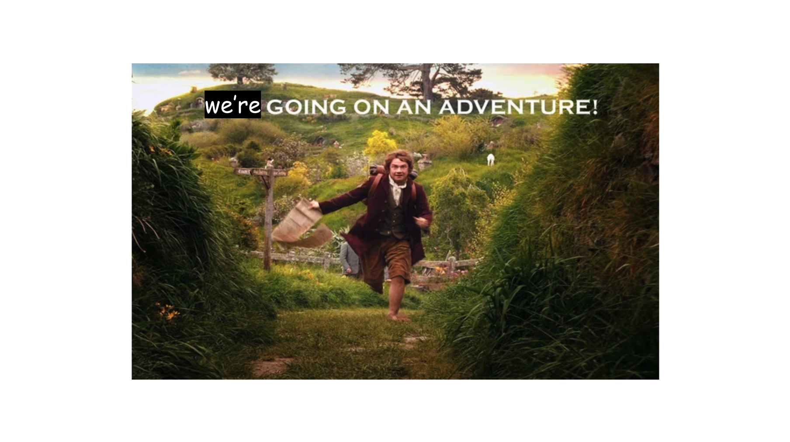

At the time, I did not feel ready to attempt and pull people together for
anything like this. But as I looked at my technical qualifications, what I had
learned about how businesses and products work, and how much I cared about this
problem, I had to ask myself:

**_if I don’t do this, who will?_**

…and so I decided to give it a try! Take it as an adventure, keep my
expectations in check, go in with a growth mindset, and explore the wild world
of making change on the fandom web.

## What is Wrong with ~~You~~ the Internet?

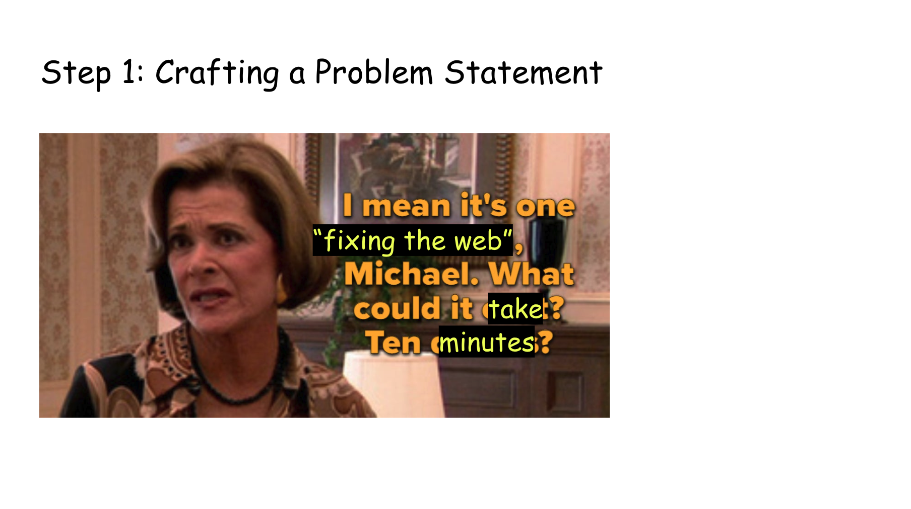

So, step 1: an _ambitious_ mission cannot have an _ambiguous_ goal![^9]

Now, when you ask around, the overwhelming majority of us agrees: something
about the online world is broken. But what is broken exactly? Or better said,
among all the many things that are broken, what should we work on fixing?

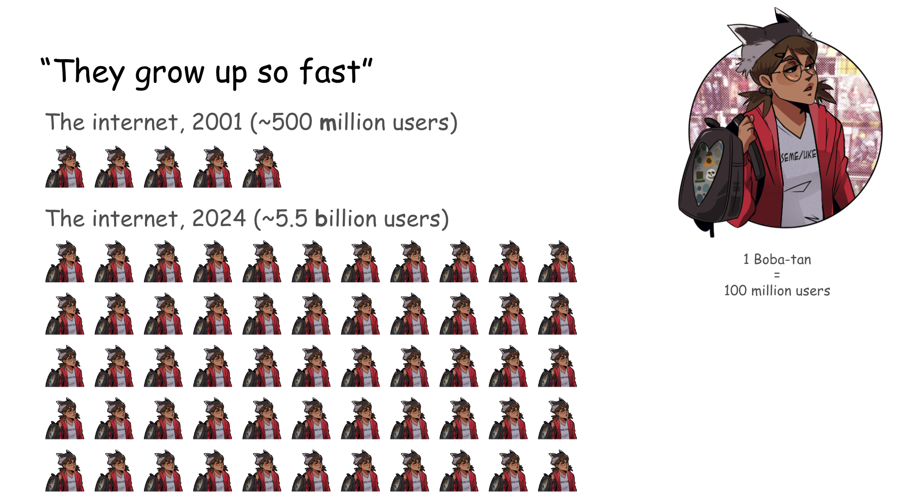

If we think about the many ways the internet has changed, **there is one I
believe is waved away too early when discussing what makes the web feel so
different: the sheer number of people on it today.**

The internet of 2024 is 11 times larger than what it was in 2001, and more than
twice as big than it was in 2013. A large size is not conducive to a feeling of
intimacy and safety. Not only that, but the types of people who spend a lot of
their time on the internet today, are very different than they were “before
doing so was cool”.

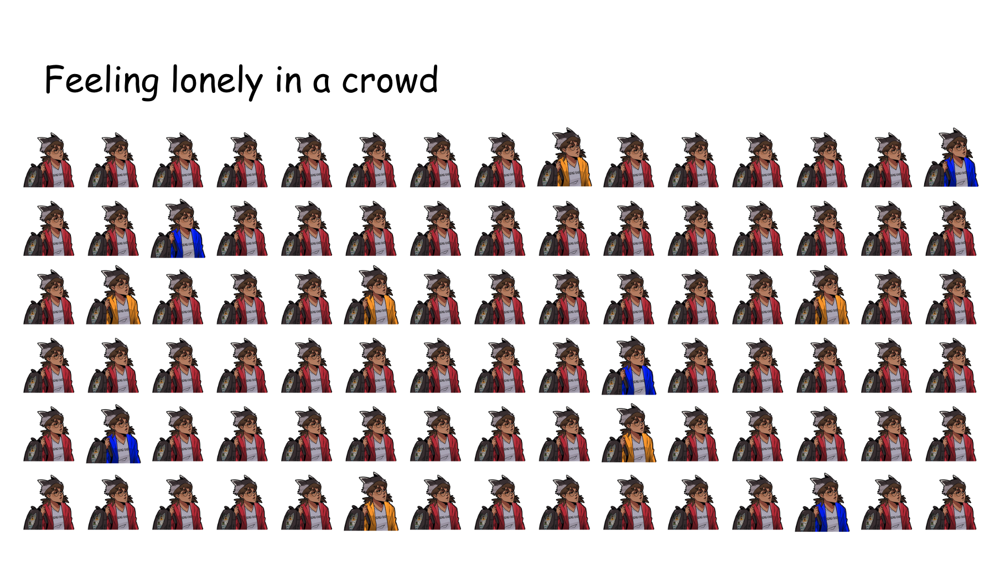

Our online social spaces are not made for us to feel nurtured and connected when
surrounded by so many people, especially when those people have so many
different ways to see the world, so many different ways to do fandom, and so
many different ways to conceptualize what is right and what is wrong.

Research is clear on this: we’re more connected to each other than ever,
especially online, but we’re also in an epidemic of loneliness. And loneliness
sucks. **Loneliness makes us depressed, angry, disengaged… it makes us feel like no one
out there understands or cares for us.** And to me that is the exactly the
opposite of what the internet is supposed to be about. So what is the opposite
of loneliness?

## The Opposite of Lonely is Community

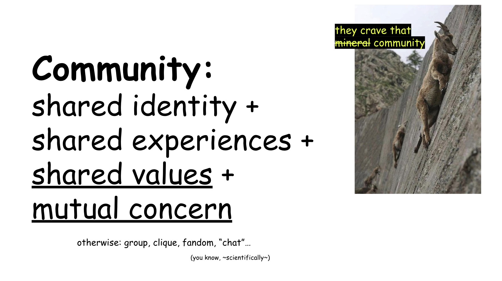

..that would be community! **Community is what happens when we have enough
people with authentic, inter-connected relationships that are nurtured over a
certain amount of time.**

When you think about fans of your favorite piece of media on a place like
Twitter, you may think of them as a fandom, but they’re most likely not a
community. That’s because they may share an identity as “fans of something”, and
experiences such as “tuning in each week to see what the OTP is up to”, but
**unless they’re a small and tight-knit group they’re unlikely to share values and
to care deeply about one another.**

When you think about it in these terms, **the incredible growth of Discord among
fannish folks and beyond makes a lot of sense.** When you can create closed,
thematic spaces with (hopefully) strong moderation or at least a good invite
policy, people can form authentic connections based not only on shared
interests, but on shared values; this helps build mutual care and concern, and
over time creates (sometimes) a real community.

Now, I’m not going to go into all the reasons why the answer here isn’t just
“Discord exists, problem solved”. Among other things, Discord is a platform
backed by large investments, and unless they can miracle out enough money to
satisfy those investors enshittification will eventually come for them too.
That’s just how big tech is nowadays.

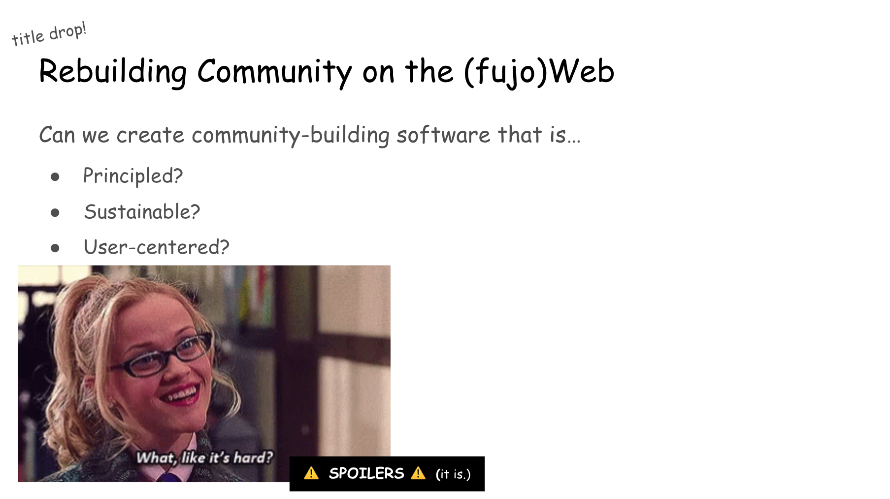

So for me the problem statement became:

> is it possible to build software for
> community on the web that knows what its ethical principles are, treats those
> who build it with fairness, and centers the needs of its users that are _not_
> businesses?

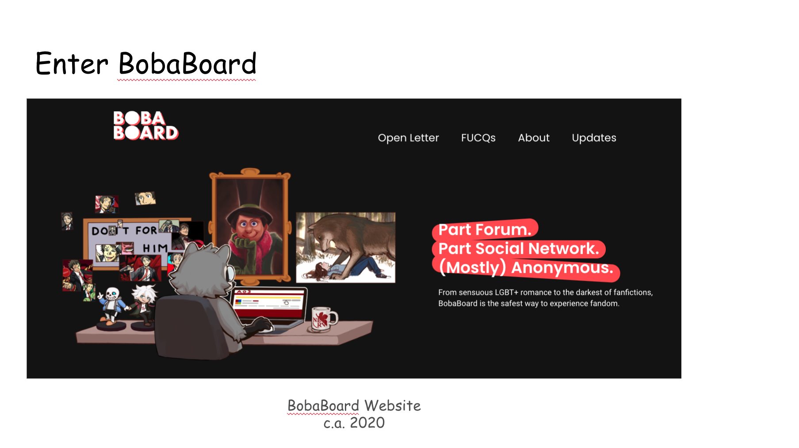

To try and answer this I quickly built a proof of concept for BobaBoard, a
software to create forum-like communities modernized for current fandom. Along
with upgrading some familiar features, it included some additional fun gimmicks
on top, mostly related to making it possible for users to hold an identity only
within the boundaries of a single thread without losing the ability to moderate.

As you can see from the website, **the initial branding was built to target fujin
who shared my cursed sense of humor, and thus at least part of my values.** I
launched the first BobaBoard community right after the pandemic started, and it
proved popular enough among early users that I decided to try and make it
possible for others to start communities like the one we were running.

As you can imagine, _a lot has happened since._

## A Wake Up Call: Theory, Meet Practice

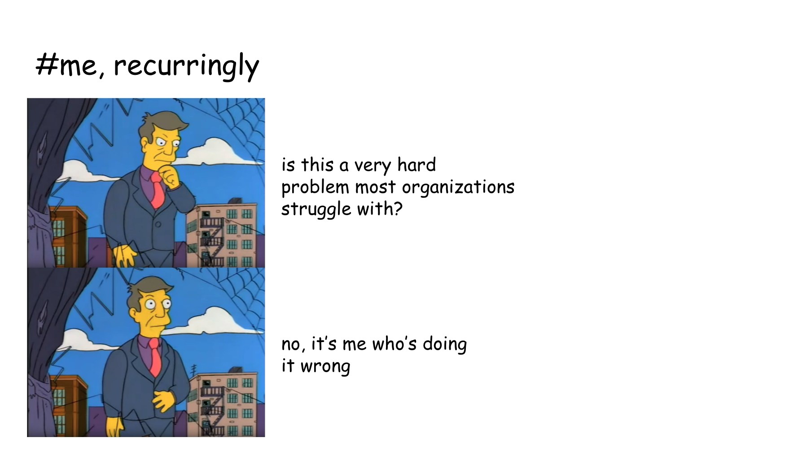

Not mincing words: trying to bootstrap a project like BobaBoard beyond proof of
concept was a hard journey. When I connected with fandom folks who had been
around the “new platform for fandom” block a few times, I was repeatedly
commended for being the rare person approaching it with realism.[^10] And yet, it was
still orders of magnitude more complicated than I thought it would be.

Above all, something unexpected kept happening over and over: me and my collaborators
would find ourselves grappling with a hard problem (usually an organizational
one), but **when I tried connecting with other project leads to learn how to fix
it, I’d find they had been struggling with the very same one, often for a long
time.**[^11] Even worse (or better?), sometimes it turned out we were doing a great job
compared to the average, and yet the job we were doing was anything but good
enough.

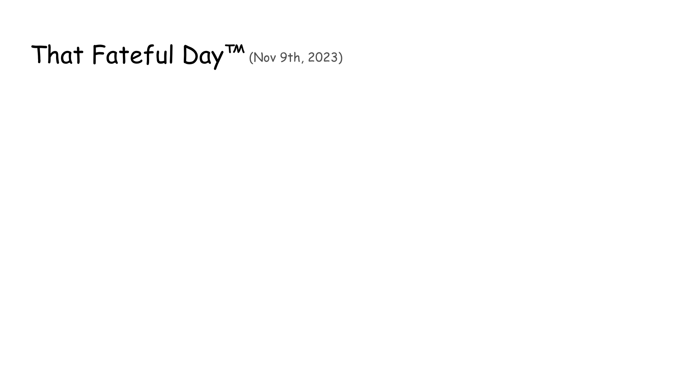

This all came to a head in November of last year. The BobaBoard team had been
going through a period of intense frustration: with a team made primarily of
volunteers we kept encountering false starts and stops, spending resources
training newcomers just to have their lives explode in their faces and having to
go back to square one.

But more importantly, **we were surrounded by negativity towards small platform
builders, and at the same time frustrated by the overwhelming amount of
responsibility placed on what was a small set of people**, without what we felt
was a corresponding level of support from those who directly benefited from our
work.

Once again I thought I must have been doing something wrong. Then on Nov 9th,
2023, three different project runners published three different posts
talking about the unsustainable mental and physical toll that their
projects had placed on them.

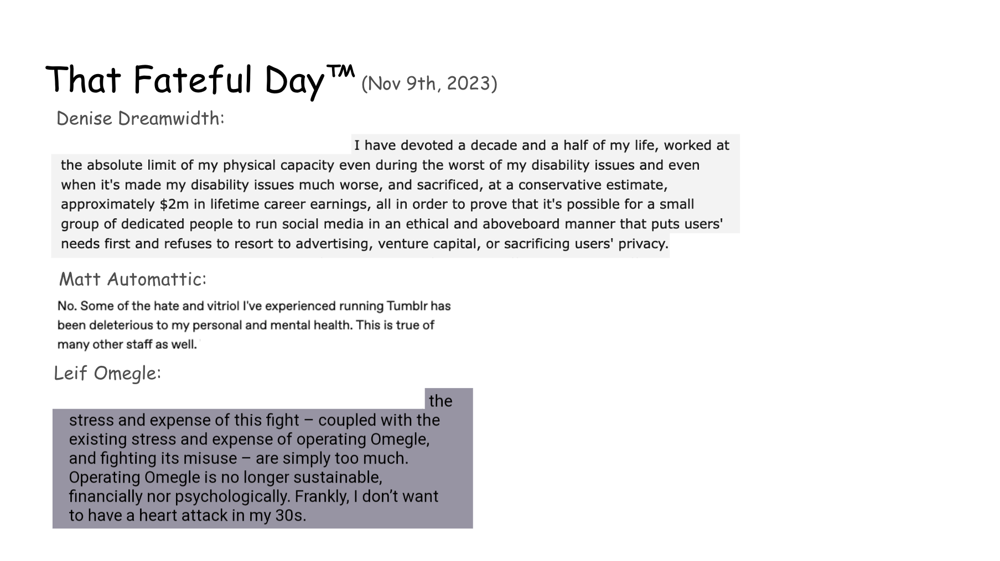

These were [Denise Dreamwidth](https://dw-news.dreamwidth.org/42768.html?thread=6496784#cmt6496784),
[Matt Automattic](https://www.tumblr.com/photomatt/733544377875595264/you-good-dude?source=share)
and [Leif Omegle](https://web.archive.org/web/20231111132523/https://www.omegle.com/).

Now, I’ll drink a glass of water and leave you a minute to read them. But before
I do, I just want to say: I know some of you will balk at the inclusion of our
newest Tumblr daddy[^12], but please consider that **those who run projects without that
amount of capital experience similar dynamics with way less layers of
indirection**, and way less money to have others take care of issues on our
behalf.

— BREAK —

Since
then, I witnessed many other project leads and contributors express similar
feelings. More independent projects, like retrospring recently, have been forced
to close shop. Even in the larger world of open source software, maintainer
burnout has been a bigger and bigger issue, with almost 60% of maintainers
having considered quitting (or altogether just quitting) their own projects.

**When issues like these come up, people run to find explanations that focus on
how the projects are run**: “_If only their TOS had been good! Didn’t they know
better?_”, “_Haven’t they thought about converting to a non-profit?_”, “_Maybe if
they hadn’t been rude that one time, then I’d have supported them_”, or the
evergreen “_Well, if they just added this one feature..._”

## Building Social Software: the Downward Spiral

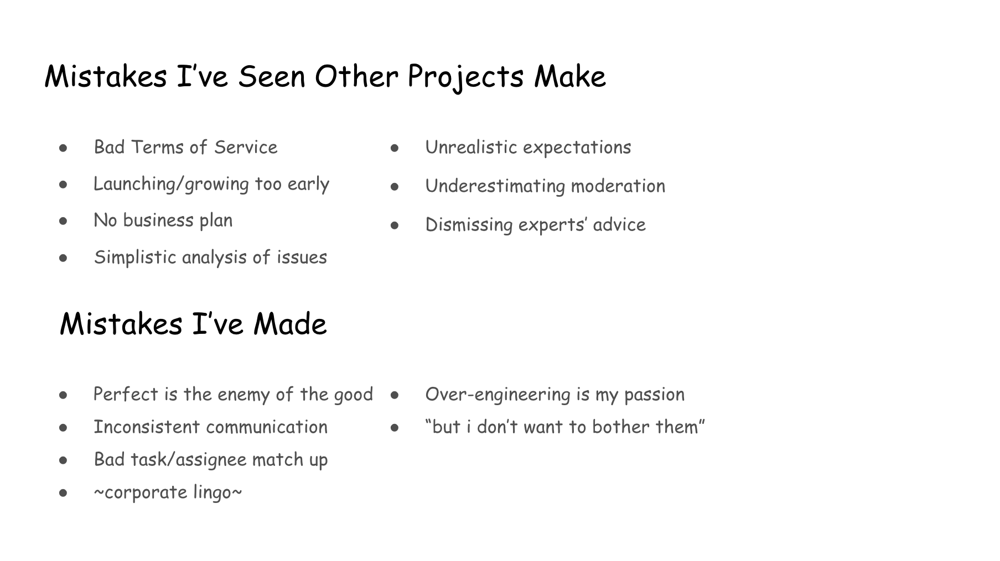

This is, of course, an understandable impulse, and not one without basis. **I am
personally, painfully aware that any project lead wishes they had handled
something differently**, and I’ve myself been very frustrated at avoidable
mistakes I’ve seen other projects make.

So here, before we move forward, I want to emphasize I don’t mean to dismiss the
share of the blame on the shoulders of project runners. But over-indexing on
these mistakes means missing the **ever-increasing structural issues that make it
harder and harder for indie projects that benefit the web to be born and to
continue to exist:**

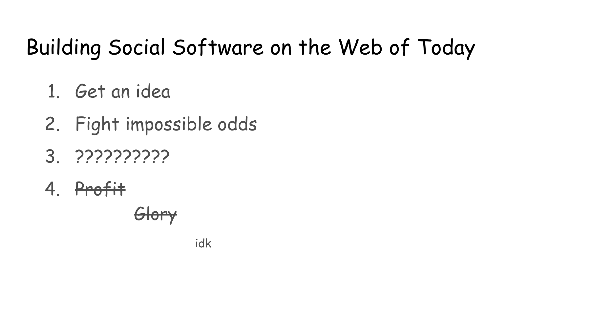

- Building and maintaining quality software is more and more expensive, with
  most non-business users unwilling or unable to pay recurring fees;
- the hostility in online spaces keeps escalating, and continues causing pain
  and frustration to already overstretched project contributors;
- social and economic instability makes it harder to bear the physical,
  emotional and financial toll of these projects;
- and last but not least important, many bleeding heart believers who even
  remember what the independent web was like are getting older, more tired, and
  sometimes outright passing away.

With how dire things are right now, **it’s hard to ask people to step in to fix
the issues that plague the social web. After all, what reward is there to reap?**

If anyone _competent enough to succeed_ was seeking money, they’d have an
infinitely easier time and much more likelihood of success with other types of
software ventures; if anyone was seeking glory, what they’ll find themselves
facing as their project gains visibility is an increasingly uncharitable (and for
some of us outright dangerous) internet.[^13]

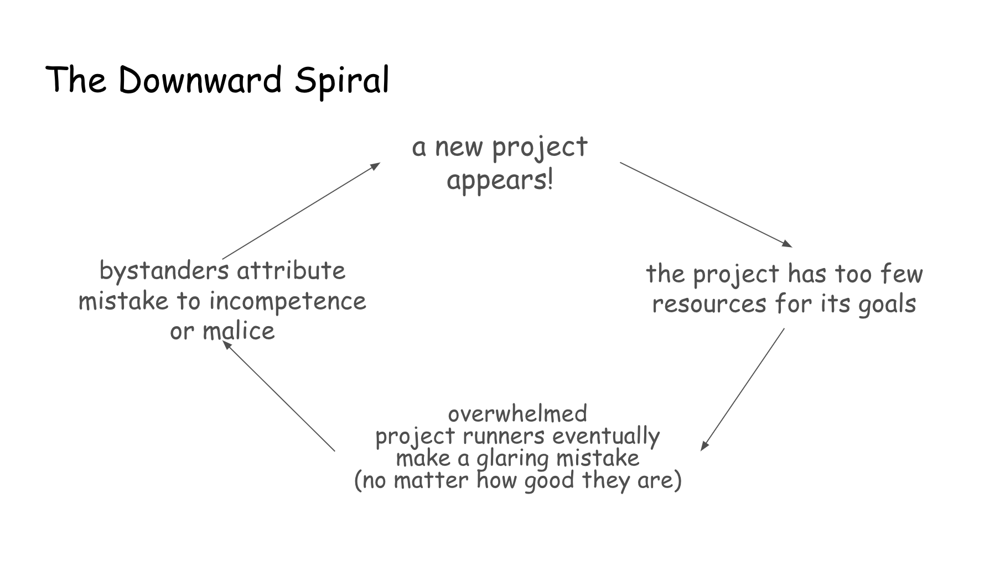

The things is, we’re currently in a downward spiral. Since large corporations
keep disregarding the needs of their users and underpaying their workers,
**indie projects often feel that they, untouched by corporate greed and
capitalistic incentives, are supposed to bring forth a utopia** where all hard
problems are solved, everyone is compensated fairly, and no one is ever made to
feel unhappy or unwelcome. But they come into a system that’s set up to see them
fail.

**Being an indie project makes it harder not easier to meet these expectations.**
After all, large swaths of our online world only survive because of large
investors. And even assuming a project were willing to ask for their help, large
investors would not find the financial return they seek in the projects we need
and would then refuse to fund them.

And so, as these projects try to fix everything with nothing, eventually one of
two things happens:

- either the people working on the project burn out, killing the project
- or a glaring mistake happens which proves to bystanders that the
  issue was simply that project runners were not up to the task.

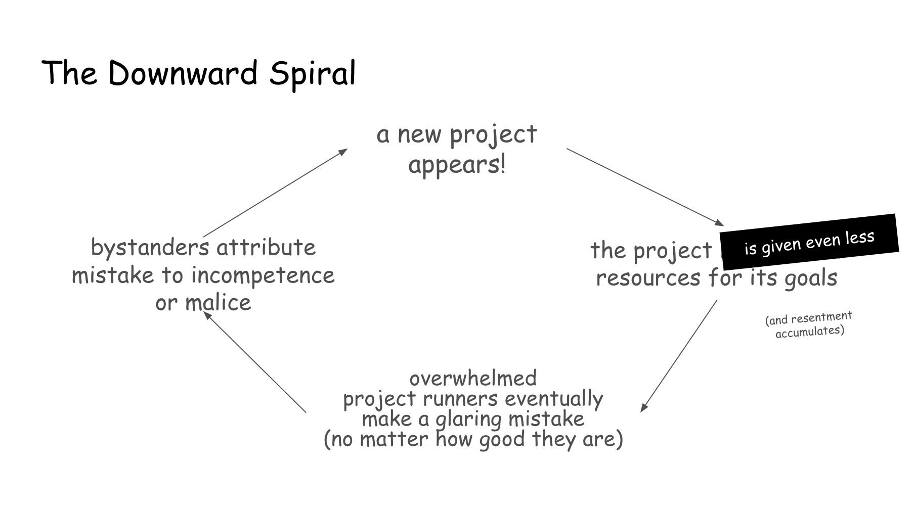

Then we do another round around the block: people who’ve had their hearts broken
before are even less inclined to support new projects, and a lot of resentment
breeds all around. And the spiral continues.

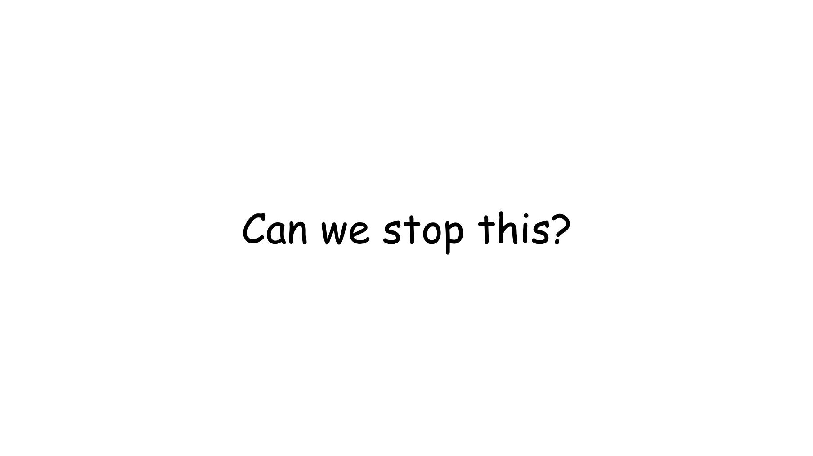

So now that I’ve described this uplifting and encouraging situation, _can we stop
this?_

## Escaping the Spiral

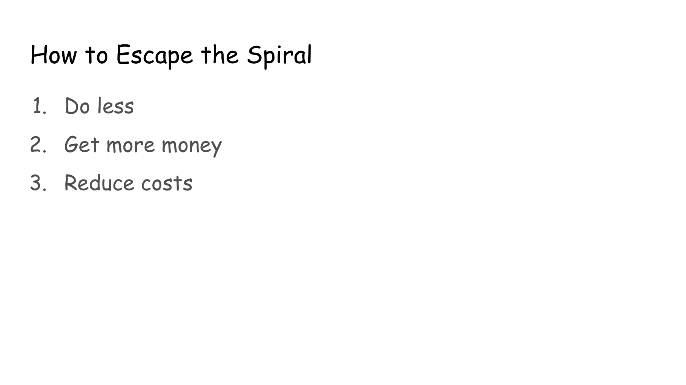

There are three main ways for a project to try to escape this spiral. None of these
are mutually exclusive, and they all influence each other to a degree.

I had originally included more about each, but it made this talk run long and I
want to have some time to answer questions people have sent in. So let me just
give a couple thoughts about the first two, and we’ll look at the third one in
depth.

### Reduce Scope

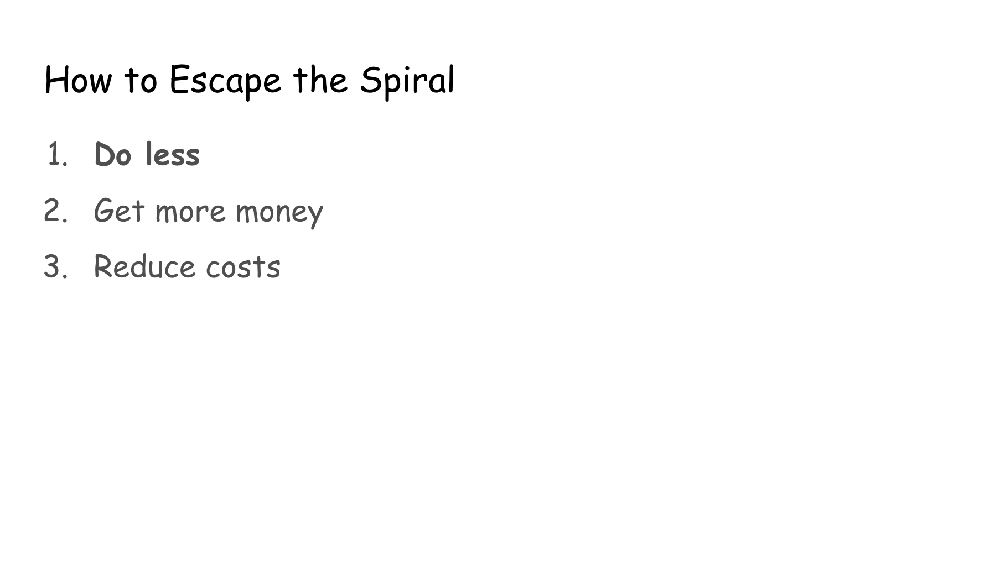

First, “do less”. If you set your sights lower, then you can build what you seek
while needing less resources. One way to do this is to take open source software
that already exists, modify it a bit, rebrand it, and offer it to others.

For example, an enterprising group of fans could use the open source software
behind AO3 to create a new fanfiction archive with a different moderation and
tagging policy without having to build a platform from scratch. **This has already
happened in fandom before**: it’s what Dreamwidth did with LiveJournal, and it has
given people a stable, independent home away from big platforms for the last 15
years.

But since one of the comments we saw earlier was from one of Dreamwidth’s own
founders, you can see this route still comes with its own challenges.[^14]

### Get More Money

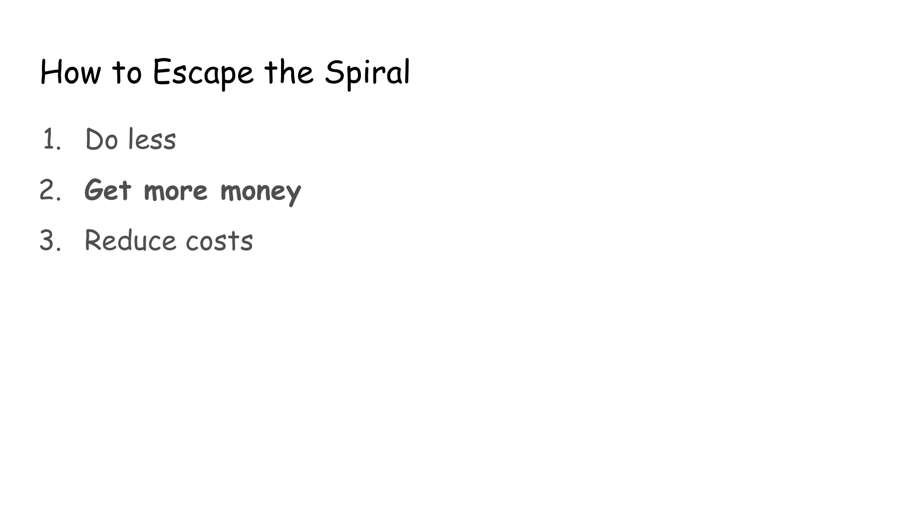

Next, get more money. There is a lot to say here so I’ll just let a picture
speak _nearly half a billion words…_

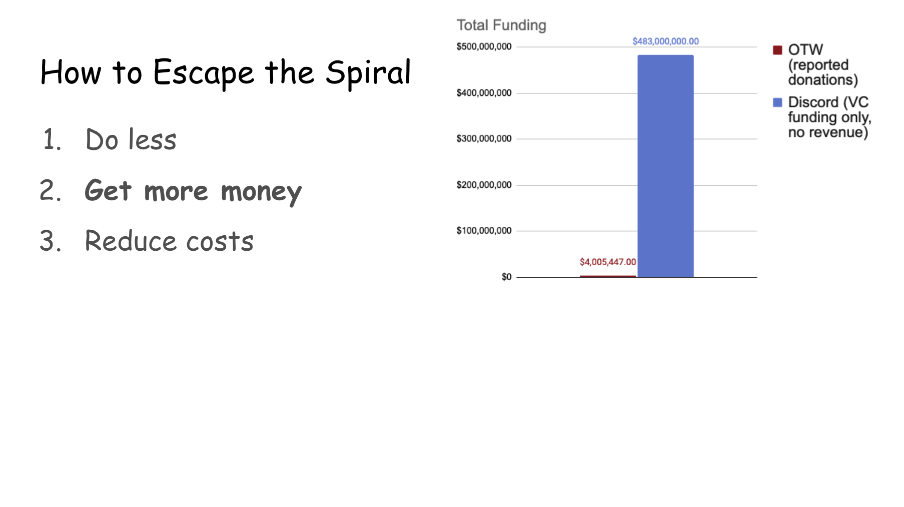

_…cause that is the difference in funds raised by the OTW and Discord throughout
the years._ While I made this image a couple years ago, not much has changed.
Most likely, the disparity has just gotten worse.

I want to stress: this chart does not include the money Discord makes selling
things like Nitro or getting paid by advertisers for product tie-ins. **This is
just what external donors invested in the company to buy it enough time to
become profitable software**, and is what Discord will be asked to pay back with
interest one day.

### Get Volunteers

So here’s the last strategy and our focus: reducing costs. There are a few
different ways costs can be reduced. Building decentralized software is
definitely one, and open source software also helps.

But the most tempting option is always the same: volunteer labor. In theory, **if
you’re looking to build a platform that solves a problem as shared as “better
online social spaces” then volunteers seem almost a no-brainer.**[^15]

---

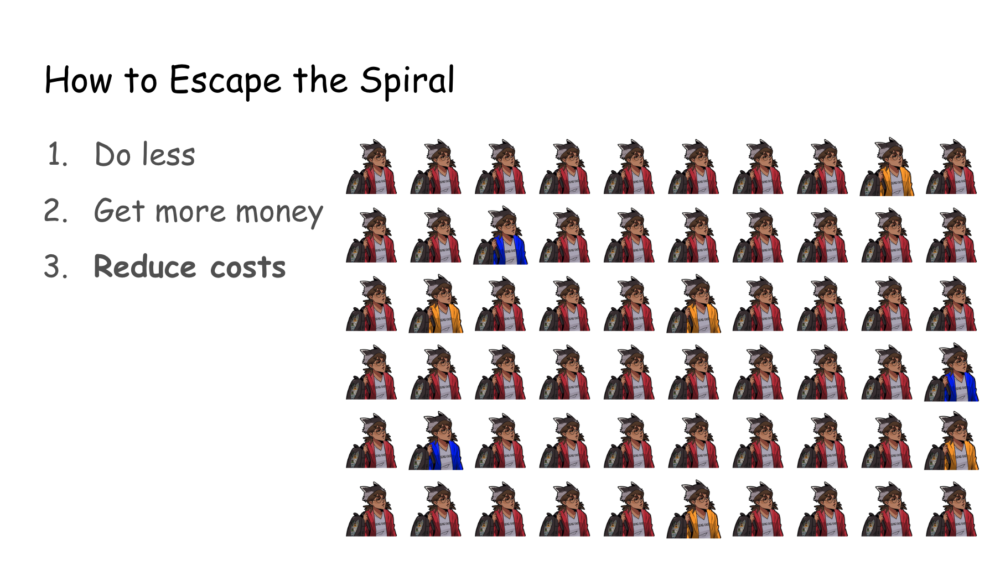

After all, isn’t part of the issue that there’s too many of us? And **if people
feel powerless and in the dark, at the mercy of platforms’ poor decisions,
wouldn’t they want to be involved?** Here’s where it gets tricky…

---

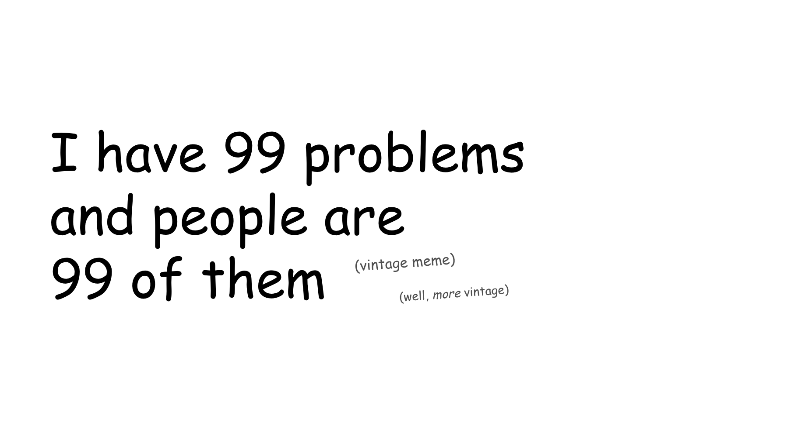

…as a famous software engineering maxim says _“no matter what the problem is,
it's always a people problem”._

Unfortunately, working together with people is hard. BobaBoard, and Dreamwidth,
and AO3, along with many others projects did and do indeed recruit the help of
volunteers. But as far as I can tell, **this alone has rarely been enough to
create an environment that is truly sustainable and that doesn’t overwhelmingly
rest on a few individuals.**

And to analyze why that is, we need to talk about power.

### To Be Continued....

...see you soon with part 2 (of 4) of this talk! Follow me [on my socials](/#socials) to make sure
you don't miss it, and in the meantime, if you want spoilers do check out [the full
recoding on YouTube](https://www.youtube.com/watch?v=tFx4XAOnFVE)!

Did reading this make you think, "_wow, I sure wish I could do something about all this, like
giving some of my hard-earned money to **a project that's all about helping communities
move past these issues to rebuild a sustainable internet**_"? Well, you're in luck because
[you can support FujoCoded LLC on Patreon today](https://www.patreon.com/c/fujocoded)!

[^1]:
    As everything on this page hopefully suggests, you should picture me
    saying all this in front of a live audience.

[^2]: Once a Cho Hakkai girl, always a Cho Hakkai girl

[^3]:
    "Exploring your teen queerness on fandom Yahoo groups" is (I believe) just
    the 00s version of the 10s' "exploring your teen queerness on fandom
    Aminos", which (probably) is now "exploring your teen queerness on fandom
    Discord servers". \
    \
    May it have been as fun and exilarating to you all as it was for me—I'd say
    "not as dramatic though," but I know fannish teens.

[^4]:
    08's me was sweet and innocent and had drank a lot of sweet-tasting tech
    kool aid. But, while you're ~~hearing~~ reading the story of me discovering
    things aren't as bright and rosy as I imagined, I want to stress: **being
    able to move to the USA, undergo the professional development a big tech
    company will offer, and earn a tech salary _did_ change my life and it _did_
    lift me out of poverty.** I will forever be grateful to the tech industry
    for that, my many gripes with it aside.

[^5]: Yes, I survived _"Tom Hiddleston takes over Hall H"_. AMA.

[^6]:
    I'm sure this particular executive never thought about their comment
    again, but every time I think about it whenever I find myself asking "can
    this category of people really be _that_ out of touch?".

[^7]:
    See it from the POV of an average successful Big Tech Executive who goes
    on Twitter mostly to post some pre-made statement about how proud they are
    of a launch, or to retweet some company announcement: they don't know what
    callout posts are; they've never seen a BYF; they live—or did at the time—blessed,
    simple internet lives.

[^8]:
    _"No stronger shackles than the one our own mind puts on us,"_ or some similar
    made-up-on-the-fly quote.
    \
    \
    Jokes aside, often the first step in changing The System™ is recognizing the subtle
    ways in which The System™ convinced you that nothing but The System™ can exist.

[^9]:
    It took me years to truly see this, but if I had to give one single piece of
    advice to someone wanting to make change nowadays, it would be this: the
    clearer what you're trying to achieve is, the more people will be empowered
    to join you on the road to achieving it.

[^10]:
    You may think people are cynical and disillusioned, and all I can say is... well,
    _there's a reason they are._ With that said, defaulting to believing in
    people is, I believe, something that's important not to lose—even if it
    _does_ get repeatedly beaten out of you. \
    \
    And if you're someone who wants to get things done (and I mean _truly_
    done), remember: **you can do things you would never believe are possible,
    but you need to be willing to face the hard parts head on.** If you can
    acknowledge and strategize arouns the many ways in which reality won't match
    your pre-existing beliefs, you're ahead of many, many, many others who've
    tried before. \
    \
    If it were easy, someone else would have done it, yes, but something not
    being easy is not the same as it being impossible.

[^11]:
    This eventually changed or I wouldn't be here today. But you'll have to wait for
    another talk to hear all about it.

[^12]:
    The more times goes on, the more I feel like I need to justify including
    Matt here. I have a lot of opinions on the situation, but regardless the
    point remains: if this impacts people you may see as power-hungry
    individuals that don't care about the pain they cause others, imagine what
    it does to everyone else.

[^13]:
    And then, when they complain, they'll be faced with the ever-classic, "_well,
    what did you expect? This is what you get in exchange for glory and
    recognition you sought!_" ...except that even if the person _was_ chasing glory
    and recognition, which they often aren't, the glory and recognition are
    often not worth the toll "being visible online" takes on people's mental health,
    especially when they're queer neurodivergent weirdos.
    \
    \
    I weep for the amount of brilliant people who could give so much to the
    internet are forced into hiding because of what online visibility means for them. And
    **the first step in fixing this situation is to stop accepting it as a
    foregone—even fair!—conclusion.**

[^14]:
    In the year since this talk, I have also connected with people who are running their
    own AO3 instances using that software. Let me tell you: it only further
    strengthened the arguments I'm bringing forward in this talk. Mastodon (or
    other Fediverse software) instance runners? Ah! More fuel for all this,
    I'm afraid.

[^15]:
    As they say,
    
    (affectionate)

