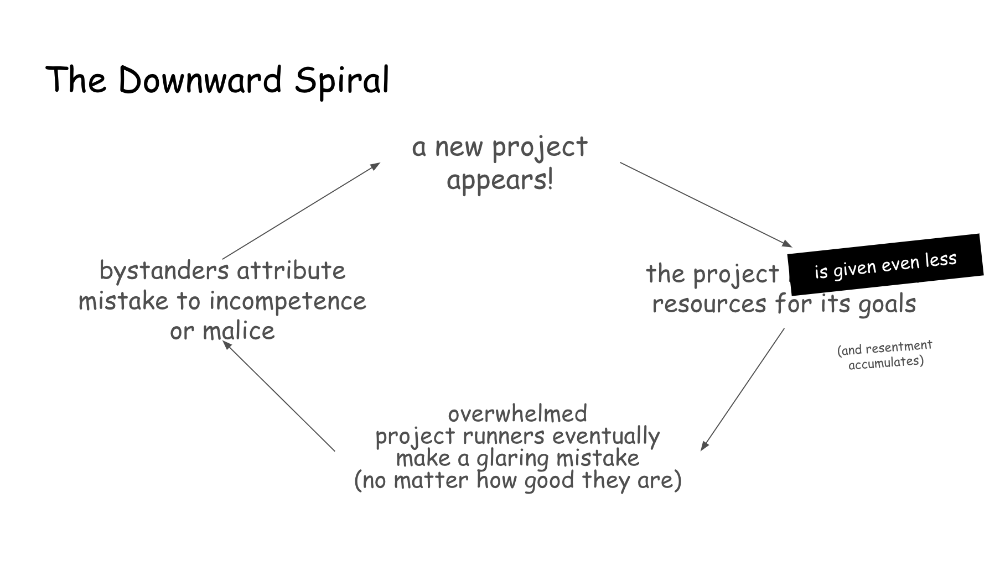
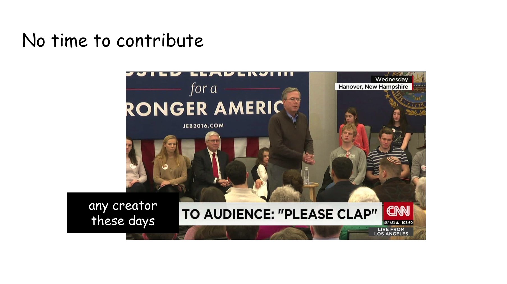
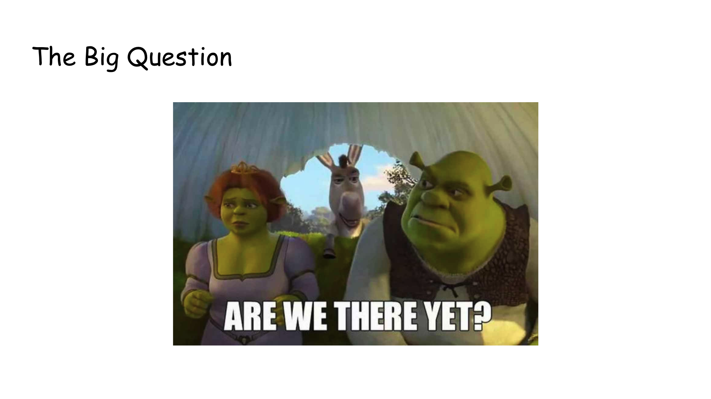

This was originally a talk given at [the 2024 edition of CitrusCon](https://www.citruscon.com/citrus-con-2024)
to a public of Boys Love media fans—one of the online communities most impacted by the current state
of the web. [Check it out on YouTube](https://www.youtube.com/watch?v=tFx4XAOnFVE), or read on!

## Previously on "Rebuilding Community"...

> Missed part 1? [Find it here](./part-1)!

**Independent projects for the social web are caught in a downward spiral!** Faced with
impossible odds and outsized expectations, project maintainers face unsustainable
levels of burnout. Even worse, each new failure (a foregone conclusion given the
situation) makes it even harder for new attempts to succeed. This perpetrates a cycle
of apathy and resentment in our communities.

How can we come out of this cycle? _Doing less_ is by itself not enough; _getting
more money_ helps, but independent fundraising cannot match the investment VC capital
injects into modern software; **is _getting volunteers to help_ the solution we seek?**

As they say, "every problem is a people problem". And there's only one way to
understand why projets struggle to move past a few individuals carrying a disproportionate
load, even when seeking intra-community help:

## Talking About Power

Now, this may feel like it’s coming out of left field, but bear with me. Let’s
go back to that fateful day when [those posts were
published](./part-1#a-wake-up-call-theory-meet-practice)[^1]: after seeing other
project leads talk about the toll of running projects, the frustration me and
my collaborators had been feeling spilled over, and we found ourselves
discussing our struggles openly within our communities.

While the discussion was at times raw, **we found that rather than creating
fear, uncertainty or resentment and causing people to retreat, openly sharing our
frustration instead renewed a sense of closeness and comradery,** with more people
coming forward to ask what they could do to help. After those discussions, we
did see a vibe-shift in our spaces. Obviously, that didn’t fix all our
issues—and yet, why did something change?

For a while, my answers were fairly
simplistic. It wasn’t until I read about other groups having similar experiences that I got
to better understand the role power played.

Now, the world as it has existed for a long time overwhelmingly rests on
hierarchical power structures. This means **we often tend to perceive our
relationship with the world as an “us” and a “them”, two separate entities, one
above and one below, one with power and one subjected to it.** Unfortunately
this is so ingrained inside and outside us, as to be inescapable.

So when you have people like us small platform runners (but not only) that
aren’t quite as powerful as those often slotted in this “them” group, but that
still do have some power, where do we go? You may think, “well, it depends on
the person”. And that's true! **Power is not an absolute thing, power only exists
in the context of a relationship.**

Now here's the thing: indie projects are often born as a rebellion against large
tech platforms, with the desire to shift the balance of power and put it closer
to the users. But **shifting who is in power doesn’t change that a hierarchy
exists,** no matter what intentions the power shift is born with.

Groups like ours that are overwhelmingly full of queer, disabled, poor, and
otherwise marginalized individuals, have often been betrayed and mistreated by
those in power. Because of this we’ve justifiably learned to be suspicious of
anyone who has it or seeks it. At the same time, **we've so often been stripped of
our own power and agency, that we may perceive those who wield it as
fundamentally different.**

Because of this, small platform runners can end up in the “them” group (often
subconsciously), even for the people we're here to serve and help. This is not
true for everyone, nor it is a fixed thing.

I've seen this happen first hand: what is a often long-time peer relationship,
even a friendship (in a way an “us”), can suddenly take an “us vs them” feel the
moment I find myself having to step into a role that has power. Eventually **as
long as someone is in power, the _us versus them_ is still there.**

Where there's power people will either passively submit, leaving all the
responsibility in the hands of “leaders”, or actively rebel, antagonizing those
above them.

However, when people saw us come forward with our frustration and pain, and
express the overwhelming weight of what we were carrying, it made it harder to
continue the narrative of us vs them, platform user vs builder, server members
vs moderators, person who can’t and person who can. After that discussion **people
saw us for who we truly are: members of their same community that, for all their
weaknesses and faults, are trying to build something that makes a difference.**

Once people saw the barrier drop, we were able to level the playing field, and
it became easier for us to ask for help, and easier for others to give it. It
made it easier for people to empathize with us and give us the grace we
sometimes need. Now if you’re jumping in your seat going “_I know how to fix
this! I know how to fix this! Let’s get rid of hierarchy and power_”, don’t
worry: we’ll get there.

But before we do, let’s talk about different types of power.

## Types of Power

They say knowledge is power, and indeed one of the most powerful things we can
do is to know more about it. So… We all deal with power in our lives, but **we tend
to have an oversimplified view in which power exists as a single entity.** In
reality, power takes many different forms.

### Power-Over

We’re all familiar with power-over. This is the classic type of power that flows
from above to below: often wielded through fear, shaming and bullying, where
people who use it are more concerned about _being right_ than _getting it right_. It
centers those at the top and disregards those at the bottom. **When someone has
power-over they can make a decision that affects someone else, even when the decision is
not theirs to make.**

Power-over is often confused with authority, which is when someone with special
context, expertise or insight has earned their position through experience and
learning. **The opinion of an authority may have more weight not because of
their place in the hierarchy but because of their understanding of the
situation.** But this is only true in some contexts, and it can easily become
power-over if authority exceeds its bounds.

Now, while we’re used to hearing about these types of power, we’re less familiar
with others. In particular, there is **one lesser-known type of power I believe is
fundamental to understanding the dynamic in our spaces: _power-under_.**

### Power-Under

**Power-under is power that flows in the opposite direction,** where people at the
bottom of a hierarchy wilfully avoid stepping into the power that they _do_ have.
Now since we often see power as inherently desirable, you may be confused by the
idea of choosing to renounce it. But what we tend to forget is that with great
power comes great responsibility, and responsibility can be _incredibly
uncomfortable._

When we renounce our responsibility and let others make decisions for us, we
always retain the ability to blame them when they turn out to be wrong, when
they were faced with impossible choices, or simply when we don’t like the
outcome of what was decided. When we don’t take on responsibility ourselves, we
can always say “I told you so” and believe we would have known what to do—and
done it better.

**By giving away their power, people also overpower others at the
same time.**

To show a neutral example, here’s quotes (presented with permission) from a
Pillowfort thread I did not participate in myself. You can see **people do
recognize power-under, even if they can’t name it.** And you can see how damaging
it can be to small teams of folks trying to make a difference.

During rehearsals, I was asked to pause here to let people reflect. So let me
drink a glass of water again.

— BREAK —

Now I want to be clear: just because someone is
in a top or bottom position, this does not mean that they exercise these powers,
do so all the time, or do so willingly. And **power-under does not imply that
people use it because they’re evil.** Instead, it’s been most often observed as
a trauma-response, especially in marginalized populations that may not often
have access to “power-over”. So given what we know about the demographics that
form our groups, you can see why it’s important that we discuss it and learn to
recognize it.

Once you know about power-under, you can see it permeate not only our platforms,
but our discord servers, fandom events, social movements and so on… and while
**you can see power-under morphing and getting worse as the web degrades**, you can
see it has been in our spaces way before this decline started.

### Removing Hierarchy: Power Sharing

Now that you know about _power-under_, you can see removing hierarchy is not as
simple as having those at the top give up power. To get equal power, those in
power do need to step down…

…but at the same time those with less power need to step up.

**Collective power, power shared between platform users and builders, can only
happen when _everyone_ uses the power they have.**

## Who Can Take on Power? _You_ (yes, _you_)!

Now, I’ve been around these spaces long enough to know what some of you are
thinking: "well, this sounds great for people who do have power inside them, _but
this surely does not apply to me!_ I don’t have anything of value to contribute,
and my personal life circumstances would keep me from participating anyway."

This goes back to something I said before: for many different reasons, **people
sometimes see those of us working on these projects as inherently different.** And
when we discuss these differences, these are the points we most often see come
up.

Before we go forward, an important reminder: it is not up to me to decide
whether you can contribute or not. Nothing I say should be taken as implying
anyone is making excuses. **Your power or lack of it is for you to self-determine.**

But I do believe it’s important for me to publicly spend some time talking
through each one of these points, as my collaborators and I did privately after
the Fateful Day™.

### Having Nothing to Contribute

So, let’s go in order!

When we talk with people about what hesitations they have about joining our
project, we often hear the same answer: “I don't have any valuable skill to
bring in, and all I’d do is bring everyone down”. Now, here’s the thing: when we
think about hierarchy, we see **there is not just a hierarchy of _power_ in our
society, but also a hierarchy of _skills_.** Some skills are seen as more valuable
than others, which are instead diminished and dismissed.

Since we tend to see skills as a fixed thing you either have or don't have,
this means that **if there are valuable and useless skills, there also have to be
valuable and useless people.** But not only is that not true, that wildly
misunderstands how skills are built and the type of skills a group needs to
succeed.

Let's take me as an example: there are some things I'm naturally good at. These
include things like "software engineering", “abstract math”, and "shitposting".
And I was lucky enough to be born in a era where my natural aptitude for
computers made it possible for me to be regarded as a "highly-skilled
professional".

However, there's also things I'm naturally terrible at, that I've only become
(relatively) able to do through active learning or repeated practice. These
include things like "business", "marketing", and "community building".

And then there are things that I never have been able to practice, or that I
still suck at despite trying and trying to get better at them. There are also
things that, while I'm theoretically able to do well, take a disproportionate
toll on me and quickly sap all my time and energy. These include "collecting
notes after discussions”, "assigning people tasks", and "entering data".

Because of my position as one of the "doers" and because some of my natural
skills are so high in the perceived hierarchy, I've found that **people tend to
assume that if I possess the skills at the top, then I must also inevitably
possess those at the bottom.** That couldn't be further from the truth.

Very often when I talk to people about the skills I lack and what I’m
desperately struggling with, I see a light bulb go off above their head: "oh,
that's not hard at all", they say, "I love doing that type of task", or (one of
my favorite to hear) "I didn't even realize that was a skill".

So allow me my one swearword in this PG-13 talk: fuck the hierarchy of skills.
To build successful projects we need many different types of abilities, all
across that “so called” hierarchy. Just like we’d be unlikely to succeed without
someone who knows software programming or without a good business plan, **we’d
also have a hard time going anywhere without the skills society tries to
convince us are useless.**

Some of the most impactful and positive contributions to our project have come
from people who collected data, updated our socials, asked questions, and wrote
alt-text for our posts and websites.

## Having No Time to Contribute

Now, the second one: “I don’t have time”. This is completely understandable!
Time (and mental space) are incredibly limited nowadays.

But **just like we tend to think we need to have big skills to contribute, we
also think that we need to do things that take a lot of time.** And yet, there
is something anyone running or joining projects needs that requires very little
time to do…

…and that is actively showing your support!

One of the hardest things any creator and platform runner deals with is complete
silence. **There’s nothing more alienating than doing things for an unresponsive
audience, and not hear back until something needs fixing or changing.**

Whether it is personally thanking someone who’s doing something in your spaces,
gushing about their work with others, or boosting their posts on socials,
interacting with people working to make your communities better is guaranteed to
make their day, and doesn’t take much time.

Now you may think: _but that’s so little!_ And, well, to be blunt it is! But this
is where we’re currently at. I’ve heard this over and over from many sources:
**people who are doing essential work for the health of our fandom web and
communities are struggling to get back even a simple “_thank you_”.**

And if you want to do more start looking carefully at your spaces: you’ll soon
notice small bits of work people may use help with that no one else is taking
up. Here’s some examples I was given of requests that often go unheard:

- helping to choose the day an event should be held on and creating a calendar
  invite
- submitting ideas for a “question of the day”
- saying hello to new members joining a Discord server, or
- helping fill entries in a community wiki.

**You may not be the perfect person to help with any of these, and yet you may be
the only one doing so!**

## Being too "[x]" to Contribute

And now the hard one…

This is something that’s very hard to talk about, and I wish I had had more time
to have many people review my wording and be confident I’m conveying the right
amount of nuance with the perfect phrasing. Unfortunately, this talk took way
too long to prepare, and the time for this topic is shorter than ideal.

**Remember I speak as an inside ambassador:** some of our most important
collaborators have disabilities that significantly impact their lives; some of
our collaborators have had significant life and health events; a lot of our
collaborators struggle with mental health, to the point that we have (as someone
defined it) "a bingo-card of mental illnesses" among our team; and obviously
some of our collaborators are poor, overworked, and in generally difficult life
situations.

When those of us who face these struggles have talked about contributing with
people in similar situations, we’ve repeatedly encountered something we believe
needs to be talked about.

### Learned Helplessness

And that is learned helplessness. Here’s what this may look like:

- Maybe we fail to meet a deadline for reasons we even struggle to explain, and
  feel the weight of the other person's disappointment, or worse we get yelled at.
  _So we stop showing up for tasks with deadlines._
- Or maybe we see someone effortlessly breeze through tasks we don’t even know how
  to start with, and when we struggle with the same we get the task taken away, or
  worse get mocked for our inability to complete it. _So we stop showing up for
  tasks that are hard._
- Maybe we’re told people like us will always struggle, _so we come to believe that
  we will never amount to anything._

**The trauma of learned helplessness builds up slowly, over time. Eventually, we
stop believing we could ever meaningfully contribute to our projects and our
communities.**

While everyone's life circumstances are different, I’m here to tell you: it may
come with unique challenges, it may not be easy, you might need support and
encouragement and a safe space to fail, learn, and get up to try again, but \*_all
of us have the power to show up and make a difference._

### Power Types Encore: Power-Within

And this brings us to the last type of power of today: power-within. **ower-within is
what happens when we're able to step into our own agency, see that we are
capable, and believe (or even better know) that we can meaningfully contribute
to our collective.**

During this journey, we’ve met many people struggling with learned helplessness
and saw them overcome it to reach power-within. When this happens, people are
transformed. They often go from timid and hesitant to eagerly volunteering their
skills and opinions. They learn to say, “I don’t know if I can do it, but I will
try”. **They learn to recognize when a task does not play to their strengths, and
see failure as an inevitable condition for growth rather than a personal defeat.**

Even more importantly they go from _needing_ encouragement, to _giving_
encouragement.

Helping people step into their power is hard work, and not everyone can do so
within organizations as messy as the ones that exist today. But that makes it
even more important that **those who can show up for this stage of the journey
help us create an upward spiral that counters the cycle of hopelessness we’re
currently stuck in.** More than any piece of software this is what will rebuild
our communities.

Because **real community happens when people help each other become who they want
to be**; when people come together to share information, skills, hard-won lessons,
attentive care, and above all _friendship_; and, when in the process of doing so,
people create something that is bigger than the sum of their parts.

## ...In The Next Episode of "Rebuilding Community"

...see you soon with part 3 (of 3) of this talk! Follow me [on my socials](/#socials) to make sure
you don't miss it, and in the meantime, if you want spoilers do check out [the full
recoding on YouTube](https://www.youtube.com/watch?v=tFx4XAOnFVE)!

<h3>Before You Go:</h3>

Did this talk make you think, "_wow, I sure wish I could help, maybe by giving
some of my hard-earned money to **a project that's all about helping
communities rebuild a sustainable internet**_"?

Well, you're in luck: [you can support FujoCoded LLC on Patreon today](https://www.patreon.com/c/fujocoded)!

[^1]:
    From the previous part: "On Nov 9th, 2023, three different project runners
    published three different posts talking about the unsustainable mental and
    physical toll that their projects had placed on them."

