This was originally a talk given at [the 2024 edition of CitrusCon](https://www.citruscon.com/citrus-con-2024)
to a public of Boys Love media fans—one of the online communities most impacted by the current state
of the web. [Check it out on YouTube](https://www.youtube.com/watch?v=tFx4XAOnFVE), or read on!

## Previously on "Rebuilding Community"...

> Missed part 1? [Start from the beginning](./part-1)!
>
> Need to catch up with part 2? [Pick up from the middle of our story](./part-2)!

---

And with this hopeful message, it’s time for the last big question: is what we
discuss today enough? Well, I’m sorry to say that alas, harnessing the power of
more helpers is a necessary but insufficient condition to escape the current
situation. Here’s the problem:

---

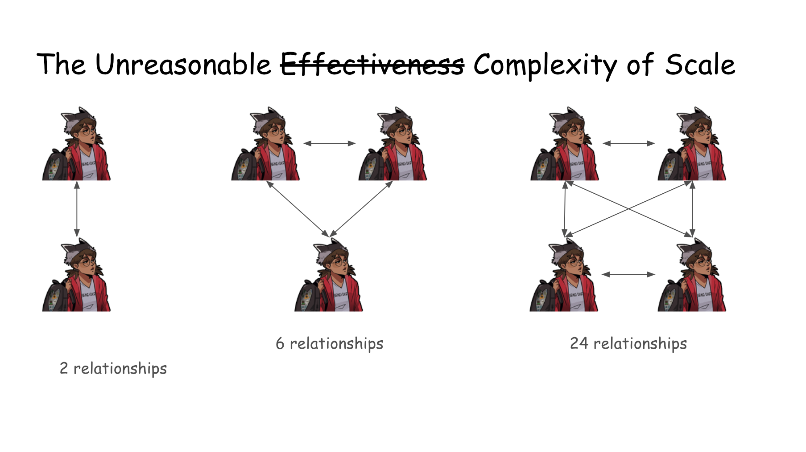

As you know the larger the cast the higher the number of relationships between
its members. Similarly, when more than a handful of people come together to work
on a project, complexity increases dramatically. Every person adds more arrows
to the graph of relationships, and every arrow adds new possibilities for
misunderstandings, missed expectations, someone shipping your NOTP, and
eventually proper conflict.

---

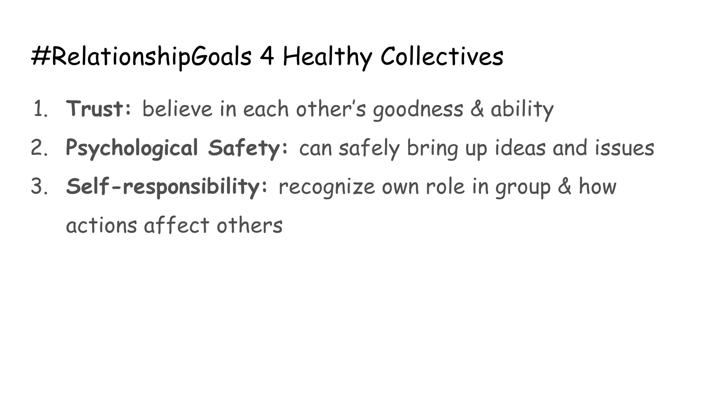

Going deep into this would require us to explore trust, psychological safety and
self-responsibility. However, this talk is already long, so I’ll leave you with
just a few thoughts: as things are now, it’s hard to feel safe and secure in the
spaces we inhabit. When we feel under constant threat, it’s hard for people to
speak up when needed and to listen when necessary. When the collective
suspicion, resentment, and pain that results from their members feeling
silenced, disrespected or otherwise unsafe eventually boils over, organizations
often clench up in response. They tighten their ranks, become less transparent,
and attempt to maintain order through increased control and hierarchy.

---

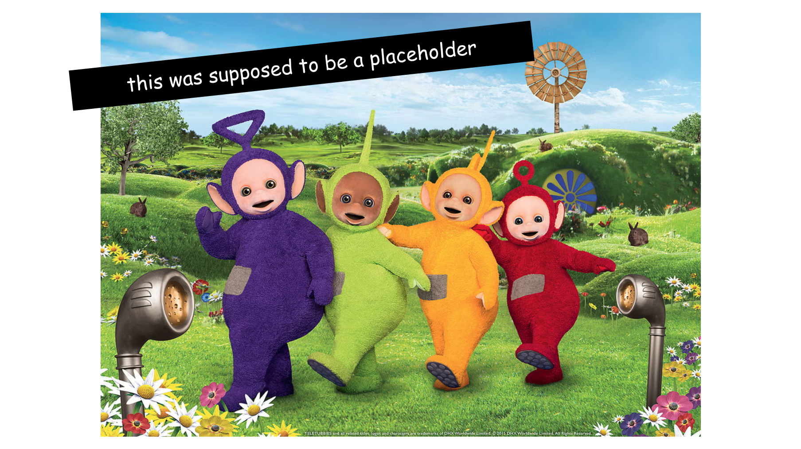

But we can create environments where feedback is gladly given and received. We
can teach people the skills to solve their own conflicts from a place of love,
giving them a true sense of responsibility for the words they use and the
environment they create. We can build projects where we collaborate on an even
field despite our differences. But creating those spaces starts with
understanding that organizations and communities are messy. Being together in
harmony is the biggest problem humanity has ever faced, and one we continue to
struggle with. Despite what we may think, building good organizations is not a
solved problem with an easy blueprint to follow.

---

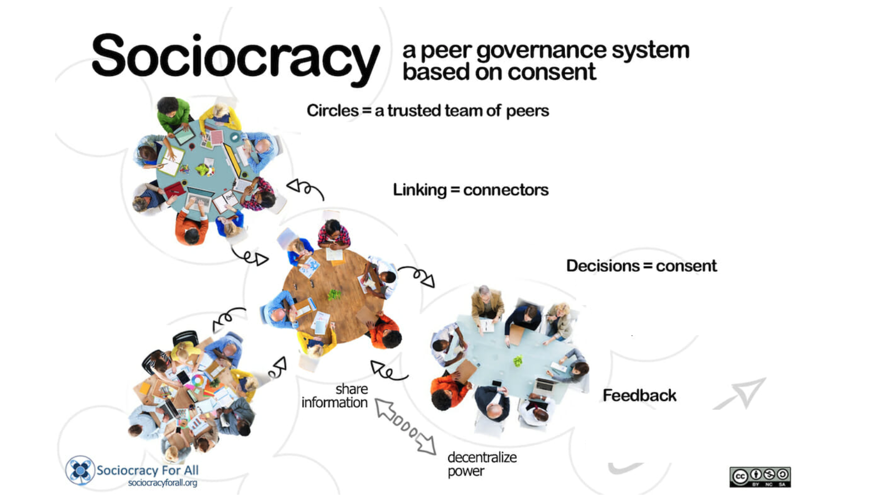

But this has started to change in recent years. Within the past year, I learned
about sociocracy, a peer governance system that uses a mechanism of circles and
consent to enable non-hierarchical, decentralized decision making. A lot of what
I discussed today I only learned thanks to the educational material created by
Sociocracy for All, an organization that helps other organizations learn about
and adopt this system.

---

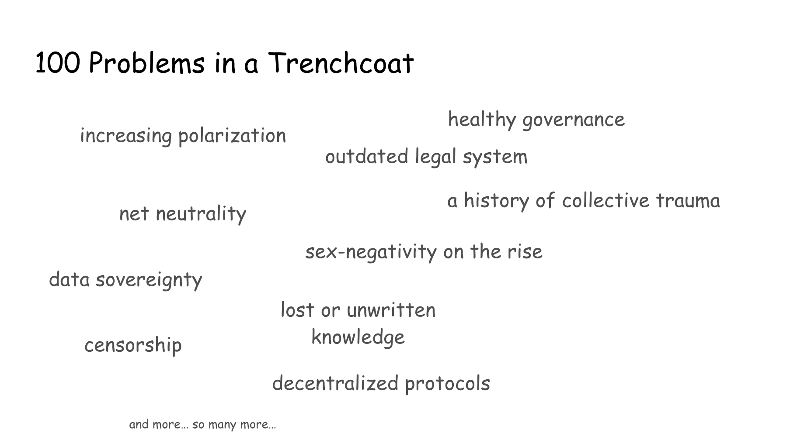

I hope today helped you appreciate how the problems that plague our web and our
communities are complex and intertwined. No one knows how to fix all of these
problems alone, and not all of them even have a clear solution.

---

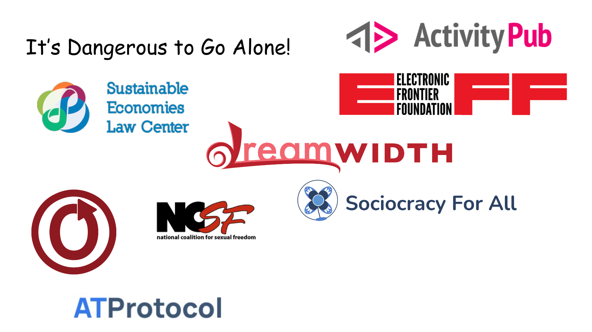

But here’s the good news: just like we are not alone as people, we are also not
alone as communities. There’s a lot of groups out there solving the many
problems on the way to a better, more equitable, more communal online and
offline world. I mentioned Sociocracy for all already, but we also wouldn’t be
here without the Sustainable Economies Law Center, that has given us free legal
advice that helped me go from someone terrified by the american legal system to
someone who’s still terrified by the american legal system but that can
understand and navigate some of the issues it presents. And obviously I would be
remiss not to mention the work that Dreamwidth did paving the way and that they
continue to do on both the legal and platform sides, as well as offering us
support and advice as needed. Similarly, it’s important to recognize the
inspiration that the OTW provided as well as the wisdom its individual members
have shared with us.

---

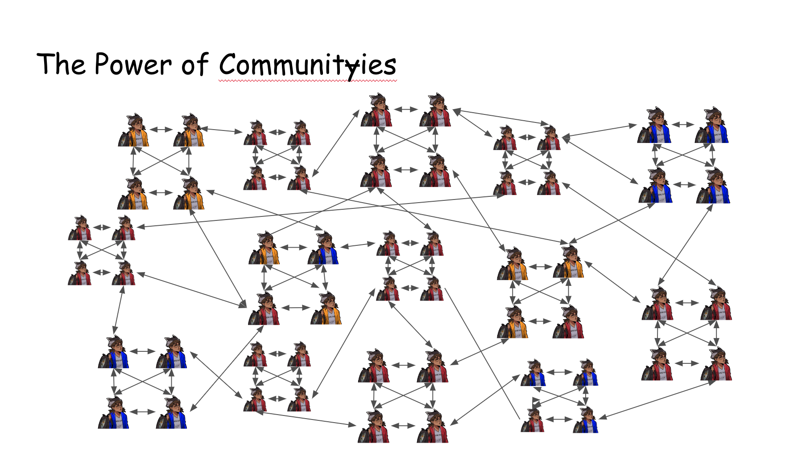

Eventually true change on a large scale does not happen by working together as a
single group, but by empowering people to create new ones and work together on
the problems that matter to them, with their unique power and perspective. When
such a system exists, everyone can find the place where their power can be put
to use in a way that best matches their work style and values. And just as
importantly, the failure of one project won’t cause the whole system to
collapse, but instead makes us all stronger by teaching us what we didn’t know
before.

---

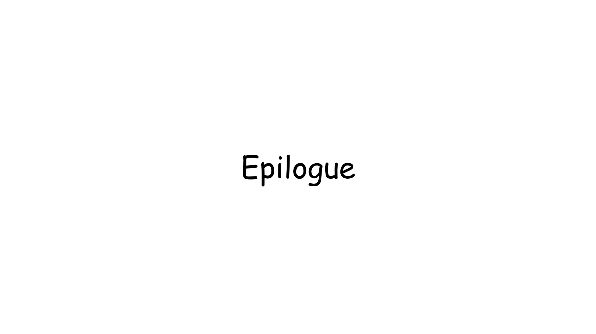

And with this our talk comes to a close.

---

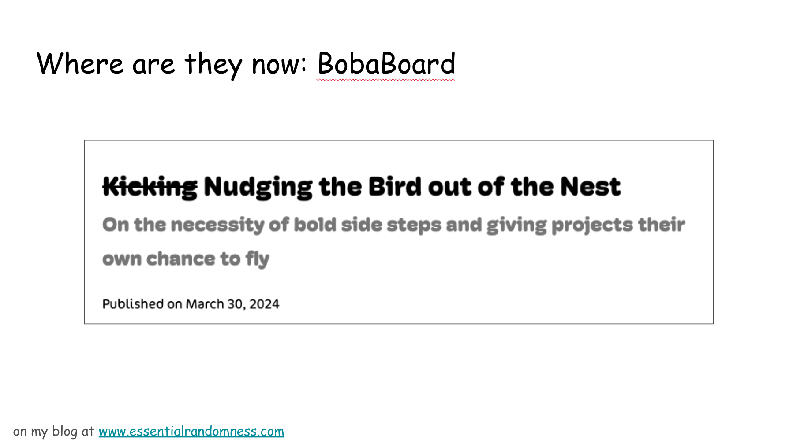

In March, some time after “that fateful day”, I officially stepped down as
BobaBoard’s project lead. While I’m still involved with the project, this
gesture explicitly signaled my decision to renounce the power I had and put
BobaBoard’s future in the hands of the community. I’m happy to say people gladly
stepped in to take on the power I had given up, and thanks to the hard work of
some contributors, we’re now in the process of growing BobaBoard as a
sociocratic organization. Progress is slow, the todo list is ever growing, but
we’re working hard to remove me as a bottleneck and unwillingly-central decision
maker and enable people to come help us make BobaBoard a reality.

---

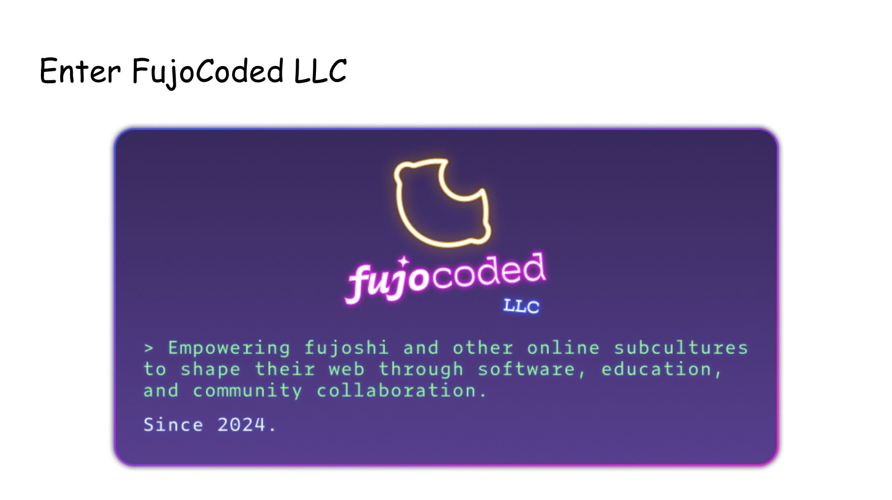

And then this April, me and a few other BobaBoard volunteers officially founded
FujoCoded LLC, with the explicit goal to empower members of online subcultures
to shape their own web and build a kinder, more diverse, more collaborative
internet.

---

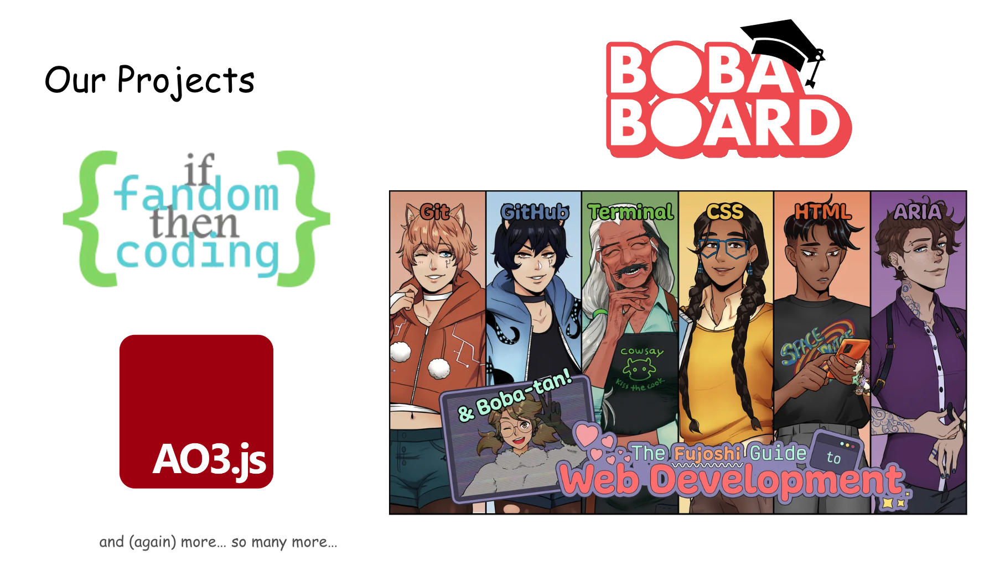

The projects we run are many and varied. They range from teaching people how
build and collaborate on software by using hot fictional versions of programming
languages, to starting communities that help people find support on their coding
journey, to building experimental software like BobaBoard that will give them a
place to come learn and create their own web.

This new chapter of this story has just started, and there’s no telling where
it’ll end up going in the future. Knowing our next steps doesn’t make the
journey an easy one. But I’m excited and eager to continue working on nurturing
an internet that has meant so much to me, alongside the friends who helped make
this journey possible, and the new faces we’ll continue to meet along the way.

---

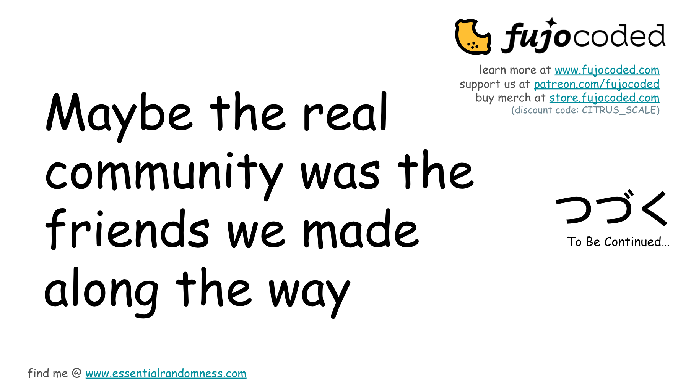

And with this, I’m done! Don’t forget to go check out our website to [sign up for
our newsletter](https://fujocoded.com/#newsletter), [support us on Patreon](https://www.patreon.com/fujocoded) so we can continue providing awesome
educational resources, and [buy our incredibly cute merchandise in our store!](https://store.fujocoded.com/)
Thank you!

---

[Sociocracy For All](https://www.sociocracyforall.org/)

[Collective Power](https://www.sociocracyforall.org/collective-power/)

---

[^1]: PLACEHOLDER

[^2]: PLACEHOLDER

[^3]:
    PLACEHOLDER
    PLACEHOLDER
    PLACEHOLDER
    PLACEHOLDER \

