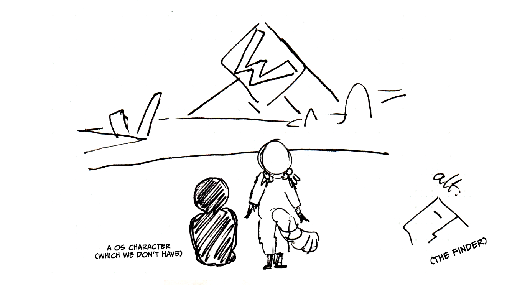
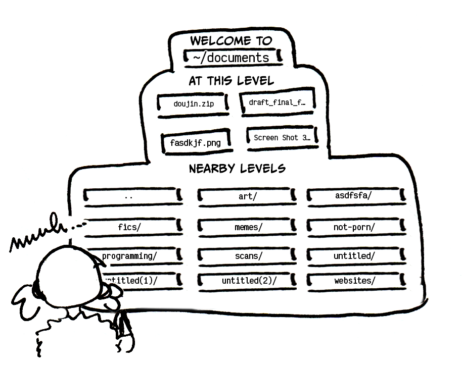
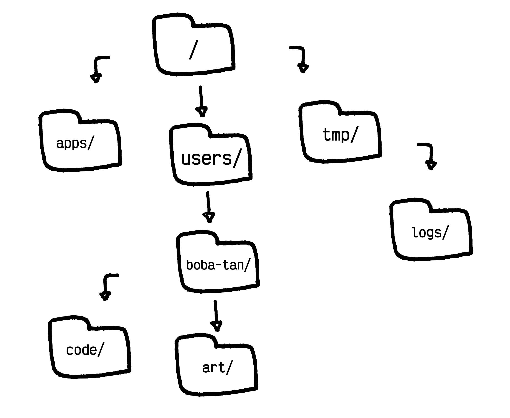
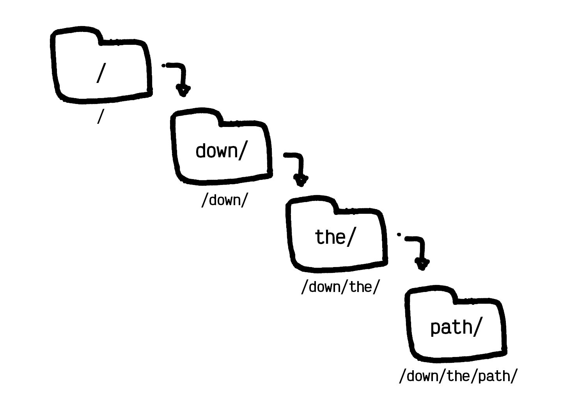
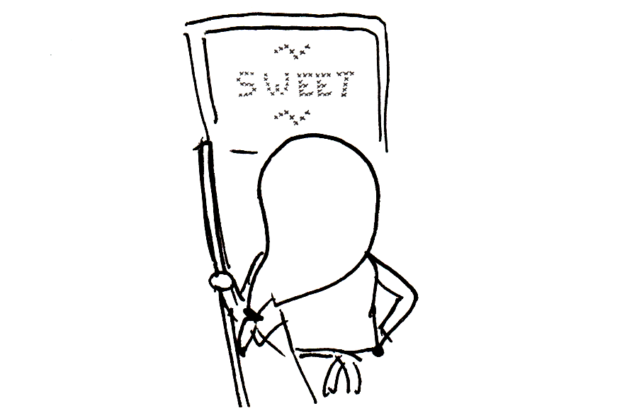
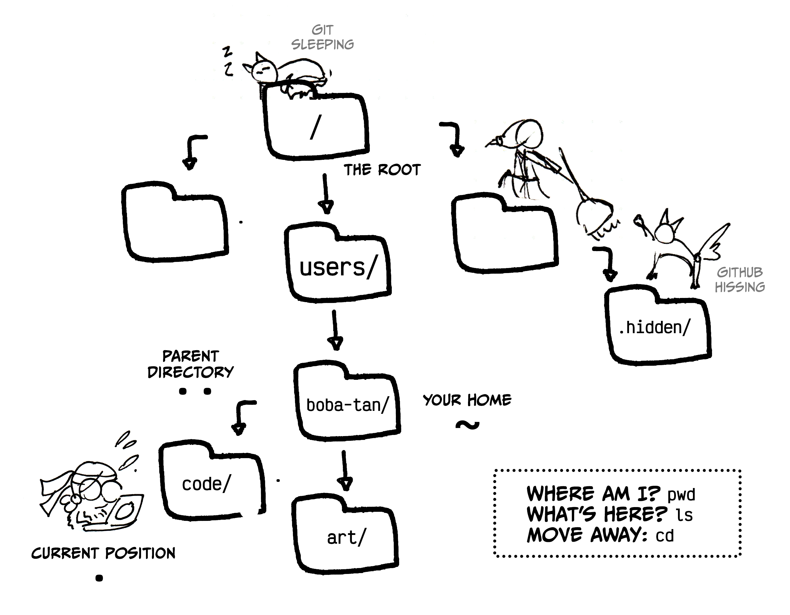

import Outro from "../../../components/posts/Outro.astro";

## What's a File System, anyway?

Think of data stored on a disk as a primordial soup of `0`s and `1`s. While all
the information you have saved does exist somewhere on the disk, it cannot be
retrieved without something to give it boundaries and "shape". **The file system
is the part of the operating system in charge of reading and writing "files" out
of this sea of data**[^-1].

<figure>


<figcaption>(End of Evangelion voice) "I knoooowww, I know I've let you dowwnnn~"</figcaption>
</figure>

### What File Systems Do

Aside from knowing how to retrieve the content of a file from the disk it's
saved on, **file systems also maintain additional information about each
file.** For example, a file system might keep track of, among many other things,
when a file was created, when it was last accessed, and which user owns the
file.

However, **the most popular function of the file system is to maintain a
human-readable way to organize**–one might say, _file away_–**this data.** It
does this is by keeping track of the `path` of each file within a
system of `directories` (also called `folders`).

### Folders and directories

When file systems were first created, the files in a system would be presentend
as a single, long list. However, when this proved unwieldy to manage, **people
decided they needed a way to group related files together.** While this seem
obvious in retrospect, it wasn't immediately so at the time: to figure out
the right organization system, people turned to the real world for guidance.

In particular, two metaphors surfaced: `folders` and `directories`[^0]. While
`folder` is the more popular metaphor for laypeople, `directory` is the preferred
term when talking about programming.

#### The folder metaphor

<figure>


<figcaption>Filing away her fanfic collection.</figcaption>
</figure>

**Imagine each file as a sheet of paper. To keep related files together, you could
place them in a paper `folder` to collect them.** Then, you might imagine yourself
continuing to group related `file`s and `folder`s together, placing them within
their own `folder`, then within another `folder`, then maybe within yet another
`folder`... eventually, thanks to your zelous organizing, you end up with
a single `folder` that contains all the `file`s and `folder`s in your system.

#### The directory metaphor

<figure>


<figcaption>"This filesystem is a maze!"</figcaption>
</figure>

Similarly, imagine you're searching for a file somewhere in your system. **To
find the data seek, you might consult a `directory` that lists every file along
with its "address" in the system.** As the amount of files grows big, you may
want to have a multi-level system, where each level has its own `directory` to
point you towards either the files at that level or the nearby directories where to
continue your search.

### The File System Tree

Regardless of which metaphor you like best, **the end result is a branching
structure with every file in your system placed somewhere within it.** The shape
of this structure is one of the most common and studied in programming: a tree[^1].

<figure>


<figcaption>
  If you rotate the picture 180 degrees, you can imagine the top level folder as the base of a tree (its "root"),
  while the branching paths form its, well, "branches" (that end in "leaves"). Yes, these are all
  technical terms.
</figcaption>
</figure>

#### Finding your Path

One of the advantages of this structure is that each file occupies a unique
position within it. To point someone to a specific file, you can start from
the top-most layer and lay out to the specific sequence of `directories` they must
move through to find it. **The `path` of a file is the sequence of `directories`
one must follow to reach a file, starting from the top of the file system.**

#### Unix vs Windows

While the general metaphor is the same, there are some differences on how
Windows and Unix[^0_5] systems represent paths that's important to be aware of.
These are:

- **Top-level folder/directory:** in Windows, the top-level folder is prefixed
  with a single capital letter indicating the disk it belongs to. For example,
  you likely have seen `C://` as the top level folder of the `C` disk. In Unix,
  the top level folder is always `/`.
- **Path separator:** In Windows, each `directory` in a path is historically
  separated with a backward slash ("`\`"). Unix systems always use the forward
  slash ("`/`").

### Useful file system terms and concepts

When talking about file systems, a few terms appear over and over:

- **Root:** The top-level `directory`, where it all starts from. This is usually
  represented with `/`.
- **Parent:** Each `directory` (aside from the `root`) has another `directory`
  that contains it: its parent. Computer scientists usually refer to the
  elements under a parent as its children, though is not as common in file
  systems.
- **Subdirectory/Subfolder:** If you put a `directory` within a `directory`,
  that's called a `subdirectory` of the parent `directory`. You can use a
  similar terminology for `folder`.
- **Nesting:** When a `directory` is contained within another `directory`, we say
  it's "nested" within it.

<figure>


<figcaption>

Do not talk to me or my subdirectory, or my subdirectory's subdirectory, or my
subdirectory's subdirectory's subdirectory, or my subdirectory's
subdirectory's subdirectory's subdirectory ever again.

</figcaption>
</figure>

#### Your own personal space: Home Sweet Home (`~`)

<figure>


<figcaption>He cross-stitched that himself.</figcaption>
</figure>

In modern operating systems, **each user is assigned a "home directory", their
own special folder where to store their data.** The home directory of a user is
usually inaccessible to other users, making it a safe place to collect personal
files.

**The symbol for the home directory is `~`**. You'll see it around a lot.

On Windows, the home is generally under `C:\Users\[username]`. On Unix
systems, the position changes quite a bit, but will generally be some variation of
`/usr/[username]`.

#### Sneaking around: hidden files and folders

To make things more tidy, or to hide them from less experienced eyes, files and folders can
be marked as hidden. In Unix systems, this is done by prefixing their name with a "`.`".
It is often used for configuration files (like `.env`) or program folders that should not be
manually edited by most users (like `.git/`).

## Moving across the file system, Terminal Edition

**One of the most important things to do to get comfortable using a terminal is to learn
to travel across the filesystem.** You only need to learn three simple commands to
make moving around a breeze:

1. "Where am I?" (`pwd`)
2. "What's here?" (`ls`)
3. "Let's go somewhere else" (`cd`)

While Windows has its own unique commands, it has now adapted to the Unix style.
If you're using PowerShell as your terminal (you should), then many Unix
commands will be available to you[^2].

### Oh, user, where art thou? (`pwd`)

**The first, most important question to learn how to answer is: where am I?** To
do this, you can use the `pwd` command. `pwd` stands for **P**rint
**W**orking **D**irectory, but if you need another mnemonic I propose
"**P**ardon, **W**hich **D**irectory (is this)?"

Running `pwd` will show you the `path` you're currently at.

```bash
pwd
# output
/users/boba-tan/programming/blorbo-shrine/
```

### Show Me Your ~~Secrets~~ Files! (`ls`)

**You can look around your current position with the `ls` command.** `ls` stands for
**l**i**s**t, but if you need another mnemonic, I suggest "**L**et's **S**ee".

```bash
ls
# output
art/
asdfkasdfhjk.png
doujin.zip
memes/
```

One caveat about `ls` is that it doesn't show hidden files or directories (the ones
starting with `.`) by default. While this keeps things tidy, you might want to
see _everything_ your current position has to offer. **You can list hidden files and directories
by using the `-a` flag (`a` stands for "all").**[^3]

```bash
ls -a
# output
.surprise-file
.surprise-directory/
art/
asdfkasdfhjk.png
doujin.zip
memes/
```

You can use a path with `ls` to see what's in a directory different from the one you're
currently in.

```bash
ls -a ~
# output
.ssh/
.zsh/
art/
asdfasdfasdf.png
programming/
```

### Beam me anywhere, Scotty (`cd`)

**To go to a different place, you can use the `cd` command.** `cd` stands for **C**hange **D**irectory, and if you need a
different mnemonic you're out of luck cause I really can't do better than that.

You use `cd` by following it with the `path` you want to move to. For example, to move to your home folder, you could use:

```bash
cd ~
# equivalent to:
cd /usr/boba-tan
```

**`cd` can use both relative and absolute paths**. But since you still don't know what this means,
let's go learn that.

> **Quick tip:** you can use `cd -` to go back to where you were before your last directory change.

## Absolute vs Relative Paths

There are two ways to point to a location in a file system:

- In an **absolute way** that describes the `path` to take from the root of the file system.
- In a **relative way** that describes the `path` to take from a different position within the
  system, most often the one you're currently at.

#### Working with absolute paths

**Absolute paths always start from the root of the file system.** This means that absolute path
always start with `/` or with `~` (which is a shorthand for `/usr/[username]`).

```bash
# go to the fanfics folder in the user home
cd ~/fanfics

# list all the users folders
ls /usr/
```

Running `pwd` in a directory will show you its absolute path.

```bash
pwd
/usr/boba-tan/programming/
```

#### Working with relative paths

**Relative paths start from where you currently are in the file system.** Paths
are interpreted as relative when they don't start with `/` or `~`.

There are two special symbols to remember when working with relative path:

- **`.` (single dot) indicates your current directory**. `directory_name/`
  (without prefix) is equivalent to `./directory_name/`, that is the
  "`directory_name/`" directory under your current directory "`./`".
- **`..` (double dot) indicates the parent directory**. This shorthand helps you
  visit your whole family tree. For example, `../../` will be your grandparent
  directory, while `../another_directory/` will allow you to point to your
  "sibling directory".

```bash
# go visit your parent
cd ..

# see what your grandparent has to offer
ls ../..

# stay exactly where you are!!
cd .

# now show me your secrets
ls -a .
```

## Final cheatsheet

Here's a final cheatsheet to help you remember what we learned.

<figure>


<figcaption>

If you find this useful (and want a version with better art), let me know! We're
currently working on the cheatsheets for FujoGuide's backer rewards.

</figcaption>
</figure>

While there's an infinite amount of things to say about file systems, this is
an overview of what you need to know to navigate them in everyday programming.

<Outro slug="terminal-filesystem-friends" />

[^-1]:
    While there's a lot of different types of file systems (you might have heard of `FAT` or
    `NTFS`), their differences don't generally matter to most users, even programmers.

[^0]: Theoretically there's a difference, but practically there's not. Don't even worry about it.
[^0_5]: MacOS + Linux
[^1]: Two computer scientists sitting in a tree, [T-R-A-V-E-R-S-I-N-G](https://en.wikipedia.org/wiki/Tree_traversal)
[^2]:
    The ability to use these commands on a terminal is required for `POSIX` (Portable Operating System Interface)
    compliance. Using a terminal compliant with `POSIX` will allow you to use the same commands across any system.

[^3]:
    Flags are options added to a terminal command to change their behavior. They can be single letters preceded by a
    `-` (like `-a`), or words preceded by a `--` (like `--all`). Often there are long form synonyms for single letters
    shorthands, but not always.

<style>{`
    img {
      padding-block: 0!important;
      border: 1px solid #bbb;
      width: calc(100% - 8px);
      max-width: 700px;
    }
    img + img {
      margin-top: 20px;
    }
    figure {
        text-align: center;
    }
    figcaption {
        margin-top: 5px;
        text-size: small;
        color: gray;
    }
    .whats-this, .socials-callout, .warning {
      font-family: var(--font-family-title);
      background-color: #f4f4f4;
      padding: 20px;
      margin-top: 40px;
    }
    .socials-callout h3 {
      margin: 0 0 10px 0;
      font-size: 20px;
    }
    .socials-callout img {
      margin-block: 20px;
      max-width: 600px;
    }
    .socials-callout ul {
      margin: 0;
      padding: 0 0 0 20px;
    }
    .socials-callout li {
      margin: 0 0 0 0;
    }
    .socials-callout summary {
      font-size: 16px;
      cursor: pointer;
    }
    div.socials-callout:last-of-type {
      margin-bottom: 50px;
    }
`}</style>
