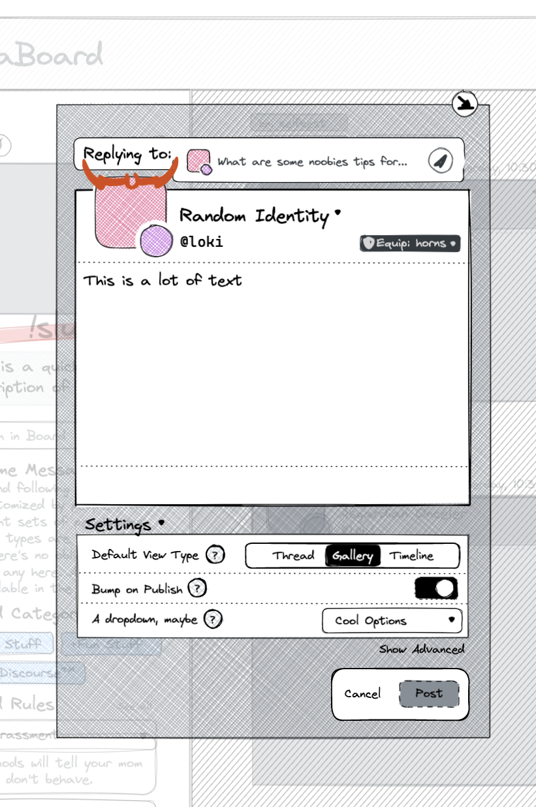
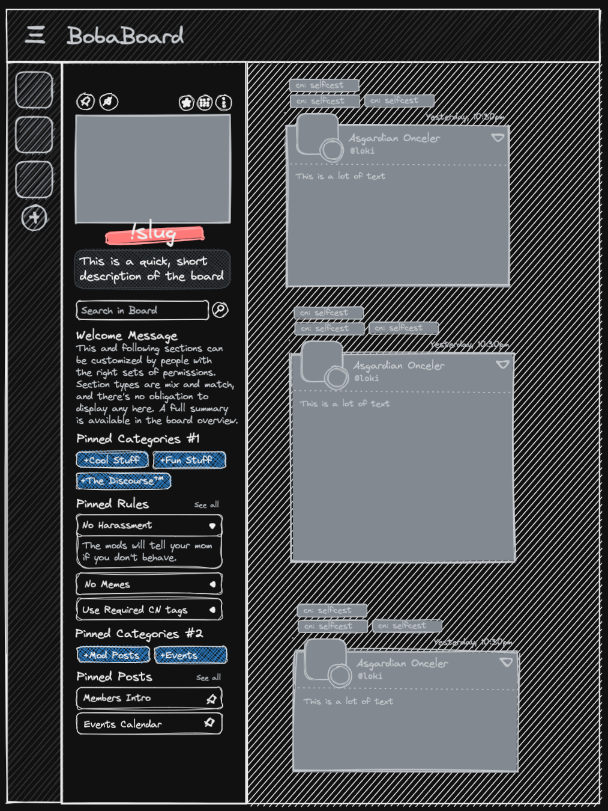

> _(Ms. Boba voice) This edition of our summary is brought to you by my amazing
> "volunteer assistant" Michelle._

<aside class="intro">
<figure>

  <figcaption>

Michelle's [chosen persona](https://picrew.me/share?cd=25Oqwbf1SE). As you can
see, she's really cool.

  </figcaption>
</figure>

Hello, BobaBoard community! **My name’s Michelle, and I’m helping Ms. Boba as a
volunteer assistant.** While much of this work is at a too early stage to dive
deep into—bummer!—let's just say: it involves building up BobaBoard as an
organization, and figuring out its structure and processes.  
I also did a lot of writing for this summary, and I’ll continue to ghost write,
research, and support Ms. Boba until she manages to clone herself and can run
BobaBoard on her own. Until then, I’ll be here lurking in the shadows.

</aside>

## August - September 2021

### Volunteering

**Our main focus area is building a sustainable environment for volunteers** by,
among other things, delineating the fundamentals of good documentation, defining
the onboarding process for new folks, and building up processes and tools to
match each volunteers to the project that best matches their skills, interests,
and availability. As part of this, we’re reaching out to seasoned volunteers
from various startups, nonprofits and fandom-orientated projects to talk about
how their volunteering programs work (or don't!).

As part of this, we realized that _a fundamental part of creating a functional
volunteers environment is writing down everything we know/decide about ongoing
projects_\*, so that if a volunteer needs to drop out the next person can pick
up right where they left off, and so there's a (electronic) paper trail of the
choices made. Here are some example from this month:

---

#### Conceptual/Design

When creating a new thread or adding a comment or contribution to a post, you
can’t poke around the current page without either deleting what you wrote or
sending the comment. [To solve this, we’re redesigning the
editor](https://bobadocs.netlify.app/docs/product/WIPs/minimize-editor), making
it possible to minimize it, move around the page, and pick up right where you
left off.

> \[Volunteer Shoutout\] Thank you to one of our wilfully anonymous volunteers
> for the revamped "block editor" design (seen above). **Thank you so much,
> secret designer!**

#### UI implementation

Our current GIF search interface leverages a non-BobaBoard library, making its
logic and look different from the rest of the website. To solve this, we’re
looking [to expand our dropdown menus code to include the ability to select
between
image](https://bobadocs.netlify.app/docs/product/WIPs/extensible-dropdown).

#### Technical

Internal details about our current authentication mechanism are leaking into
some of our database queries. Trust us: this is bad. [Here’s a—not
taken!—project tackling this issue, while also making the queries less
cumbersome and
repetitive](https://bobadocs.netlify.app/docs/engineering/WIPs/internal-uid).

---

There's still a lot of work to be done to effectively manage volunteers and
create a smooth process and experience, so expect to hear a lot about it in the
following months!

### REST API Standardization

One of Ms. Boba most daunting-yet-necessary tasks at the moment has been
**standardizing and documenting BobaBoard’s REST API.** For the uninitiated, an
API is the contract through which clients communicate with the server, while
REST is one of the golden standards for API definition
[https://en.wikipedia.org/wiki/Representational_state_transfer](https://en.wikipedia.org/wiki/Representational_state_transfer).

> “The REST architectural style emphasises the scalability of interactions
> between components, uniform interfaces, independent deployment of components,
> and the creation of a layered architecture to facilitate caching components to
> reduce user-perceived latency, enforce security, and encapsulate legacy
> systems”.

Standardizing this API means people who are not Ms. Boba can make choices that
are consistent with her own, and helps create a codebase that's easier to
understand, modify and expand. As you can image, this significantly ties into
the [volunteering focus area](#volunteering) described above.

As part of this effort, we've spent time adding a whole pipeline to make
creating API documentation as seamless as possible. This means that **when we
make changes to BobaBoard’s API, our [work-in-progress documentation
website](https://bobadocs.netlify.app/docs/engineering/rest-api/) automatically
displays the latest documentation** for everyone to peruse. In time, this will
allow us to catch any mistakes that get our expectations out of sync with what’s
actually happening, and get volunteers up to speed quickly and safely.

[Ms. Boba wrote an article on some of the work
done](https://dev.to/essentialrandom/documenting-express-rest-apis-with-openapi-and-jsdoc-m68),
though the functionality is rapidly expanding to include even more bells and
whistles like automatic validation and testing.

<figure>

  <figcaption>

[Original tweet](https://twitter.com/BobaBoard/status/1418022326918991876).
Screenshotted for posterity on 10/19/2023 because... _you know_.

  </figcaption>
</figure>

### Observability

Since observability is a complicated concept ([you can read more about it in
this article](https://www.ibm.com/cloud/learn/observability)), let's focus on a
summary of its main benefit:

> The overarching benefit of observability is that with all other things being
> equal, a more observable system is easier to understand (in general and in
> great detail), easier to monitor, easier and safer to update with new code,
> and easier to repair than a less observable system.

Keeping it very simple, observability means you can keep track of the internal
state of the system so that, when errors happen, you can figure out what’s going
on without tearing your hair out.

This month we started using [honeycomb.io](https://www.honeycomb.io/) to
discover errors in BobaBoard's server logic. It already allowed Ms. Boba to
figure out some of them were—maybe unsurprisingly—coming from Tumblr's
mishandling of some embed requests. Oh, Tumblr.

### Practical Coding

Aside from all this theoretical work, the practical one has been revamping a lot
of how the server works (which also impacted the client, of course). As an
example, the notifications delivery architecture has been completely rewritten
from scratch so it doesn’t make Ms. Boba feel gross when she looks at it.

Much of this is working toward the launch of Realms, and is vital to it: without
laying this solid foundation, Realms cannot happen or, at the very least, will
make writing new functionality harder and harder with time.

> \[Volunteer Shoutout\] For this work, we would like to give a shout out to our
> volunteer Sel who has been a great help in the [board
> UUID](https://bobadocs.netlify.app/docs/engineering/WIPs/boards-uuid)
> migration. This is something we really can’t do Realms without! **Thank you so
> much, Sel!**

### UI Mocks

We’ve been working on creating some premade UI mocks to help us iterate faster
when making design changes, and get earlier feedback. For example, here's how we
used our "board page" mocks to visualize how the sidebar might look in the
future, including an exploration of potential new sections.

Of course, none of this is finalized! As said above, these are simply drawings
we’ll use in the future to gather feedback earlier in the process, or brainstorm
potential changes/ideas.

We’re also working on more high-end mocks, but we’re not ready to share the
links yet.

---

...and this is all for this month! As usual, let us know what you think (and
what you want to see more of) [in the feedback
form](https://docs.google.com/forms/d/e/1FAIpQLSe8tUxa4v72CeUswgRf8yiFniLu8wtj3Ju6uBPYhHE__n2VWQ/viewform)!

And if you want to support BobaBoard, you can [subscribe to the paid edition of
this newsletter](https://essentialrandomness.com/subscribe/) for only $5/month!
Not ready to commit? What about [some custom
merchandise](https://store.bobaboard.com/) or even [a whole
ship](https://robinboob.com/)?

See you soon,  
Michelle & Ms. Boba

