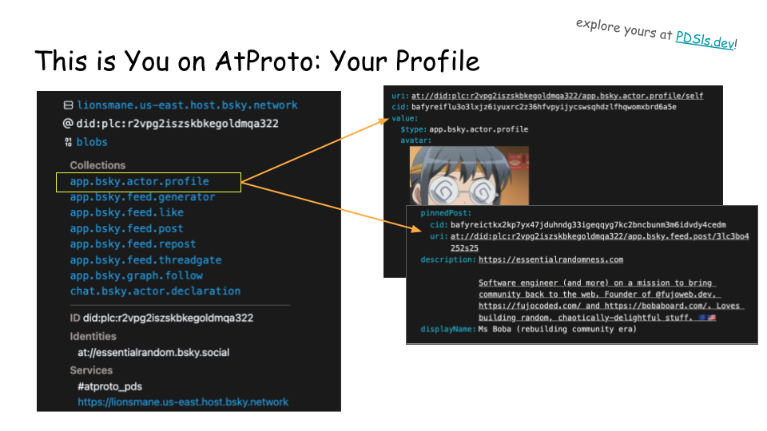

## Slide 1

Hello and welcome!

My name is Ms Boba and I’m here representing FujoCoded LLC, a somewhat unusual company with a bold, ambitious mission.

Before I tell you about it, however, here’s an ominous question for you to ponder:

## Slide 2

why are you here today? I don’t mean “to attend the conference Boris and team so kindly put together”. Dig deeper. Why do open protocols matter so much to you that you’d spend the weekend here at the ATMosphere conference?

Are you excited to get your hands dirty with a new technological toy? Are you angry at how the tech industry squandered the potential of the web? Or is it that you see the huge second-order effects social networks lock-in has not only on people’s well-being, but on democracy itself?

For me, it’s all these things.

## Slide 3

But put simply, I’m here because I love the internet. And above all, because I love the niche, often-weird subcultures that find their home in it—that give even “the weirdos” space to find, joy, connection, friendship, and build community with others like them.

A few years ago, after Tumblr’s porn ban scattered my community across the web, I set out to explore what niche communities like ours needed to thrive again, and I realized we needed to empower them with the skills to create and control their own online social spaces. And to help them help themselves, I founded FujoCoded.

## Slide 4

So today, to show you the work we do and why it matters, I’ll cover 3 things:

First, I’ll introduce Fanworks Fandom—my community— and why communities like ours matter to the web;
Next, I’ll showcase 3 projects I built to introduce this community to ATProto
And finally, I’ll explain why we must engage niche online communities early on to solve the problems we all care about.

And with this, let’s start from fanworks fandom…

## Slide 5

Keeping it simple, Fanworks Fandom is a loosely-aligned community centered around creating fanart, fanfiction, and other creative works inspired by existing media. I’m sure many of you have seen us around, for better or worse. But here are two things you might not know:

First, we (as well as our sub-niche “shipping fandom”) have been around a long time. But due to copyright law, and, you know, because of other reasons, participation has historically been highly stigmatized—in some circles, it very much still is! As a result, many of us rely on the online world for connection, and on anonymity for protection—(so, please continue pretending you don’t know what I look like).

Anyway, not only do we run a lot of online events, projects, and initiatives, some of which with decades of history and thousands of participants, but we do so without knowing each other’s names or faces.

## Slide 6

Second, despite this stigma, we contribute a lot to both the online and the offline. This goes…

…from helping save beloved series like Star Trek, to archival work of old sites and media;
…from creating Archive of Our Own, which serves thousands of fanfictions each minute on a fully-volunteer staff, to making a sizable portion of the reaction gifs you use;
…from challenging legal cases that threaten the internet, to raising $18k to teach version control to coding hobbyists, the project that got FujoCoded started. I have a copy with me, if you want to check it out!

But aside from “look how cool we are,” let me tell you why that matters to you, which I’ll do by borrowing the story of someone else you might know…

## Slide 7

…that’s Maciej Cegłowski, the founder of Pinboard. In 2013, Maciej gave a talk about his “enemies-to-lovers” run-in with fandom and how it changed his perspective on the relationship between communities and platforms. As the shirtless picture of kirk and spock so clearly demonstrates, it’s an interesting talk. I put a link in the slides, but here’s the gist:

Maciej, in his words, “used to be a real jerk about fandom”—that is, until Delicious’ ex-community manager told him “you should look at [how] the fanfic people [are using Delicious tags], they're doing crazy stuff.” After his initial “No way! Fanfiction is lame!”, Maciej went to check and, again in his own words,…

## Slide 8

…he discovered fans were indeed “doing something incredible”:

They hadn’t just used the tagging tools Delicious provided; they’d spontaneously “converged on a set of elaborate tagging conventions that allowed them to turn Delicious into a custom search engine for fanfic”. Without ever forming a steering committee or holding a standards meeting, fans had MacGyvered an entire community-driven classification system—complete with greasemonkey scripts and browser extensions.

## Slide 9

Now, there’s much more to this story, including a collaborative, 52-page document coordinated entirely anonymously through Google Docs. So again, I highly recommend checking out the talk itself.

But, spoilers ahead, here’s Maciej conclusions:

## Slide 10

In his words, “fans are an example of real people using machines to talk to one another.” They are community already happening on the internet, something organic you can’t easily engineer.
Despite their often-antagonistic relationship with platforms, despite the stigma, fans have built (and rebuilt) online spaces of genuine joy and connection—the opposite of the soulless, alienating, constantly-infighting internet of today.
As we all know, ATProto is far from the first attempt at “trying to make decentralized social happen”. But today more than ever, people online feel the need for what we’re trying to build. We owe it to them to create something that helps real people build real community on the web. And, as Maciej says, “fans have a lot to teach us all” about doing exactly that.
With this, let’s go to our projects.
—
6-7 MINUTES

## Slide 11

This November, I needed a bit of a pick-me-up—for reasons I’m sure you can all imagine. With our flagship projects winding down for the holidays, I decided to use my “live coding streams” to explore a question I’d been pondering for a long time: how do we get fans interested in open protocols?

This is obviously a complicated question—but one where being an insider helps. As we say in my country, “I know my chickens”, and my chickens, whether they admit it or not,…

## Slide 12

…love falling for bait.

Now, bait is an effective tool that must be wielded cautiously. People often sense when they’re being baited, and it’s hard for outsiders to distinguish between enticing bait that tastes sweet, and artificial bait that tastes of betrayal—if you can get people to bite!

As a member of fanworks fandom, however, I recognized immediately that ATProto had one piece of delicious-tasting bait our community wouldn’t be able to resist. And that is…

## Slide 13

…the labeling system.

Fans have a primal need to label things—you’ve seen tags on Delicious!

## Slide 14

So when I saw decorative Bluesky labels—or, as I call them, badges—I immediately knew we had the perfect entry point to pique their interest. After all, “composable moderation” may be new, but the urge to showcase yourself on your personal profile is anything but.

## Slide 15

See, for example, some old-school website badges on the very modern sites of our community members! Modern socials may have severely damaged “web badges” culture, but in our corner it’s alive, well, and ripe for exploiting.

So we have the perfect bait… but what should we do with it?

Before we go to the next slide, remember: we may be weird but we come in peace.

And…

## Slide 16

…here it is! In shipping fandom, which characters you pair with each other (and in which order) is incredibly serious business. Some people are “omnivorous”, open to experiencing many different couplings. Others have fixed configurations, and may go as far as muting or blocking people who ship their favorite character “the wrong way”.

Now, this may seem like an overreaction, and indeed, the customs of niche communities tend to make little sense from the outside. You’ll just have to trust me here: this is A Thing™. It’s so much of a thing, that when a Japanese fan mapped different types of shippers to different animals, it became a world-wide community meme.

So, I asked the community to help turn these animals into a set of labels, and got to work on….

## Slide 17

…the fujin labeler! I probably don’t need to explain how labelers work, but the long story short is that when you like a post made by a labeler like ours…

## Slide 18

…you will get a corresponding label assigned to your account, like me getting my proud “turtle fujin” label here by liking the associated post.

I built this project in the course of a 2-3 hours stream, using Alice’s labeler starter kit to do the bulk of the technical work. This way, unencumbered by the low-level details, I could focus on understanding ATProto, and on helping my community understand it alongside me, while building something that excites them.

So now I’m going to tell you what we learned, but I’ll do so by directly addressing a less-technical, fannish audience who has never heard about protocols. With this, I want to show show you that, contrary to popular belief, it’s indeed possible to talk about them in an accessible, only “slightly simplified” way.

Ready? Let’s start!

—-
10 MINUTES

## Slide 19

In this talk and beyond, you’ve heard people talk about “ATProto”. This term may feel magical, foreign, and (if you’ve tried looking it up on your own) utterly confusing. But if we take things step by step, I swear it’s WAY more approachable than it might seem!

Since the early days of the web, our community has had to scramble to work around platform limitations, and build tools that help make software work for us rather than against us. We talked about tags on Delicious, but you might remember extensions like XKit for Tumblr or software like TweetDeck. Usually platforms have fraught relationships with these tools—at best, they tolerate them, at medium, they break them, and at worst they acquire them and turn them into paid offerings we cannot afford.

If you hate this, you’re in luck: so do many technologists! Wouldn’t it be nice, we sometimes ask ourselves, if software was designed to be compatible with other software, so anyone could come build additional tools and services?

To make this possible,the carriers of this dream need to do something really, really hard: agree on how the relevant data should be shaped, and how actions taken should be represented and communicated across programs. This is what’s known as a protocol: a set of rules that, if followed, allow different applications to understand each other and work together on the same data.

## Slide 20

Now, you already use protocols every day without thinking about them: WiFi and Bluetooth are both protocols, and every time you visit a website, you're using HTTP—a protocol that lets your browser talk to the websites you visit either to ask for data, or to tell them about actions you’ve taken.

But while using good protocols is easy, making a new protocol—and getting developers to build useful, beloved, widely-adopted software with it—is really, really hard. And historically, this has been particularly hard for social networks, with many attempts and kinda-mixed success. But technologists are nothing if not full of hubris. So, from time to time, someone comes and decides to try again.

The latest carriers of this tradition are the Bluesky developers. First, they studied software built using existing protocols. like Mastodon, to understand what technological hurdles keep more users from adopting these platforms. Then, they got together to coordinate building the AT Protocol—ATProto for short—and its first test application: BlueSky.

Now, using BlueSky as a testing ground, they’re hoping to convince other folks—that is us—to give this new protocol a chance, and to use our precious time and resources to come build other independent tools and platforms that use this shared language to communicate with each other.

So now that you understand what a protocol is, how does ATProto work?

## Slide 21

This is usually when people bring up diagrams like this one. If you’re feeling your soul leave your body, trust me: you’re far from alone. But here’s the secret…

## Slide 22

…you don’t need to understand that diagram to understand ATProto. Actually, completely forget about that diagram!

Instead, let me tell you about something cool that will show you how it all works in practice, something whose value is both easily-understandable and broadly-applicable.

And that is your Personal Data Server.

—

14 MINUTES

## Slide 23

When a user creates an account, an ATProto application like Bluesky creates and assigns them their own Personal Data Server, also known as a PDS. A PDS is a collection of all the data associated with you as a user. In traditional online applications, like social networks, this data is owned by and locked down within the service you create an account on. Instead, think of a PDS as your personal folder of data that different software can both read from and, with your authorization, write to.

PDSes are one of the central concepts in AtProto and, to me, the coolest. And that is because they speak to something we all feel these days, even when we fail to articulate it: the desire to own our data.

We’ve too often been locked into platforms we don’t like, run by people we don’t like, not just because “all our friends are there”, but because they own our data. Moving platforms means losing all the posts we made, all our images, all our meticulously tagged “reblogs”; it often means accidentally losing some of our close connections, even when our friends do want to move along with us!

This friction keeps us locked in place, knowing the high cost of leaving a platform to rebuild from scratch over and over again.

Thanks to a PDS, however, all your data remain yours, accessible by any application. This means that ATProto-based services cannot hold your data hostage just to keep you from breaking up with them.

## Slide 24

But wait, there’s more! When a PDS is created, it is also assigned a sequence of letters and numbers that is unique across the whole ATProto network. This sequence, called a “Decentralized Identifier” (or DID for friends), is you and no one but you, no matter what platform you originally signed up on, what your current username is, or even who is hosting this folder with all your data. Everything you do on ATProto only refers back to you by using this DID.

This has a very juicy consequence: since a DID is not tied to a specific URL, username, or service, it means that software can find and refer to you regardless of who is currently keeping your data safe and online for you. While by default Bluesky creates and hosts your PDS, you can at any point in time move it to a different service, or even decide to keep it on your own server!

With this, should Bluesky ever ban your account—and, to be clear, they can still do so—your data will be safe, and can be used to rebuild your presence somewhere else.

But let’s go deeper.

## Slide 25

We said that a PDS is like a folder that contains all the data associated with you. Indeed, here’s a list of all the “subfolders” in my account—this is (as the app.bsky prefix shows) my Bluesky data. Unfortunately—shame on me!—I haven’t really explored other AtProto applications yet.

## Slide 26

So to quickly show you, here’s the data of someone who has, as they say, “tried to catch them all”. See those different prefixes? By clicking through these, you can—just like any application can!—see the publicly-available data each service associates with the owner of this PDS.

But let’s get practical: what is inside these folders? Their name is often a clue!

For example, app.bsky.actor.profile…

## Slide 27

…will contain the data of your—or in this case my—Bluesky profile!

## Slide 28

You can see how BlueSky uses this data on the app. But remember: just because it’s in the Bluesky folder, it doesn’t mean that only Bluesky can write or read it. It just means they’re the ones that defined its shape and properties!

## Slide 29

Similarly, if you go look into the app.bsky.feed.post “subfolder”—or, in technical terms, “collection”—you’ll find every BlueSky post you’ve ever made! Here’s the one I showed you earlier, in all its glory.

I will leave looking into graph.follow as homework. Instead, let’s look at one last example to bring us all the way back. Remember my “turtle fujin” label? How does our labeler know I should have that?

## Slide 30

Well, here’s my likes. Guess what we’ll find if we rummage through them? Why, it’s out labeler’s “turtle post”.Since the data on my likes is public, our “Fujin Labeler” program can read them to know I want a label, and which one I want—no one can, for better or worse, stop it from doing so!

But you can imagine that going through all the users in the network to look at all their likes would be incredibly time consuming. So, our labeler does something slightly different: it listens to what ATProto calls the firehose.

The firehose is an “almost literal” stream of everything that happens in the network. Every post, every like—every unlike! Imagine our labeler program sitting at the bottom of this stream, waiting for the corpse of its enemy—I mean, a like on its posts to pass. Once it sees it…

## Slide 31

…it will go and assign the requested label to the decentralized identifier of the person liking the post! Thanks to the firehose, ATProto software can quickly react to actions taken by users on the network, no matter what application those actions originated from.

And this is what protocols allow us to do.

—-
20 MINUTES

## Slide 32

TA-DA!

So, here’s how I introduce ATProto to people. It’s pretty dense, but I’ve found it really resonates and gets people excited about what ATProto can do, and sometimes about what they can do with it!

Just keep in mind that I would usually pause after each “meaty” chunk to let people digest and ask questions.

## Slide 33

As a quick bonus, here’s some of the lessons I’ve applied while building this pitch. Knowing your audience makes this all much easier—and that’s exactly why intra-community outreach can be so effective. But quoting Maciej again, “to get people involved in your site [(or protocol)], [...] treat them with respect and give them room to do it on their own terms”.

But this is only our first project, so let’s jump to the second one!

[21m]

## Slide 34

Our next project is once again deeply tied with “shipping fandom”—and specifically, with the ever-popular fanfiction website Archive of Our Own, also known as AO3.

Here accounts can have two disjoint sets of labels:
Ratings: on AO3, every fanfiction gets exactly one rating to indicate its spice level, from “general” to “explicit”
Warnings: AO3 authors can mark their stories as containing various categories of—quote, unquote—“upsetting” content, no such content, or a convenient “chooses not to say”, which is helpful for people who don’t want to bother, or stories where that would count as a spoiler. Each fanfic, like each labeled account, can have multiple of these warnings.

Now you might go: “a-ah! Time to finally put the moderation back into labelers!” But this labeler is explicitly “just for funsies”. See, I’ve been online for a long time, I run multiple communities, and—long story short—you cannot pay me enough to make me do moderation. It’s a thankless job, and I know much better than to become the arbiter of who gets what label.

Still, even without making this an official moderation tool, people can—and do!—use these labels to decide whether to follow, not follow, or even block a user. Even on their own, badges like these can act as a “before you follow”, a warning system that tells people what content MAY be posted so they can choose to take manual action.

Now, what should we explore with this labeler?

## Slide 35

Have a new question: what does a labeler’s PDS look like? And how is it different from a user’s?

There’s two things:

## Slide 36

First, we have this exclusive “labeler service” collection, which lists the labels our labeler can assign and their settings—for example, whether they automatically blur images in the posts they’re applied to, or whether they identify the content as “adult only”.

## Slide 37

But the star of the show is this #atproto_labeler under services and the associated URL. This is where the magic happens.

The labeler starter kit includes a command to add the HTTP address of our labeler program to our PDS, just like you see there. Once this is in place, Bluesky will recognize the associated account as a labeler. Then it will change its avatar to a square to properly identify it to others, and will provide a “subscribe to labeler” button for people to opt-in to its services.

So, now that we officially have a labeler account, where do we go from here?

## Slide 38

Here’s a trick: by visiting a special address on the labeler service, we can find a list of all the labels that the labeler assigned\*, each with the name of the label and the DID of the receiving user.

This too is part of what ATProto defines: to be an ATProto labeling service, you need to have that address\*\*. This way, any application can visit it, read the list of assigned labels, and build its view of the labels in the network.

Now you may be asking: well, this all fine and dandy, but how do I figure out that this address exists? And that’s a great question! That—once again—goes back to one big problem of designing flexible protocols anyone can use…

—
(\*this is not what the Bluesky AppView uses to learn about labels though)
(\*\*theoretically FOR THIS CASE you don’t according to the spec, but let’s not complicate this further)

https://github.com/bluesky-social/atproto/blob/main/lexicons/com/atproto/label/queryLabels.json
https://atproto.com/specs/label#label-distribution-endpoints

## Slide 39

…and that is that people need to agree on what the shape of the data is, and how to take actions on it—actions like listing all the labels assigned by a service!

So, how does AtProto solve this? It does so in 2 phases:

“Word of God”—in this case whoever decided what ATProto labelers should do and how—states that these actions will be available, what URLs they’ll be associated with, and how they will work.
Then, they write a Lexicon. Lexicons are special files that describe what endpoints exist, what they do, how to access them, and what type of data they will give back. They can be used both to discover features that are available, and to automatically generate code and documentation for others to use.

So, if you’re ever curious about what can you do with a service or collection… go look up the associated Lexicon!

—
25 MINUTES

—
Spec: https://atproto.com/specs/label#label-distribution-endpoints
Lexicon definition: https://github.com/bluesky-social/atproto/blob/main/lexicons/com/atproto/label/queryLabels.json  
Documentation: https://docs.bsky.app/docs/api/com-atproto-label-query-labels

## Slide 40

And with this, here’s the last project in this talk: the fanwork labelers.
Once again we’re going to step up our game:
First of all, we’re going to label posts instead of people.
Next, we’re not going to assign labels by liking posts. Instead, we’re going to go outside the BlueSky App, and let people use their PDS to sign in into an independent website that allows them to do so.

## Slide 41

So here on the left is how our website ended up looking! This is a simple site built in Astro, a framework beloved in our community, now with a convenient reference for ATProto integration.

As may intuit, this is how our site works:

1st, you add the URL of a post in the form you see
Next, you select which type of fanwork the post contains—it may be a fanfiction, an art piece, an event etc.

Then once you submit the form, one of two things happens:

If the post is yours, our “fanworks labeler” will assign the labels you requested
If the post is not yours, it will be sent to a Discord server for approval via emoji—this way, moderation tools can reach our communities where they already are

When I first gave this talk, I went through the architecture piece by piece. But that’s too long for today, so let me just introduce our last building block: feeds.

## Slide 42

Now that we have a series of labels marking different types of content, we can make a feed for each type and let people follow what’s happening around our fanworks community.

You may think: wouldn’t tags be better here? But here’s food for thought: tags are a global search indicator. In the widespread semantic, tagging something means you want everyone to be able to search for it. But niche communities like ours don’t always benefit from a wide reach: while we want our work to be seen, and maybe even searchable, we might prefer it remains in our network. And indeed, someone following a fanworks feed of their own free will is a good signal that if they’re not one of us, they’re at least ok with “our whole deal”

And now, to understand feeds…

## Slide 43

…let’s welcome back PDSls!

To make our feeds appear in the Bluesky UI, we ran a script provided by the Feed Generator Starter Kit which created a app.bsky.feed.generator collection in our account’s PDS, as well as one entry for each different type of fanworks. As you can see in the Blueksy UI, this results in a corresponding amount of new feeds.

So, now that we have feeds, how can applications know what’s in them?

You may be thinking: let’s go find them in the feed service, like we did for the labeler! That’s a good suggestion…

https://pdsls.dev/at/did:plc:kfs6qq5alv3klxr32zkmxbnv/app.bsky.feed.generator
https://fanworksfeeds.fujocoded.com/xrpc/app.bsky.feed.getFeedSkeleton?feed=at://did:plc:kfs6qq5alv3klxr32zkmxbnv/app.bsky.feed.generator/zine
https://fanworksfeeds.fujocoded.com/.well-known/did.json

## Slide 44

…except there’s no feed service in our PDS!

If you think about it, it makes intuitive sense: an account with a labeler service becomes a labeler people can subscribe to. But any regular account can create feeds!

So, where do we find our feed content?

## Slide 45

Let’s go back to a feed entry, and let’s check the value called “did”. This is the identifier of something in the network! But what?

Well, here’s a new trick: with a did:web value, a special type of DID, we can go to its /.well-known/did.json page to learn more about it! Once we do that, we’ll find the “BlueSky feed generator service” we were searching for. And indeed, each feed entry uses this did field to point to a separate feed service that provides that specific feed.

With this in mind, let’s figure out how to access one.

## Slide 46

First, let’s check the definitions in the app.bsky.feed lexicon, as seen in the Bluesky documentation. Here’s one of the “actions” it defines, the one to get the content of a feed. The documentation shows two things:

The address at which the action is provided
The parameters of the action

Armed with this…

## Slide 47

…we can build our “getFeed” URL.

1st, we use the address of the feed service we found at the DID
Next, we use the information about the action address and “params” from our Lexicon
And last, we ask for this specific feed by using its “ATUri”—that is, the unique network address of its record.

Once we go to that URL, the feed service will give us a list of network addresses, one for each post in our feed! From here, apps can go fetch the latest data about each post, and display the feed in its full glory.

—

30 MINUTES

## Slide 48

So with this, we’re done with the projects. Last—not least!—section: why did we do all this?
Is it because these labelers will move a significant amount of fandom folks to BlueSky?
Is it because we want everyone in our community to make their own labelers?
Is it because we want people to use our cool labeler ⇔ feeds ⇔ Discord integration?
Not at all! While all of these would be nice, our secret plan is much more sinister…

## Slide 49

…and that is to join initiatives like lexicon.community! If you’re not familiar, this initiative aims to work on independent, shared lexicons owned not by Bluesky, but by the larger AtProto community.

Here’s my question though: if these lexicons are supposed to be “by the people, for the people”, then who are the people? Not who do we wish were the people, who are the people who can show up for these discussions?

Usually, it’s technical folks, and a very specific type of them at that! After all, what does someone need to join? First, one needs to know that this is happening and why it matters; then one needs to know enough about protocols and ATProto to understand what is being discussed; then one needs to understand what a RFC is, nevermind being able to parse the technical language in the proposals… you can see there are many structural barriers in place, through no fault of anyone involved. This is just how this stuff works!

Now, protocols are about getting people together to decide how they’re going to communicate, so Lexicons are a fundamental stepping stone toward that. The formats and actions defined at this stage are going to have long-term repercussions on the network and what is easy or hard to build on it. If niche online communities like fandom want to make this protocol (also) ours, we must learn how to contribute our work and opinions! And indeed, I’ve found that with a little bit of knowledge and a technical person steering the discussion, “laypeople” can and will gladly give us valuable insights.

## Slide 50

…but even without going as far as these initiatives (which will always have some barriers), there are many ways to grow people’s ability to get involved. For example, here’s a GitHub issue requesting to increase how many labelers people can subscribe to. After building our labelers and asking our community to come upvote it, we brought its original 6 upvotes to 47.

Now, there are valid technical reasons for the limit on labelers, and this request is unlikely to be implemented as is. But doing this exercise still achieves two things: first, it shows us that people can and want to be engaged; then, it shows them that they can do so and how. We’ve learned from the hobbyist coders in our community that commenting or upvoting on GitHub issues was often their first step into open source development, and we’ll be sure to help people use this power again when the right time comes.

https://github.com/bluesky-social/social-app/issues/5618

## Slide 51

Going back to Maciej’s words, “fans are an example of real people using machines to talk to one another”. And while our community has had a lot of ups and downs, internal wank, historical chaos, etc. we know a lot about “how to do the internet”, which we do in radically different ways from many of you.

Eventually, and I say this with all the love in my heart, it’s up to us to stop tech folks from continuing to pursue what seems like a deep, ingrained instinct: reinventing Twitter, but decentralized. By bringing in our experience, we can avoid encoding platform biases at the lower levels of the protocol, and bring a bit more Tumblr, a bit more Amino, a bit more LiveJournal, a bit more AO3 to this ecosystem—all sites that, while they may not be your personal favorites, have been beloved by people like us and helped us build joy, love, friendship and, above all, community.

## Slide 52

To conclude, when people try to make decentralized socials happen, they often focus on getting developers onboard so they can build “TikTok but on AtProto”, “Reddit but on AtProto”, “[blank] but on Atproto”. I believe that’s the wrong way to look at this problem.

Now more than ever regular people out there want what open networks can give them. In addition to convincing the developers of today to come build platforms on these protocols, we need to enable new people to pick up the tools so they can come and find their spot in the big picture—whether it’s contributing to lexicon discussions, filing issues, coding a new library, building a new service, running a relay, or the many things that a good, modular design like ATProto’s allows.

Then, they’ll gradually invite others in their community to come find their own places, so they can build new services that shine not because they are the TikTok of everyone, but because they are tools real communities use, nurture and make available for others.

Because the truth is that, eventually, building a new, meaningfully different web cannot be done with the same tools, people, and incentives that built the one we’ve now effectively lost.

—

35 minutes

## Slide 53

…and with this, the talk is done! Feel free to ask questions, follow me on blueksy to keep in touch, and if you too think this work is important, we have a patreon and are always open to sponsorships!

